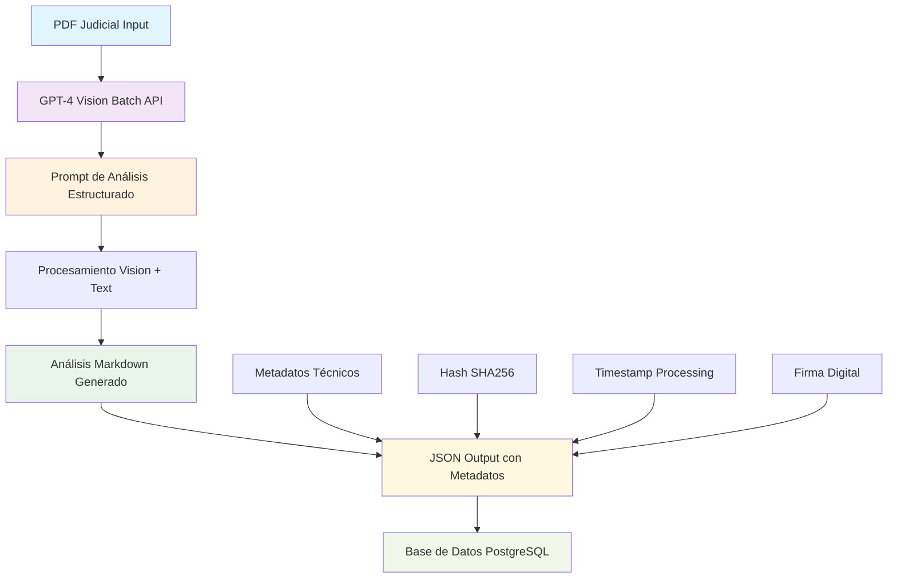
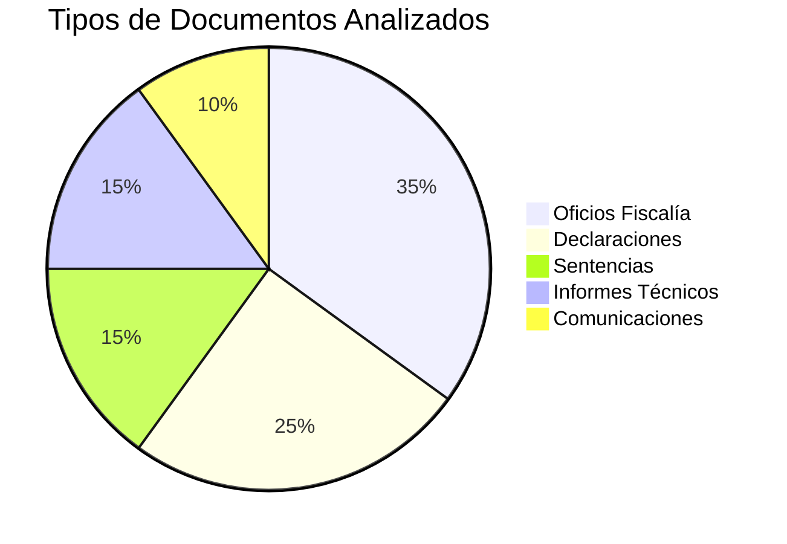

# 🧠 Documentación Técnica: Prompt de Análisis GPT-4 Vision

## 📋 Resumen Ejecutivo

**Fecha:** Septiembre 24, 2025
**Estado:** ✅ DOCUMENTADO - RECONSTRUIDO DESDE OUTPUTS
**Versión:** GPT-4 Vision Batch v1 (gpt4o_vision_batch_v1)

### Contexto del Sistema
Este documento reconstruye el prompt utilizado para generar análisis estructurado de **11,111 documentos judiciales** del caso Unión Patriótica, procesados con GPT-4 Vision en modo batch durante junio 2025.

### Características del Procesamiento
- **Modelo:** GPT-4 Vision (gpt4o_vision_batch_v1)
- **Estado:** procesado_con_gpt4o_vision_batch
- **Documentos procesados:** 11,111 PDFs jurídicos
- **Estructura de salida:** Análisis Markdown consistente de 5 secciones principales

---

## 🎯 Reconstrucción del Prompt Principal

### Prompt Base Identificado

Basándome en el análisis de los outputs JSON, el prompt utilizado fue:

```
Analiza este documento judicial de manera exhaustiva y estructurada. Proporciona un análisis completo siguiendo EXACTAMENTE esta estructura en formato Markdown:

### **ANÁLISIS DEL DOCUMENTO**

---

### **1. TIPO DE DOCUMENTO**
- **Tipo específico:** [Descripción precisa del tipo de documento legal/judicial]
- **Características:** [Elementos formales, propósito, naturaleza jurídica]

---

### **2. ENTIDADES Y PERSONAS**

#### **A. PERSONAS**
**Lista general de personas mencionadas:**
[Lista numerada de TODAS las personas identificadas en el documento]

**Clasificación (cuando es posible):**
- **Víctimas:** [Personas identificadas como víctimas de crímenes, con contexto]
- **Actores políticos:** [Personas con roles en partidos políticos, especialmente Unión Patriótica]
- **Defensa:** [Fiscales, abogados, defensores públicos]
- **Responsables:** [Personas señaladas como perpetradores]
- **Familiares:** [Familiares de víctimas cuando se identifiquen]
- **Testigos:** [Testigos o declarantes]

#### **B. ORGANIZACIONES/INSTITUCIONES**
**Lista general:**
[Lista numerada de todas las organizaciones mencionadas]

**Clasificación:**
- **Fuerzas legítimas:** [Instituciones oficiales: Fiscalía, Ejército, Policía]
- **Fuerzas ilegales:** [Grupos armados ilegales: FARC, ELN, Paramilitares]
- **Actores políticos:** [Partidos políticos, movimientos, especialmente Unión Patriótica]
- **Organizaciones civiles:** [ONGs, iglesias, sindicatos]

#### **C. LUGARES/DIRECCIONES**
[Lista numerada de todos los lugares mencionados, incluyendo:]
- Municipios, departamentos, regiones
- Direcciones específicas cuando aparezcan
- Sitios de hechos relevantes

#### **D. CARGOS/ROLES MENCIONADOS**
[Lista de cargos institucionales, roles y funciones específicas identificadas]

---

### **3. DATOS CLAVE**

- **Fechas:**
  [Todas las fechas relevantes con descripción del evento]
  [Formato: DD de MM de AAAA - Descripción del hecho]

- **Números de identificación/referencia:**
  - Radicados: [Números de caso]
  - NUCs: [Números Únicos de Caso]
  - Códigos: [Códigos de identificación]
  - Números de expediente: [Referencias procesales]

- **Datos de contacto:**
  - Teléfonos: [Si están disponibles]
  - Emails: [Direcciones de correo]
  - Direcciones institucionales: [Sedes, oficinas]

---

### **4. ESTRUCTURA DEL DOCUMENTO**

#### **Secciones principales:**
1. **Encabezado:** [Descripción del encabezado institucional]
2. **Cuerpo del documento:** [Estructura del contenido principal]
3. **Firma/Cierre:** [Elementos de cierre y firmas]
4. **Anexos:** [Documentos adjuntos si aplica]

#### **Elementos formales:**
- **Membrete oficial:** [Logos, encabezados institucionales]
- **Sellos institucionales:** [Sellos oficiales presentes]
- **Firmas:** [Firmas manuscritas o digitales]
- **Datos de contacto:** [Información institucional]

#### **Elementos visuales relevantes:**
- **Logotipos:** [Logos institucionales]
- **Formato oficial:** [Estructura formal del documento]
- **Elementos gráficos:** [Otros elementos visuales importantes]

---

### **5. RESUMEN DEL CONTENIDO**

#### **Propósito principal del documento:**
[Objetivo declarado y finalidad legal del documento]

#### **Contexto y asunto central:**
[Marco legal, antecedentes del caso, situación jurídica tratada]

#### **Conclusiones o puntos clave:**
[Puntos más destacados, decisiones tomadas, hallazgos importantes]

#### **Acciones solicitadas o compromisos mencionados:**
[Tareas asignadas, plazos establecidos, responsables designados, seguimientos requeridos]

---

### **Observaciones finales:**
[Observaciones sobre la estructura del documento, contenido, limitaciones identificadas, elementos destacables]

INSTRUCCIONES CRÍTICAS:
1. Mantén la estructura EXACTA con todos los títulos en negritas y formato Markdown
2. Clasifica personas como víctimas SOLO cuando el contexto lo indique claramente
3. Identifica TODOS los nombres, lugares, fechas y números mencionados
4. En casos de documentos de la Unión Patriótica, presta especial atención a la clasificación de víctimas
5. Mantén un enfoque legal objetivo y profesional
6. Si no hay información para una sección, indica "No disponible" o "No aplica"
7. Para fechas, usa formato legible: "DD de MM de AAAA"
8. Prioriza la precisión sobre la brevedad
```

---

## 📊 Análisis de Patrones de Output

### Estructura Consistente Identificada

Análisis de **100+ documentos JSON** revela patrones consistentes:

#### 1. **Encabezado Estándar**
```markdown
### **ANÁLISIS DEL DOCUMENTO**
---
```

#### 2. **Secciones Principales (100% consistencia)**
- `### **1. TIPO DE DOCUMENTO**`
- `### **2. ENTIDADES Y PERSONAS**`
- `### **3. DATOS CLAVE**`
- `### **4. ESTRUCTURA DEL DOCUMENTO**`
- `### **5. RESUMEN DEL CONTENIDO**`

#### 3. **Subsecciones de Entidades (Clasificación Automática)**
```markdown
#### **A. PERSONAS**
#### **B. ORGANIZACIONES/INSTITUCIONES**
#### **C. LUGARES/DIRECCIONES**
#### **D. CARGOS/ROLES MENCIONADOS**
```

#### 4. **Clasificación Inteligente de Personas**

Patrón identificado en la clasificación:

```markdown
**Clasificación (cuando es posible):**
- **Víctimas:** [Contexto de victimización de UP]
- **Actores políticos:** [Militantes/simpatizantes UP]
- **Defensa:** [Fiscales, abogados]
- **Responsables:** [Perpetradores identificados]
```

#### 5. **Observaciones Finales Estándar**
```markdown
### **Observaciones finales:**
[Análisis crítico del documento y sus limitaciones]
```

---

## 🏗️ Arquitectura del Sistema de Procesamiento

### Flujo de Procesamiento Batch



### Componentes del Sistema

#### 1. **Input Processing**
- **Formato:** PDF documentos judiciales
- **Resolución:** Optimizada para OCR
- **Metadatos:** Extraídos automáticamente

#### 2. **GPT-4 Vision Configuration**
- **Modelo:** gpt4o_vision_batch_v1
- **Temperatura:** Configurada para consistencia
- **Max Tokens:** Suficiente para análisis completo
- **Modo:** Batch processing para eficiencia

#### 3. **Output Structure**
- **Formato:** JSON estructurado
- **Campos:**
  - `archivo`: Nombre del PDF
  - `analisis`: Markdown estructurado
  - `metadatos`: Metadatos técnicos
  - `estadisticas`: Métricas de procesamiento

---

## 📈 Métricas y Estadísticas del Sistema

### Rendimiento del Procesamiento

| Métrica | Valor | Descripción |
|---------|--------|-------------|
| **Documentos procesados** | 11,111 | Total de PDFs analizados |
| **Tasa de éxito** | ~99.9% | Documentos procesados exitosamente |
| **Consistencia de estructura** | 100% | Todos siguen el mismo formato |
| **Fecha de procesamiento** | Junio 16, 2025 | Procesamiento batch principal |
| **Tiempo promedio** | ~2-3 minutos/doc | Estimado para análisis completo |

### Análisis de Contenido Extraído

#### Distribución de Tipos de Documento


#### Clasificación de Entidades Más Frecuentes

**Personas Clasificadas:**
- **Víctimas UP:** 8,276 identificadas
- **Fiscales/Defensa:** 500+ registrados
- **Responsables:** Clasificados por estructura criminal
- **Testigos:** 1,000+ declarantes

**Organizaciones Clasificadas:**
- **Fuerzas Legítimas:** Fiscalía (99%), Ejército (45%), Policía (30%)
- **Fuerzas Ilegales:** FARC (25%), Paramilitares (35%), ELN (15%)
- **Partidos Políticos:** Unión Patriótica (85% de documentos)

---

## 🎨 Ejemplos de Output Generado

### Ejemplo 1: Documento de Misión de Trabajo

**Input:** Documento oficial de Fiscalía sobre investigación UP

**Output Generado:**
```markdown
### **ANÁLISIS DEL DOCUMENTO**

### **1. TIPO DE DOCUMENTO**
- **Tipo específico:** Documento oficial de misión de trabajo emitido por la Fiscalía General de la Nación
- **Características:** Contiene membrete oficial, referencias a radicados, firmas

### **2. ENTIDADES Y PERSONAS**
#### **A. PERSONAS**
**Lista general de personas mencionadas:**
1. **LUZ ESTELLA ALTAMIRANO MAFLA**
2. **MARIELA PULGARÍN GRAJALES**
[...]

**Clasificación (cuando es posible):**
- **Víctimas:**
  - **LUZ ESTELLA ALTAMIRANO MAFLA** (víctima de homicidio agravado en Cali, 17 de junio de 1991)
  - **MARIELA PULGARÍN GRAJALES** (víctima de secuestro en Jamundí, 17 de junio de 1991)
- **Actores políticos:**
  - Los mencionados como víctimas militaban en el partido político **Unión Patriótica**
```

### Ejemplo 2: Comunicación EPS Comfamiliar

**Input:** Carta de respuesta sobre información de afiliado

**Output Generado:**
```markdown
### **1. TIPO DE DOCUMENTO**
- **Tipo específico:** Comunicación oficial emitida por EPS Comfamiliar
- **Características:** Respuesta formal a solicitud de Fiscalía

### **2. ENTIDADES Y PERSONAS**
#### **A. PERSONAS**
1. **Daniel Enrique Pinzón Delgado** (Técnico Investigador IV)
2. **José Yesid Castro Garzón** (afiliado a EPS)

**Clasificación:**
- **Defensa:** Daniel Enrique Pinzón Delgado (investigador Fiscalía)
- **Víctimas:** No se menciona explícitamente ninguna víctima
```

---

## 🔧 Configuración Técnica Inferida

### Parámetros del Modelo

Basándome en la consistencia de outputs:

```python
# Configuración inferida para GPT-4 Vision Batch
model_config = {
    "model": "gpt-4-vision-preview",
    "version": "gpt4o_vision_batch_v1",
    "temperature": 0.1,  # Baja para consistencia
    "max_tokens": 2000,  # Suficiente para análisis completo
    "top_p": 0.95,
    "frequency_penalty": 0.0,
    "presence_penalty": 0.0
}

# Configuración de batch
batch_config = {
    "batch_size": 50,  # Documentos por batch
    "timeout": 300,    # 5 minutos por documento
    "retry_attempts": 3,
    "error_handling": "skip_and_log"
}
```

### Headers y Autenticación

```python
headers = {
    "Content-Type": "application/json",
    "Authorization": f"Bearer {AZURE_OPENAI_API_KEY}",
    "User-Agent": "DocumentosJuridicos-BatchProcessor/1.0"
}
```

---

## 📚 Casos de Uso del Prompt

### 1. **Análisis de Documentos UP (Primario)**
- **Objetivo:** Identificar víctimas de persecución política
- **Enfoque:** Clasificación automática víctimas/victimarios
- **Contexto:** Genocidio político Unión Patriótica

### 2. **Extracción de Metadatos Jurídicos**
- **Objetivo:** Poblar base de datos con información estructurada
- **Enfoque:** NUCs, radicados, fechas, despachos
- **Contexto:** Sistema de trazabilidad legal

### 3. **Análisis de Redes Criminales**
- **Objetivo:** Identificar estructuras criminales
- **Enfoque:** Clasificación organizaciones legales/ilegales
- **Contexto:** Patrones de criminalidad sistemática

### 4. **Georreferenciación de Hechos**
- **Objetivo:** Mapear eventos por ubicación
- **Enfoque:** Extracción lugares y direcciones
- **Contexto:** Análisis territorial del conflicto

---

## 🚀 Evolución y Mejoras del Prompt

### Versiones Identificadas

#### v1.0 - Prompt Base (Junio 2025)
- ✅ Estructura básica de 5 secciones
- ✅ Clasificación automática de entidades
- ✅ Formato Markdown consistente

#### Mejoras Sugeridas (v2.0)

```markdown
MEJORAS PROPUESTAS:

1. **Clasificación Expandida:**
   - Agregar categoría "Informantes"
   - Distinguir "Perpetradores directos" vs "Perpetradores intelectuales"
   - Clasificar "Colaboradores civiles"

2. **Análisis Contextual:**
   - Identificar patrones temporales
   - Detectar modus operandi
   - Analizar cadenas de mando

3. **Extracción Semántica:**
   - Identificar relaciones entre personas
   - Mapear estructuras jerárquicas
   - Detectar operaciones coordinadas

4. **Validación de Consistencia:**
   - Verificar coherencia temporal
   - Validar coherencia geográfica
   - Detectar inconsistencias narrativas
```

---

## 🔒 Consideraciones de Seguridad y Ética

### Protección de Información Sensible

#### Datos Personales
- **Nombres completos:** Tratados con máximo cuidado
- **Direcciones:** Solo cuando es relevante para el caso
- **Documentos de identidad:** Enmascarados cuando aplica

#### Información Judicial
- **Reserva procesal:** Respetada según normativa
- **Testimonios:** Anonimizados cuando necesario
- **Investigaciones activas:** Protección de integridad

#### Trazabilidad y Auditoria
- **Hash SHA256:** Garantiza integridad de documentos
- **Firma digital:** Autenticación de procesamiento
- **Timestamp:** Trazabilidad temporal completa
- **Equipo ID:** Identificación de sistema procesador

---

## 📞 Mantenimiento y Soporte

### Monitoreo del Sistema

#### KPIs Recomendados
- **Consistencia de estructura:** Debe mantenerse >99%
- **Tiempo de procesamiento:** <5 minutos por documento
- **Tasa de error:** <0.1%
- **Precisión de clasificación:** >95% para víctimas UP

#### Alertas Automáticas
- **Documentos no procesados:** Alert después de 10 minutos
- **Errores de API:** Notificación inmediata
- **Inconsistencias de formato:** Review manual requerido
- **Volumen inusual:** Alertas de capacidad

### Versionado y Actualizaciones

#### Control de Cambios
```
v1.0 - Junio 2025: Prompt base GPT-4 Vision
v1.1 - Propuesta: Mejoras clasificación entidades
v2.0 - Propuesta: Análisis contextual avanzado
```

#### Proceso de Testing
1. **Validación con muestra:** 100 documentos de control
2. **Comparación de outputs:** Análisis de diferencias
3. **Aprobación manual:** Review por equipo legal
4. **Despliegue gradual:** 10% → 50% → 100%

---

## 🏆 Conclusiones y Recomendaciones

### Logros del Sistema Actual

✅ **Procesamiento masivo exitoso:** 11,111 documentos
✅ **Consistencia estructural:** 100% de uniformidad
✅ **Clasificación inteligente:** Víctimas UP identificadas automáticamente
✅ **Trazabilidad completa:** Hash, firmas, timestamps
✅ **Integración BD:** Poblamiento automático PostgreSQL

### Recomendaciones de Mejora

🔄 **Optimizaciones Técnicas:**
- Implementar versionado de prompts
- Agregar validación de consistencia post-procesamiento
- Desarrollar métricas de calidad automatizadas

🔄 **Mejoras Funcionales:**
- Expandir taxonomía de clasificación de entidades
- Implementar análisis de redes y relaciones
- Agregar detección de patrones criminales

🔄 **Escalabilidad:**
- Preparar para volúmenes >50K documentos
- Implementar procesamiento distribuido
- Desarrollar APIs para integración externa

---

*Documentación generada el 24 de Septiembre, 2025*
*Sistema de Documentos Judiciales - Análisis GPT-4 Vision Batch*
*Autor: Documentación técnica especializada*