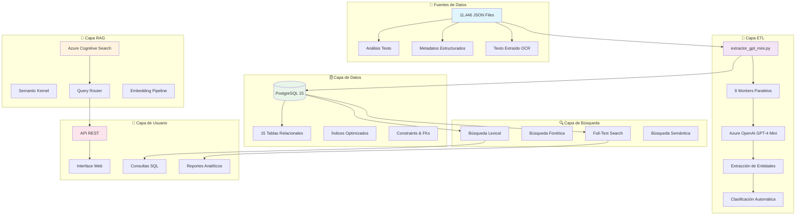

# ARQUITECTURA GENERAL DEL SISTEMA

## Flujo de Datos Principal

1. **Ingesta**: JSON files → ETL Pipeline
2. **Procesamiento**: GPT-4 Mini → Extracción de entidades
3. **Almacenamiento**: PostgreSQL → Estructura relacional
4. **Indexación**: Cognitive Search → Búsqueda semántica
5. **Consulta**: API → Interface usuario
