# ARQUITECTURA GENERAL DEL SISTEMA

```mermaid
graph TB
    subgraph "📁 Fuentes de Datos"
        A[11,446 JSON Files] --> B[Análisis Texto]
        A --> C[Metadatos Estructurados]
        A --> D[Texto Extraído OCR]
    end
    
    subgraph "🔄 Capa ETL"
        E[extractor_gpt_mini.py] --> F[8 Workers Paralelos]
        F --> G[Azure OpenAI GPT-4 Mini]
        G --> H[Extracción de Entidades]
        H --> I[Clasificación Automática]
    end
    
    subgraph "🗄️ Capa de Datos"
        J[(PostgreSQL 15)]
        K[15 Tablas Relacionales]
        L[Índices Optimizados]
        M[Constraints & FKs]
    end
    
    subgraph "🔍 Capa de Búsqueda"
        N[Búsqueda Lexical]
        O[Búsqueda Fonética]
        P[Full-Text Search]
        Q[Búsqueda Semántica]
    end
    
    subgraph "🤖 Capa RAG"
        R[Azure Cognitive Search]
        S[Semantic Kernel]
        T[Query Router]
        U[Embedding Pipeline]
    end
    
    subgraph "👥 Capa de Usuario"
        V[API REST]
        W[Interface Web]
        X[Consultas SQL]
        Y[Reportes Analíticos]
    end
    
    A --> E
    E --> J
    J --> K
    J --> N
    J --> P
    R --> T
    T --> V
    V --> W
    N --> X
    P --> Y
    
    style A fill:#e1f5fe
    style E fill:#f3e5f5
    style J fill:#e8f5e8
    style R fill:#fff3e0
    style V fill:#fce4ec
```

## Flujo de Datos Principal

1. **Ingesta**: JSON files → ETL Pipeline
2. **Procesamiento**: GPT-4 Mini → Extracción de entidades
3. **Almacenamiento**: PostgreSQL → Estructura relacional
4. **Indexación**: Cognitive Search → Búsqueda semántica
5. **Consulta**: API → Interface usuario
