# ARQUITECTURA RAG (Retrieval-Augmented Generation)

## 🧠 **Diseño Conceptual RAG**

```mermaid
graph TB
    subgraph "👤 Capa de Usuario"
        A[Consulta del Usuario] --> B{Análisis de Consulta}
        B --> C[Query Router]
    end
    
    subgraph "🎯 Enrutamiento Inteligente"
        C --> D{Tipo de Consulta}
        D -->|Estructurada| E[Ruta SQL]
        D -->|Conceptual| F[Ruta RAG]
        D -->|Híbrida| G[Ruta Combinada]
    end
    
    subgraph "📊 Ruta SQL Directa"
        E --> H[Query Builder]
        H --> I[(PostgreSQL)]
        I --> J[Resultados Estructurados]
    end
    
    subgraph "🔍 Ruta RAG Semántica"
        F --> K[Embedding Generation]
        K --> L[Azure Cognitive Search]
        L --> M[Vector Search]
        M --> N[Documento Retrieval]
        N --> O[Context Assembly]
        O --> P[GPT-4 Generation]
        P --> Q[Respuesta Contextual]
    end
    
    subgraph "🔄 Ruta Híbrida"
        G --> R[SQL + Vector Search]
        R --> S[Combine Results]
        S --> T[Enhanced Context]
        T --> U[GPT-4 Synthesis]
        U --> V[Respuesta Completa]
    end
    
    subgraph "📚 Knowledge Base"
        W[(Vector Store)]
        X[Document Chunks]
        Y[Metadata Index]
        Z[Entity Relations]
    end
    
    subgraph "🤖 IA Services"
        AA[Azure OpenAI]
        BB[text-embedding-ada-002]
        CC[gpt-4o-mini]
        DD[Semantic Kernel]
    end
    
    %% Conexiones
    L --> W
    K --> BB
    P --> CC
    U --> CC
    DD --> C
    
    %% Flujo hacia conocimiento
    I --> Z
    W --> X
    X --> Y
    
    %% Respuestas finales
    J --> EE[Respuesta Final]
    Q --> EE
    V --> EE
    
    style A fill:#e1f5fe
    style C fill:#f3e5f5
    style I fill:#e8f5e8
    style L fill:#fff3e0
    style EE fill:#e0f2f1
```



## 🏗️ **Componentes RAG Detallados**

### 1. **Query Router con Semantic Kernel**

```python
from semantic_kernel import Kernel
from semantic_kernel.connectors.ai.open_ai import AzureChatCompletion

class QueryRouter:
    """
    Enrutador inteligente de consultas que determina
    la mejor estrategia de respuesta: SQL, RAG o Híbrida
    """
    
    def __init__(self):
        self.kernel = Kernel()
        self.chat_service = AzureChatCompletion(
            deployment_name="gpt-4o-mini",
            endpoint=AZURE_ENDPOINT,
            api_key=AZURE_API_KEY
        )
        
    async def route_query(self, user_query: str) -> QueryType:
        """
        Analiza la consulta y determina el tipo de procesamiento
        """
        classification_prompt = f"""
        Analiza esta consulta y clasifica el tipo de respuesta óptima:
        
        Consulta: "{user_query}"
        
        Tipos:
        - SQL: Consultas sobre datos estructurados, estadísticas, conteos
        - RAG: Preguntas conceptuales, interpretación de documentos
        - HYBRID: Consultas que requieren ambos enfoques
        
        Responde solo: SQL, RAG, o HYBRID
        """
        
        response = await self.chat_service.complete_chat_async(
            chat_history=[{"role": "user", "content": classification_prompt}]
        )
        
        return QueryType(response.content.strip())
```

### 2. **Azure Cognitive Search Integration**

```python
from azure.search.documents import SearchClient
from azure.core.credentials import AzureKeyCredential

class CognitiveSearchManager:
    """
    Gestiona la indexación y búsqueda en Azure Cognitive Search
    """
    
    def __init__(self):
        self.search_client = SearchClient(
            endpoint=SEARCH_ENDPOINT,
            index_name="documentos-juridicos",
            credential=AzureKeyCredential(SEARCH_KEY)
        )
        
        # Esquema de índice
        self.document_index_schema = {
            "name": "documentos-juridicos",
            "fields": [
                {"name": "id", "type": "Edm.String", "key": True},
                {"name": "archivo", "type": "Edm.String", "searchable": True},
                {"name": "contenido", "type": "Edm.String", "searchable": True},
                {"name": "personas", "type": "Collection(Edm.String)", "searchable": True},
                {"name": "organizaciones", "type": "Collection(Edm.String)", "searchable": True},
                {"name": "lugares", "type": "Collection(Edm.String)", "searchable": True},
                {"name": "fechas", "type": "Collection(Edm.DateTimeOffset)", "filterable": True},
                {"name": "embedding", "type": "Collection(Edm.Single)", "searchable": True, "vectorSearch": True}
            ]
        }
        
        # Configuración de búsqueda vectorial
        self.vector_search_config = {
            "vectorSearch": {
                "algorithms": [
                    {
                        "name": "hnsw-algorithm",
                        "kind": "hnsw",
                        "hnswParameters": {
                            "metric": "cosine",
                            "m": 4,
                            "efConstruction": 400,
                            "efSearch": 500
                        }
                    }
                ],
                "profiles": [
                    {
                        "name": "vector-profile",
                        "algorithm": "hnsw-algorithm"
                    }
                ]
            }
        }
    
    async def semantic_search(self, query_embedding: List[float], top_k: int = 5) -> List[Dict]:
        """
        Realiza búsqueda semántica usando embeddings
        """
        search_results = self.search_client.search(
            vector_queries=[{
                "vector": query_embedding,
                "k_nearest_neighbors": top_k,
                "fields": "embedding"
            }],
            select=["id", "archivo", "contenido", "personas", "organizaciones"],
            top=top_k
        )
        
        return [result for result in search_results]
```

### 3. **Document Chunking Strategy**

```python
class DocumentChunker:
    """
    Estrategia de chunking para documentos judiciales largos
    """
    
    def __init__(self, chunk_size: int = 1000, overlap: int = 200):
        self.chunk_size = chunk_size
        self.overlap = overlap
        
    def chunk_document(self, document: Dict) -> List[Dict]:
        """
        Divide documento en chunks con metadatos preservados
        """
        content = document.get('analisis', '') + ' ' + document.get('texto_extraido', '')
        
        chunks = []
        for i in range(0, len(content), self.chunk_size - self.overlap):
            chunk = {
                "id": f"{document['id']}_chunk_{i}",
                "documento_id": document['id'],
                "archivo": document['archivo'],
                "chunk_index": i,
                "contenido": content[i:i + self.chunk_size],
                "personas": document.get('personas', []),
                "organizaciones": document.get('organizaciones', []),
                "lugares": document.get('lugares', []),
                "fechas": document.get('fechas', [])
            }
            chunks.append(chunk)
            
        return chunks
```

## 🔄 **Pipeline de Indexación**


## 🎯 **Estrategias de Consulta**

### 1. **Consultas SQL Directas**
```sql
-- Ejemplo: "¿Cuántas víctimas hay en el caso?"
SELECT tipo, COUNT(*) as total
FROM personas 
WHERE tipo = 'victimas'
GROUP BY tipo;
```

### 2. **Consultas RAG Conceptuales**
```python
# Ejemplo: "¿Cuál fue el impacto psicológico en las víctimas?"
query = "impacto psicológico víctimas"
embedding = await generate_embedding(query)
context_docs = await cognitive_search.semantic_search(embedding)
response = await gpt4_generate(query, context_docs)
```

### 3. **Consultas Híbridas**
```python
# Ejemplo: "Analiza la evolución temporal del caso con enfoque en víctimas"
sql_data = execute_sql("SELECT fecha, personas FROM analisis_fechas...")
rag_context = await get_context_about("evolución temporal víctimas")
hybrid_response = await synthesize_response(sql_data, rag_context)
```

## 📊 **Métricas RAG**

### Métricas de Calidad
- **Retrieval Precision**: % de documentos relevantes recuperados
- **Retrieval Recall**: % de documentos relevantes encontrados
- **Answer Relevance**: Relevancia de la respuesta generada
- **Factual Accuracy**: Precisión factual de las respuestas

### Métricas de Performance
- **Query Latency**: Tiempo de respuesta por consulta
- **Embedding Generation Time**: Tiempo de generación de embeddings
- **Vector Search Time**: Tiempo de búsqueda vectorial
- **LLM Generation Time**: Tiempo de generación de respuesta

## 🔧 **Configuración de Deployment**

### Azure Cognitive Search Setup
```json
{
    "index_configuration": {
        "name": "documentos-juridicos",
        "fields": 15,
        "vector_dimensions": 1536,
        "storage_size": "500GB",
        "pricing_tier": "Standard"
    },
    "semantic_configuration": {
        "prioritized_fields": {
            "title_field": "archivo",
            "content_fields": ["contenido", "personas", "organizaciones"],
            "keyword_fields": ["lugares", "fechas"]
        }
    }
}
```

### Embedding Pipeline Configuration
```python
EMBEDDING_CONFIG = {
    "model": "text-embedding-ada-002",
    "dimensions": 1536,
    "batch_size": 16,
    "max_tokens": 8191,
    "retry_attempts": 3,
    "rate_limit": 3000  # tokens per minute
}
```

## 🚀 **Roadmap de Implementación**

### Fase 1: Configuración Base (Semana 1)
- [ ] Setup Azure Cognitive Search
- [ ] Configurar Semantic Kernel
- [ ] Implementar Query Router básico

### Fase 2: Indexación (Semana 2)
- [ ] Pipeline de chunking
- [ ] Generación de embeddings
- [ ] Indexación de documentos existentes

### Fase 3: Búsqueda y Generación (Semana 3)
- [ ] Implementar búsqueda vectorial
- [ ] Integrar generación con GPT-4
- [ ] Testing de calidad de respuestas

### Fase 4: Optimización (Semana 4)
- [ ] Tuning de parámetros
- [ ] Métricas de evaluación
- [ ] Interface de usuario
