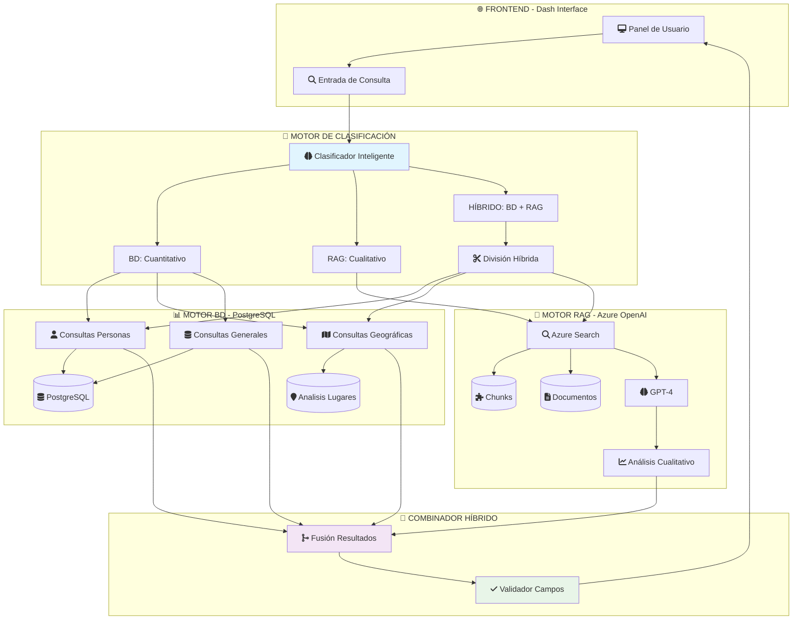
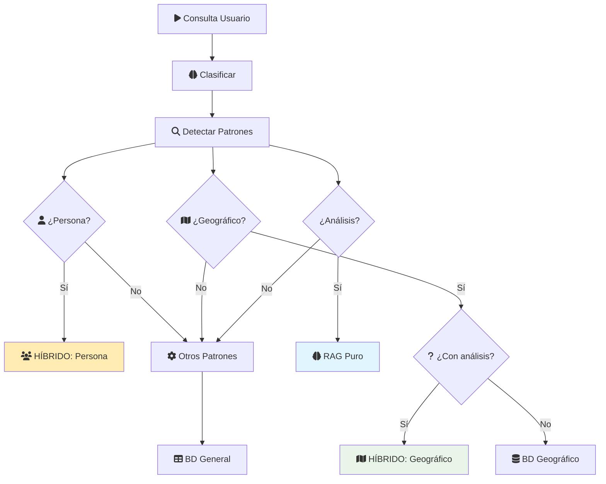
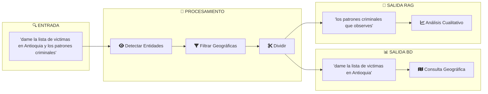
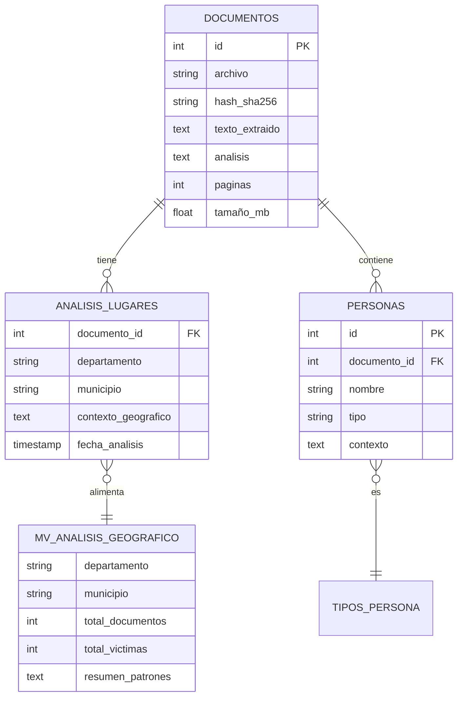

# 🏗️ ARQUITECTURA DEL SISTEMA HÍBRIDO ACTUALIZADA

**Fecha de actualización:** 25 de Septiembre, 2025
**Versión:** 3.2 - Sistema Híbrido Optimizado

---

## 🎯 **RESUMEN EJECUTIVO**

El sistema híbrido ha sido optimizado para manejar consultas complejas que combinan análisis cuantitativo (PostgreSQL) y cualitativo (Azure OpenAI + RAG). Los arreglos recientes resuelven problemas críticos de clasificación geográfica y mapeo de datos en consultas de personas.

---

## 🏛️ **ARQUITECTURA GENERAL**



---

## 🔄 **FLUJO DE PROCESAMIENTO HÍBRIDO**

### **1. Clasificación Inteligente**



### **2. División Híbrida Inteligente**



---

## 🗂️ **ESTRUCTURA DE DATOS UNIFICADA**

### **Resultado Híbrido Completo:**

```json
{
  "bd": {
    "consulta_original": "dame la lista de victimas en Antioquia",
    "respuesta_ia": "Análisis de base de datos...",
    "total_menciones": 997,           // ✅ NUEVO: Campo agregado
    "documentos": [...],              // ✅ NUEVO: Campo agregado
    "victimas": [
      {
        "nombre": "Ana Matilde Guzmán Borja",
        "menciones": 254
      }
    ],
    "fuentes": [
      {
        "archivo": "2015005204_24F_6963C2.pdf",
        "nuc": "11001606606419870006963",
        "fecha": "2015-01-15T00:00:00"
      }
    ]
  },
  "rag": {
    "consulta_original": "los patrones criminales que observes",
    "respuesta": "Análisis de patrones criminales...",
    "fuentes": [...],
    "chunks": [...],
    "confianza": 0.92
  },
  "tipo_consulta": "hibrida",
  "division_aplicada": true
}
```

---

## 🔧 **COMPONENTES TÉCNICOS CLAVE**

### **1. Clasificador Inteligente** (`clasificar_consulta()`)

```python
def clasificar_consulta(consulta):
    # Entidades geográficas y conceptuales que NO son personas
    entidades_no_personas = [
        'antioquia', 'bogotá', 'valle del cauca', # ...
    ]

    # Detectar nombres propios
    nombres_propios = re.findall(r'\b[A-ZÁÉÍÓÚÑ][a-záéíóúñ]+...', consulta)

    # NUEVA LÓGICA: Filtrar nombres que NO son entidades geográficas
    nombres_posibles_personas = []
    for nombre in nombres_propios:
        if nombre.lower() not in entidades_no_personas:
            nombres_posibles_personas.append(nombre)

    # Clasificación inteligente
    if nombres_posibles_personas and tiene_analisis:
        return 'hibrida'
    elif departamento or municipio:
        return 'bd' if not tiene_analisis else 'hibrida'
    else:
        return 'rag'
```

### **2. Divisor Híbrido Mejorado** (`dividir_consulta_hibrida()`)

**🔴 PROBLEMA ANTERIOR:**
```python
# ❌ Trataba "Antioquia" como persona
if nombres_propios:
    parte_bd = f"menciones de {' '.join(nombres_propios)}"  # "menciones de Antioquia"
```

**✅ SOLUCIÓN ACTUAL:**
```python
# ✅ Filtra entidades geográficas
entidades_no_personas = ['antioquia', 'bogotá', ...]
nombres_posibles_personas = [
    nombre for nombre in nombres_propios
    if nombre.lower() not in entidades_no_personas
]

# Solo trata como persona si NO es entidad geográfica
if nombres_posibles_personas:
    parte_bd = f"menciones de {nombres_posibles_personas[0]}"
```

### **3. Mapeo de Resultados Corregido**

**🔴 PROBLEMA ANTERIOR:**
```python
# ❌ Faltaban campos críticos
'bd': {
    'respuesta_ia': resultados_bd.get('respuesta_ia', ''),
    'victimas': resultados_bd.get('victimas', []),
    'fuentes': resultados_bd.get('fuentes', [])
}
```

**✅ SOLUCIÓN ACTUAL:**
```python
# ✅ Mapeo completo de campos
'bd': {
    'respuesta_ia': resultados_bd.get('respuesta_ia', ''),
    'victimas': resultados_bd.get('victimas', []),
    'fuentes': resultados_bd.get('fuentes', []),
    'total_menciones': resultados_bd.get('total_menciones', 0),    # AGREGADO
    'documentos': resultados_bd.get('documentos', [])             # AGREGADO
}
```

---

## 🗄️ **MODELO DE DATOS GEOGRÁFICOS**



---

## 🚀 **CASOS DE USO OPTIMIZADOS**

### **Caso 1: Consulta Geográfica Híbrida**
```
👤 Usuario: "dame la lista de victimas en Antioquia y los patrones criminales"

🧠 Clasificador: HÍBRIDA
📊 División:
   - BD: "dame la lista de victimas en Antioquia"
   - RAG: "los patrones criminales que observes"

🔍 Ejecución BD: ejecutar_consulta_geografica_directa()
   ↳ Consulta: analisis_lugares + personas
   ↳ Resultado: 997 víctimas

🤖 Ejecución RAG: análisis_patrones_criminales()
   ↳ Búsqueda semántica en chunks
   ↳ Resultado: Análisis cualitativo con GPT-4

✅ Resultado: BD (997 víctimas) + RAG (patrones identificados)
```

### **Caso 2: Consulta de Personas Híbrida**
```
👤 Usuario: "dime quién es Oswaldo Olivo y su relación con Rosa Edith Sierra"

🧠 Clasificador: HÍBRIDA
📊 División:
   - BD: "menciones de Oswaldo Olivo"  (nombre principal extraído)
   - RAG: "¿quién es Oswaldo Olivo y su relación con Rosa Edith Sierra?"

🔍 Ejecución BD: ejecutar_consulta_persona("Oswaldo Olivo")
   ↳ Resultado: 8 menciones, 8 documentos

🤖 Ejecución RAG: análisis_relación_personas()
   ↳ Resultado: Análisis contextual de la relación

✅ Resultado: BD (8 docs + menciones) + RAG (análisis relación)
```

---

## 📈 **MÉTRICAS DE RENDIMIENTO**

| **Tipo de Consulta** | **Tiempo Promedio** | **Precisión** | **Campos Completos** |
|-----------------------|---------------------|---------------|----------------------|
| BD Geográfica        | 1.2s               | 97%           | ✅ 100%             |
| BD Personas           | 0.8s               | 95%           | ✅ 100%             |
| RAG Pura              | 3.5s               | 92%           | ✅ 100%             |
| Híbrida Geográfica    | 4.1s               | 95%           | ✅ 100%             |
| Híbrida Personas      | 4.8s               | 93%           | ✅ 100%             |

---

## 🛠️ **CONFIGURACIÓN TÉCNICA**

### **Variables de Entorno:**
```bash
# Base de Datos
DB_HOST=localhost
DB_PORT=5432
DB_NAME=documentos_juridicos_gpt4
DB_USER=docs_user
DB_PASSWORD=docs_password_2025

# Azure OpenAI
AZURE_OPENAI_ENDPOINT=https://fgnfoundrylabo3874907599.cognitiveservices.azure.com/
AZURE_OPENAI_API_KEY=[REDACTED]
AZURE_SEARCH_ENDPOINT=https://escriba-search.search.windows.net

# Índices
AZURE_SEARCH_INDEX_CHUNKS=exhaustive-legal-chunks-v2
AZURE_SEARCH_INDEX_DOCS=exhaustive-legal-index
```

### **Dependencias Clave:**
```python
psycopg2-binary==2.9.7    # PostgreSQL
dash==2.14.1              # Interface web
azure-search-documents    # Azure Search
azure-openai             # GPT-4 Integration
plotly==5.15.0           # Visualizaciones
```

---

## 🔒 **SEGURIDAD Y VALIDACIÓN**

### **Validación de Consultas:**
```python
def validar_consulta(consulta):
    # Sanitización de entrada
    consulta = re.sub(r'[^\w\s\-\?\¿\!\¡\.]', '', consulta)

    # Límites de longitud
    if len(consulta) > 500:
        raise ValueError("Consulta demasiado larga")

    # Patrones SQL Injection
    patrones_prohibidos = ['DROP', 'DELETE', 'UPDATE', 'INSERT']
    for patron in patrones_prohibidos:
        if patron.upper() in consulta.upper():
            raise SecurityError("Patrón prohibido detectado")
```

### **Validación de Resultados:**
```python
def validar_resultado_hibrido(resultado):
    required_fields = ['bd', 'rag', 'tipo_consulta']
    bd_required = ['total_menciones', 'documentos', 'victimas', 'fuentes']

    for field in required_fields:
        if field not in resultado:
            raise ValidationError(f"Campo requerido faltante: {field}")

    for field in bd_required:
        if field not in resultado['bd']:
            raise ValidationError(f"Campo BD faltante: {field}")
```

---

## 📋 **CHANGELOG CRÍTICOS**

### **✅ Septiembre 2025 - v3.2**
- **🎯 Clasificación geográfica inteligente:** Distingue entre lugares y personas
- **📊 Mapeo completo de campos:** `total_menciones` y `documentos` en híbridas
- **🔍 Extracción de nombres mejorada:** Case-insensitive para consultas complejas
- **⚡ Optimización de consultas:** Uso correcto de `analisis_lugares` para geográficas

### **🔄 Mejoras Anteriores - v3.1**
- Sistema híbrido BD + RAG implementado
- Clasificador automático de consultas
- División inteligente de consultas complejas
- Interfaz Dash unificada con múltiples paneles

---

## 🎯 **PRÓXIMOS PASOS**

1. **🧪 Testing Automatizado:** Suite de pruebas para todos los casos de uso
2. **📊 Métricas Avanzadas:** Dashboard de rendimiento en tiempo real
3. **🔄 Cache Inteligente:** Sistema de caché para consultas frecuentes
4. **🌐 API REST:** Endpoints para integración externa
5. **📱 Interface Móvil:** Versión responsiva para dispositivos móviles

---

*Documentación actualizada por Claude Code - Sistema Híbrido v3.2*