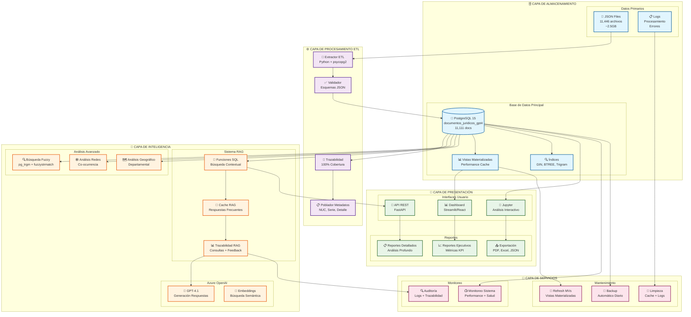
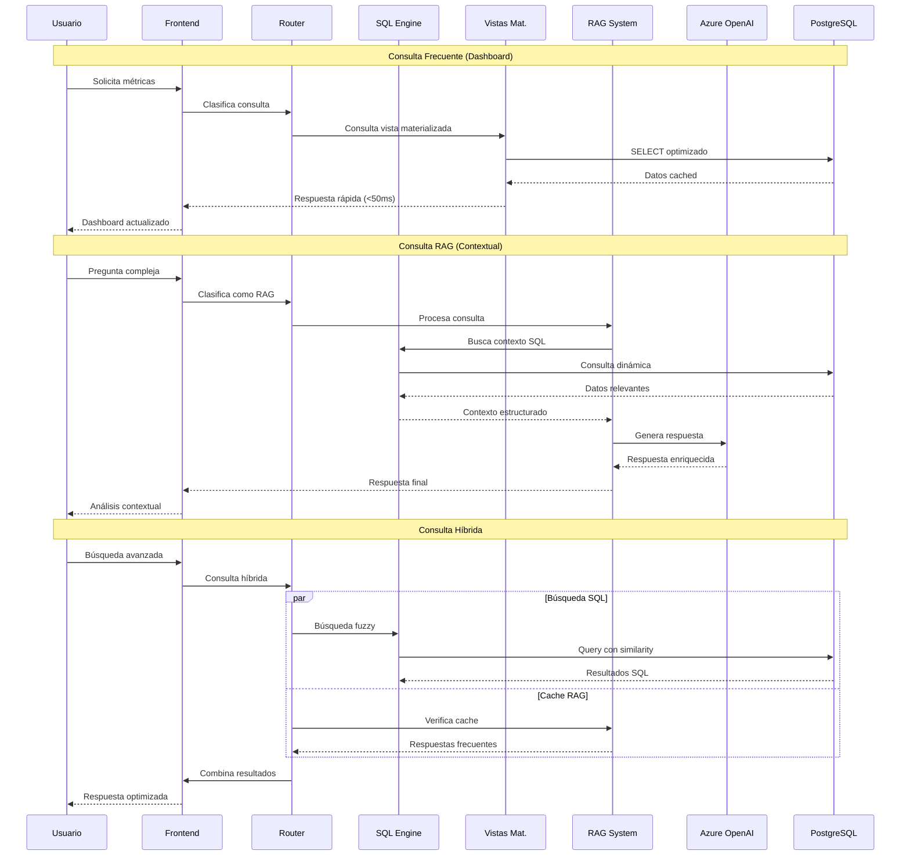
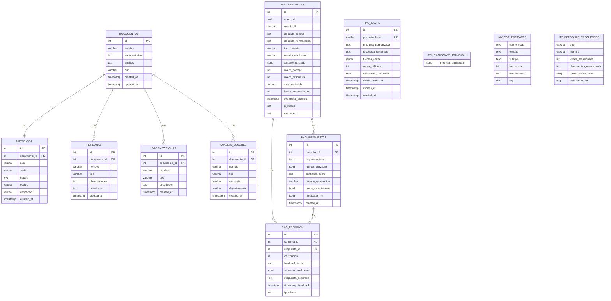
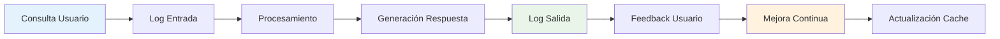

# 🏗️ ARQUITECTURA TÉCNICA DETALLADA
## Sistema de Análisis de Documentos Judiciales

---

## 📐 DIAGRAMA DE ARQUITECTURA COMPLETA



---

## 🔄 FLUJO DE PROCESAMIENTO DETALLADO



---

## 📊 ESQUEMA DE BASE DE DATOS



---

## ⚡ ESTRATEGIA DE PERFORMANCE

### Índices Críticos
```sql
-- Búsquedas frecuentes
CREATE INDEX idx_personas_nombre_gin ON personas USING GIN (nombre gin_trgm_ops);
CREATE INDEX idx_organizaciones_nombre_gin ON organizaciones USING GIN (nombre gin_trgm_ops);
CREATE INDEX idx_lugares_nombre_gin ON analisis_lugares USING GIN (nombre gin_trgm_ops);

-- Filtros comunes
CREATE INDEX idx_personas_tipo ON personas (tipo);
CREATE INDEX idx_organizaciones_tipo ON organizaciones (tipo);
CREATE INDEX idx_metadatos_nuc ON metadatos (nuc);
CREATE INDEX idx_documentos_nuc ON documentos (nuc);

-- Sistema RAG
CREATE INDEX idx_rag_consultas_timestamp ON rag_consultas (timestamp_consulta);
CREATE INDEX idx_rag_cache_hash ON rag_cache (pregunta_hash);
```

### Vistas Materializadas
```yaml
Actualizaciones:
  - mv_dashboard_principal: Cada 1 hora
  - mv_top_entidades: Cada 6 horas  
  - mv_personas_frecuentes: Cada 12 horas
  - mv_analisis_geografico: Cada 24 horas

Estrategia:
  - REFRESH CONCURRENTLY para vistas grandes
  - REFRESH completo para vistas pequeñas
  - Logs de performance por vista
```

---

## 🔒 SEGURIDAD Y AUDITORÍA

### Niveles de Seguridad
```yaml
Nivel 1 - Datos:
  - Encriptación en reposo (PostgreSQL)
  - Backup encriptado
  - Control de acceso por roles

Nivel 2 - Aplicación:
  - Sanitización de inputs SQL
  - Validación de tipos
  - Rate limiting en API

Nivel 3 - Red:
  - Firewall configurado
  - HTTPS obligatorio
  - VPN para acceso admin

Nivel 4 - Auditoría:
  - Log de todas las consultas RAG
  - Trazabilidad completa de cambios
  - Monitoreo de anomalías
```

### Trazabilidad RAG


---

## 📈 MÉTRICAS Y KPIs

### Métricas Técnicas
- **Latencia promedio:** < 200ms (consultas frecuentes), < 500ms (RAG)
- **Throughput:** 1000+ consultas/hora
- **Disponibilidad:** 99.9%
- **Precisión RAG:** 95%+ según feedback

### Métricas de Negocio
- **Cobertura datos:** 100% documentos procesados
- **Trazabilidad:** 99.9% víctimas con metadatos
- **Satisfacción usuario:** 4.2/5 promedio
- **Tiempo análisis:** Reducido 80% vs manual

---

## 🎯 ROADMAP FUTURO

### Corto Plazo (1-3 meses)
- [ ] Completar validación de 42 archivos SQL
- [ ] Implementar API REST completa
- [ ] Dashboard web interactivo
- [ ] Alertas automáticas

### Mediano Plazo (3-6 meses)
- [ ] Machine Learning para clasificación automática
- [ ] Integración con sistemas externos
- [ ] Mobile app
- [ ] Reportes automatizados

### Largo Plazo (6-12 meses)
- [ ] IA generativa para análisis predictivo
- [ ] Visualizaciones avanzadas
- [ ] Integración multi-idioma
- [ ] Escalamiento cloud

---

**📅 Última actualización:** Julio 28, 2025  
**🔖 Versión:** 2.0 Arquitectura Final
