# DIAGRAMA ENTIDAD-RELACIÓN (ERD)

```mermaid
erDiagram
    DOCUMENTOS {
        int id PK
        varchar archivo UK
        text ruta
        varchar nuc
        timestamp procesado
        varchar estado
        varchar cuaderno
        varchar codigo
        varchar despacho
        varchar entidad_productora
        varchar serie
        varchar subserie
        int folio_inicial
        int folio_final
        int paginas
        decimal tamaño_mb
        decimal costo_estimado
        varchar hash_sha256 UK
        text texto_extraido
        text analisis
        timestamp created_at
        timestamp updated_at
    }
    
    PERSONAS {
        int id PK
        int documento_id FK
        varchar nombre
        varchar tipo_persona
        varchar tipo
        text descripcion
        varchar cedula
        varchar alias
        varchar lugar_nacimiento
        date fecha_nacimiento
        text observaciones
        timestamp created_at
    }
    
    ORGANIZACIONES {
        int id PK
        int documento_id FK
        varchar nombre
        varchar tipo
        text descripcion
        timestamp created_at
    }
    
    ANALISIS_LUGARES {
        int id PK
        int documento_id FK
        varchar nombre
        varchar tipo
        varchar direccion
        varchar municipio
        varchar departamento
        varchar pais
        timestamp created_at
    }
    
    ANALISIS_CARGOS_ROLES {
        int id PK
        int documento_id FK
        varchar cargo
        varchar persona
        varchar entidad
        timestamp created_at
    }
    
    ANALISIS_FECHAS {
        int id PK
        int documento_id FK
        date fecha
        varchar tipo
        text descripcion
        timestamp created_at
    }
    
    ANALISIS_NUMEROS_IDENTIFICACION {
        int id PK
        int documento_id FK
        varchar tipo
        varchar numero
        text descripcion
        timestamp created_at
    }
    
    ANALISIS_CANTIDADES_VALORES {
        int id PK
        int documento_id FK
        varchar tipo
        numeric cantidad
        text descripcion
        timestamp created_at
    }
    
    ANALISIS_DATOS_CONTACTO {
        int id PK
        int documento_id FK
        varchar tipo
        varchar valor
        varchar entidad
        timestamp created_at
    }
    
    METADATOS {
        int id PK
        int documento_id FK
        varchar nuc
        varchar cuaderno
        varchar codigo
        varchar despacho
        text detalle
        text entidad_productora
        varchar serie
        varchar subserie
        int folio_inicial
        int folio_final
        timestamp fecha_creacion
        text observaciones
        varchar hash_sha256
        varchar firma_digital
        timestamp timestamp_auth
        varchar equipo_id_auth
        varchar producer
        text anexos
        jsonb authentication_info
        timestamp created_at
    }
    
    ESTADISTICAS {
        int id PK
        int documento_id FK
        int normal
        int ilegible
        int posiblemente
        int total_palabras
        numeric porcentaje_inferencias
        timestamp created_at
    }
    
    ANALISIS_ESTRUCTURA_DOCUMENTO {
        int id PK
        int documento_id FK
        jsonb secciones_principales
        jsonb elementos_formales
        jsonb elementos_visuales
        timestamp created_at
    }
    
    ANALISIS_RESUMEN_CONTENIDO {
        int id PK
        int documento_id FK
        text proposito_principal
        text contexto_asunto_central
        text conclusiones_puntos_clave
        text acciones_solicitadas
        timestamp created_at
    }
    
    ANALISIS_CONTEXTO_LEGAL {
        int id PK
        int documento_id FK
        jsonb normatividad_aplicable
        jsonb procedimientos_referencias
        jsonb antecedentes_relacionados
        timestamp created_at
    }
    
    ANALISIS_CLASIFICACION_TEMATICA {
        int id PK
        int documento_id FK
        jsonb areas_derecho
        jsonb tipos_proceso
        jsonb categorias_delito
        jsonb temas_principales
        timestamp created_at
    }
    
    %% Relaciones
    DOCUMENTOS ||--o{ PERSONAS : "contiene"
    DOCUMENTOS ||--o{ ORGANIZACIONES : "menciona"
    DOCUMENTOS ||--o{ ANALISIS_LUGARES : "referencia"
    DOCUMENTOS ||--o{ ANALISIS_CARGOS_ROLES : "especifica"
    DOCUMENTOS ||--o{ ANALISIS_FECHAS : "incluye"
    DOCUMENTOS ||--o{ ANALISIS_NUMEROS_IDENTIFICACION : "contiene"
    DOCUMENTOS ||--o{ ANALISIS_CANTIDADES_VALORES : "detalla"
    DOCUMENTOS ||--o{ ANALISIS_DATOS_CONTACTO : "proporciona"
    DOCUMENTOS ||--|| METADATOS : "tiene"
    DOCUMENTOS ||--|| ESTADISTICAS : "genera"
    DOCUMENTOS ||--o| ANALISIS_ESTRUCTURA_DOCUMENTO : "posee"
    DOCUMENTOS ||--o| ANALISIS_RESUMEN_CONTENIDO : "resume"
    DOCUMENTOS ||--o| ANALISIS_CONTEXTO_LEGAL : "contextualiza"
    DOCUMENTOS ||--o| ANALISIS_CLASIFICACION_TEMATICA : "clasifica"
```

## Cardinalidades y Restricciones

### Relaciones Principales
- **DOCUMENTOS (1) ←→ (N) PERSONAS**: Un documento puede mencionar múltiples personas
- **DOCUMENTOS (1) ←→ (N) ORGANIZACIONES**: Un documento puede referenciar múltiples organizaciones
- **DOCUMENTOS (1) ←→ (1) METADATOS**: Cada documento tiene exactamente un registro de metadatos
- **DOCUMENTOS (1) ←→ (N) LUGARES**: Un documento puede mencionar múltiples ubicaciones

### Restricciones de Integridad
- Todas las FK tienen `ON DELETE CASCADE`
- `archivo` y `hash_sha256` son únicos en DOCUMENTOS
- Índices optimizados en campos de búsqueda frecuente
