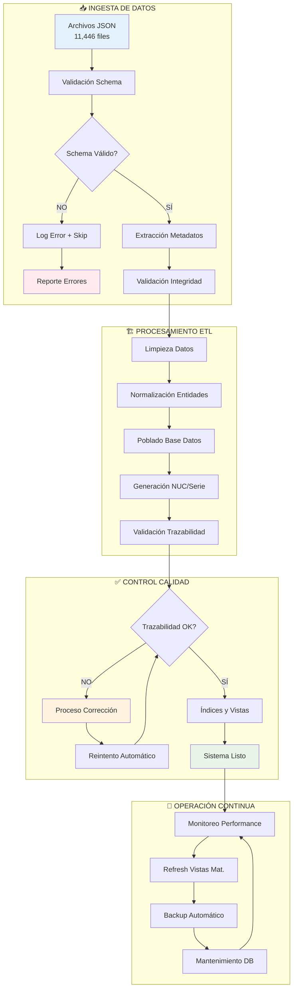
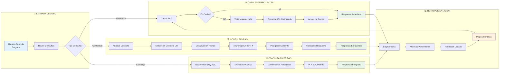
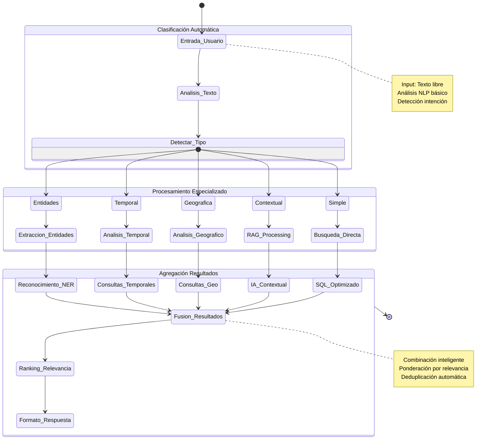
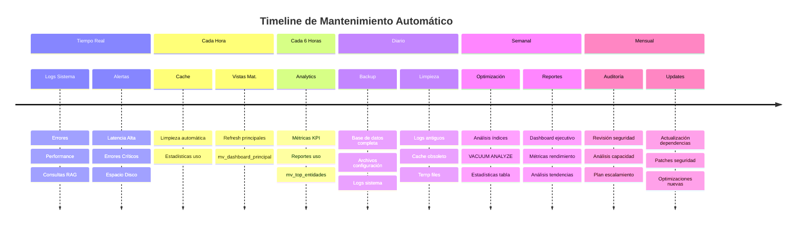
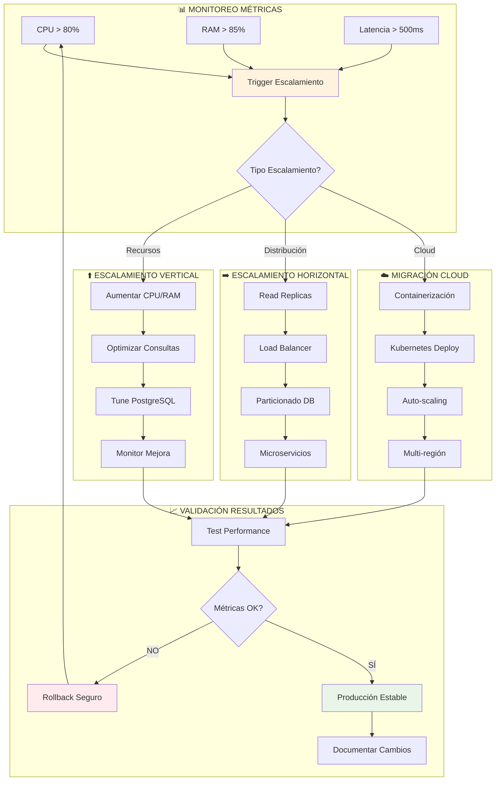

# 🔄 FLUJOS DE TRABAJO Y PROCESOS
## Sistema de Documentos Judiciales

---

## 🎯 FLUJO PRINCIPAL DE PROCESAMIENTO



---

## 🧠 FLUJO SISTEMA RAG



---

## 🔍 FLUJO DE BÚSQUEDAS AVANZADAS



---

## 📈 FLUJO DE MONITOREO Y MANTENIMIENTO



---

## 🛠️ FLUJO DE DESARROLLO Y DEPLOY

```mermaid
gitgraph
    commit id: "Init Sistema Base"
    
    branch feature/rag-system
    checkout feature/rag-system
    commit id: "Implement RAG Core"
    commit id: "Add Azure OpenAI"
    commit id: "Cache System"
    
    checkout main
    merge feature/rag-system
    commit id: "Release v1.0"
    
    branch feature/performance
    checkout feature/performance
    commit id: "Materialized Views"
    commit id: "Query Optimization"
    commit id: "Índices Avanzados"
    
    checkout main
    merge feature/performance
    commit id: "Release v1.1"
    
    branch feature/sql-validation
    checkout feature/sql-validation
    commit id: "SQL Validator"
    commit id: "42 Queries Analysis"
    commit id: "Test Suite Complete"
    
    checkout main
    merge feature/sql-validation
    commit id: "Release v1.2"
    
    branch feature/documentation
    checkout feature/documentation
    commit id: "Architecture Docs"
    commit id: "API Documentation"
    commit id: "User Guides"
    
    checkout main
    merge feature/documentation
    commit id: "Release v2.0 CURRENT"
    
    branch feature/api-rest
    checkout feature/api-rest
    commit id: "FastAPI Setup"
    commit id: "Endpoints Core"
    
    branch feature/dashboard
    checkout feature/dashboard
    commit id: "Streamlit Dashboard"
    commit id: "Interactive Charts"
    
    checkout main
    commit id: "Future v2.1" type: HIGHLIGHT
```

---

## 🔄 FLUJO DE ESCALAMIENTO



---

## 🚀 FLUJO DE DISASTER RECOVERY

```mermaid
flowchart LR
    subgraph "🚨 DETECCIÓN PROBLEMAS"
        A[Sistema Down] --> B[Alertas Automáticas]
        C[Corrupción Datos] --> B
        D[Hack/Seguridad] --> B
        B --> E[Evaluación Criticidad]
    end
    
    subgraph "🔄 RECUPERACIÓN INMEDIATA"
        E --> F{Severidad?}
        F -->|CRÍTICA| G[Failover Inmediato]
        F -->|ALTA| H[Backup Hot]
        F -->|MEDIA| I[Reparación Online]
        
        G --> J[Servidor Secundario]
        H --> K[Restore Incremental]
        I --> L[Fix en Caliente]
    end
    
    subgraph "🛠️ RESTAURACIÓN COMPLETA"
        J --> M[Validar Integridad]
        K --> M
        L --> M
        M --> N[Test Funcional]
        N --> O{Sistema OK?}
        O -->|NO| P[Restauración Manual]
        O -->|SÍ| Q[Producción Online]
        P --> M
    end
    
    subgraph "📋 POST-MORTEM"
        Q --> R[Análisis Causa Raíz]
        R --> S[Documentar Incidente]
        S --> T[Mejoras Proceso]
        T --> U[Actualizar Runbooks]
        U --> V[Training Equipo]
    end
    
    style G fill:#ffebee
    style Q fill:#e8f5e8
    style V fill:#e3f2fd
```



---

## 📋 CHECKLIST OPERACIONES DIARIAS

### ✅ Morning Checks (9:00 AM)
- [ ] Verificar estado servicios principales
- [ ] Revisar logs de errores nocturnos  
- [ ] Validar backup nocturno exitoso
- [ ] Comprobar espacio en disco disponible
- [ ] Verificar performance vistas materializadas

### ⚡ Midday Maintenance (12:00 PM)
- [ ] Refresh vistas materializadas críticas
- [ ] Limpiar cache RAG obsoleto
- [ ] Verificar métricas performance
- [ ] Revisar consultas lentas del día

### 🌙 Evening Tasks (18:00 PM)
- [ ] Análisis consultas RAG del día
- [ ] Reporte métricas KPI
- [ ] Preparar backup nocturno
- [ ] Revisar alertas pendientes
- [ ] Planning mantenimiento semanal

---

**📅 Última actualización:** Julio 28, 2025  
**🔖 Versión:** 2.0 Procesos Final
