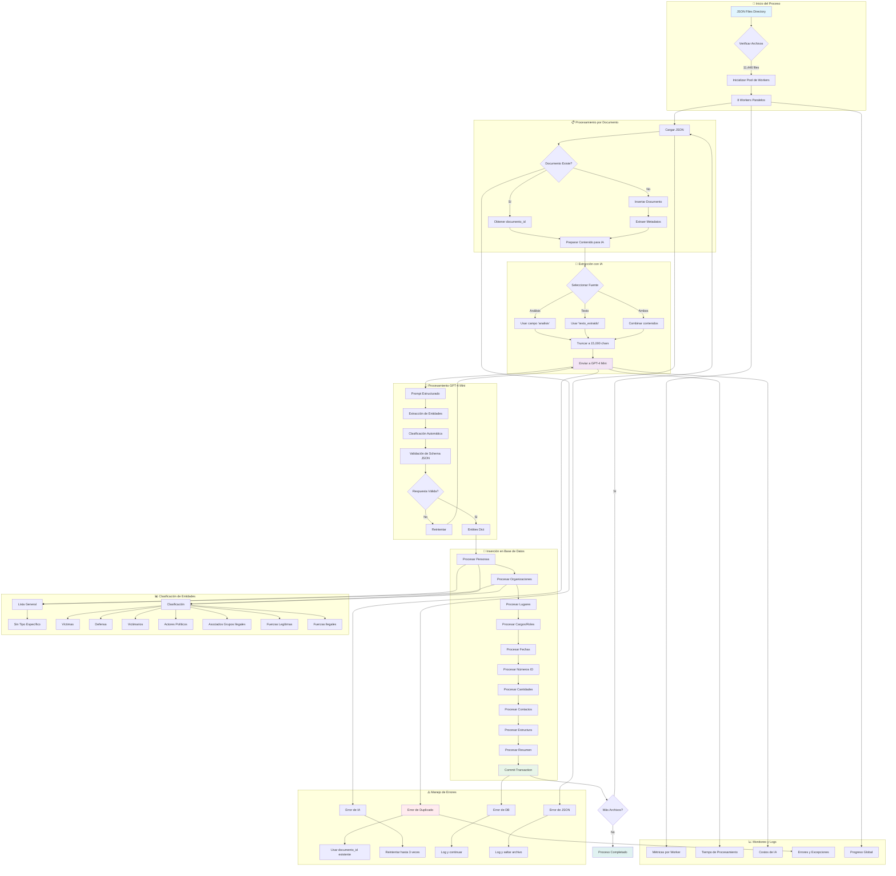

# FLUJO DE PROCESAMIENTO ETL

## Detalles del Flujo

### 1. Inicialización
- Escaneo de directorio `json_files/`
- Configuración de 8 workers paralelos
- Conexión a Azure OpenAI y PostgreSQL

### 2. Procesamiento por Worker
- Cada worker procesa archivos independientemente
- Manejo de concurrencia en base de datos
- Load balancing automático

### 3. Extracción de Entidades
- GPT-4 Mini con prompt estructurado
- Schema JSON predefinido
- Timeout de 30 segundos por request

### 4. Inserción Transaccional
- Una transacción por documento
- Rollback en caso de error crítico
- Commit solo si todo es exitoso

### 5. Monitoreo en Tiempo Real
- Logs detallados por worker
- Métricas de rendimiento
- Alertas de errores
