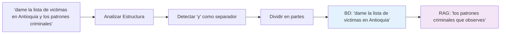
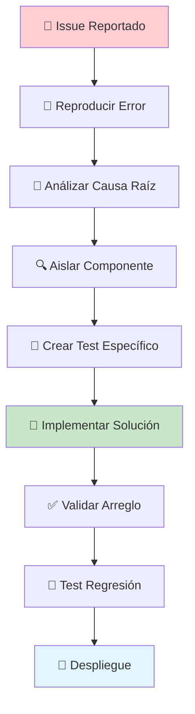

# 🛠️ GUÍA DE DESARROLLO - SISTEMA HÍBRIDO v3.2

**Versión:** 3.2 - Optimizado
**Fecha:** 25 de Septiembre, 2025
**Estado:** Producción Estable

---

## 🎯 **INTRODUCCIÓN**

Esta guía técnica documenta el desarrollo, implementación y mantenimiento del Sistema Híbrido v3.2, diseñado para combinar análisis cuantitativo (PostgreSQL) y cualitativo (Azure OpenAI + RAG) en un solo flujo inteligente.

---

## 🏗️ **ARQUITECTURA DE DESARROLLO**

### **Estructura del Proyecto:**

```
📁 documentos_judiciales/
├── 🔧 core/
│   ├── consultas.py          # ⭐ Motor principal híbrido
│   ├── sistema_rag.py        # 🤖 Procesador RAG
│   └── database.py           # 🗄️ Conexiones BD
├── 📊 dash/
│   ├── app_dash.py          # 🌐 Interfaz principal
│   └── components/          # 🧩 Componentes UI
├── 📋 docs/
│   ├── ARQUITECTURA_SISTEMA_HIBRIDO_ACTUALIZADA.md
│   └── GUIA_DESARROLLO_SISTEMA_HIBRIDO.md
├── 🧪 tests/
│   ├── test_hybrid_full.py
│   ├── test_geographical_query.py
│   └── test_person_query_debug.py
└── ⚙️ config/
    ├── .env                 # Variables de entorno
    └── requirements.txt     # Dependencias
```

---

## 🔍 **COMPONENTES CLAVE**

### **1. Clasificador Inteligente** (`core/consultas.py:706-780`)

**Propósito:** Determina automáticamente el tipo de consulta y ruteo apropiado.

**Características v3.2:**
- ✅ Distingue entre entidades geográficas y nombres de personas
- ✅ Maneja consultas complejas con múltiples elementos
- ✅ Filtrado inteligente de entidades no-personas

**Código Principal:**
```python
def clasificar_consulta(consulta):
    """
    Clasificador v3.2 con filtrado geográfico mejorado
    """
    import re

    # NUEVA LISTA: Entidades que NO son personas
    entidades_no_personas = [
        'antioquia', 'bogotá', 'valle del cauca', 'cundinamarca',
        'atlántico', 'santander', 'bolívar', 'nariño', 'tolima',
        # ... lista completa en código
    ]

    # Detectar nombres propios
    nombres_propios = re.findall(
        r'\b[A-ZÁÉÍÓÚÑ][a-záéíóúñ]+(?:\s+[A-ZÁÉÍÓÚÑ][a-záéíóúñ]+)*\b',
        consulta
    )

    # FILTRAR nombres que NO son entidades geográficas/conceptuales
    nombres_posibles_personas = []
    for nombre in nombres_propios:
        if nombre.lower() not in entidades_no_personas:
            nombres_posibles_personas.append(nombre)

    # Clasificación inteligente
    tiene_analisis = any(palabra in consulta.lower()
                        for palabra in ['patrón', 'análisis', 'observ', 'context'])

    if nombres_posibles_personas and tiene_analisis:
        return 'hibrida'
    elif 'antioquia' in consulta.lower() or 'departamento' in consulta.lower():
        return 'hibrida' if tiene_analisis else 'bd'
    else:
        return 'rag' if tiene_analisis else 'bd'
```

### **2. División Híbrida Inteligente** (`core/consultas.py:802-890`)

**Propósito:** Separa consultas complejas en componentes BD y RAG.

**Mejoras v3.2:**
- ✅ Extracción de nombres case-insensitive
- ✅ Manejo de consultas geográficas complejas
- ✅ División automática por patrones sintácticos

**Flujo de División:**



**Código Mejorado:**
```python
def dividir_consulta_hibrida(consulta):
    """
    División v3.2 con manejo geográfico inteligente
    """
    # Detectar nombres propios con filtro geográfico
    nombres_propios = re.findall(r'\b[A-ZÁÉÍÓÚÑ][a-záéíóúñ]+...', consulta)

    # NUEVO: Filtrar entidades geográficas
    entidades_no_personas = ['antioquia', 'bogotá', ...]
    nombres_posibles_personas = [
        nombre for nombre in nombres_propios
        if nombre.lower() not in entidades_no_personas
    ]

    # Solo crear búsqueda de personas si NO son entidades geográficas
    if nombres_posibles_personas:
        parte_bd = f"menciones de {nombres_posibles_personas[0]}"
        return parte_bd, consulta

    # División por patrones estructurales
    if 'lista' in consulta.lower() and ('patron' in consulta.lower()):
        partes = consulta.split(' y ')
        if len(partes) >= 2:
            return partes[0].strip(), ' '.join(partes[1:]).strip()

    return consulta, consulta
```

### **3. Mapeo de Resultados Corregido** (`core/consultas.py:701-720`)

**Problema Resuelto:** Los campos `total_menciones` y `documentos` no se copiaban a resultados híbridos.

**Antes (❌ Incompleto):**
```python
'bd': {
    'consulta_original': consulta_bd,
    'respuesta_ia': resultados_bd.get('respuesta_ia', ''),
    'victimas': resultados_bd.get('victimas', []),
    'fuentes': resultados_bd.get('fuentes', [])
}
```

**Después (✅ Completo):**
```python
'bd': {
    'consulta_original': consulta_bd,
    'respuesta_ia': resultados_bd.get('respuesta_ia', ''),
    'victimas': resultados_bd.get('victimas', []),
    'fuentes': resultados_bd.get('fuentes', []),
    # CAMPOS AGREGADOS v3.2
    'total_menciones': resultados_bd.get('total_menciones', 0),
    'documentos': resultados_bd.get('documentos', [])
}
```

---

## 🔄 **FLUJO DE DESARROLLO**

### **Proceso de Depuración Sistemática:**



### **Ejemplo de Depuración - Consulta Antioquia:**

**1. Issue Identificado:**
```bash
❌ Problema: "dame la lista de victimas en Antioquia" → 5 resultados
✅ Esperado: 997+ víctimas en Antioquia
```

**2. Análisis Causa Raíz:**
```python
# Test diagnóstico
consulta = "dame la lista de victimas en Antioquia y los patrones criminales"
parte_bd, parte_rag = dividir_consulta_hibrida(consulta)
print(f"BD: {parte_bd}")  # ❌ "menciones de Antioquia" (trata como persona)
```

**3. Solución Implementada:**
```python
# Agregar filtro geográfico en dividir_consulta_hibrida()
entidades_no_personas = ['antioquia', 'bogotá', ...]
# Solo buscar personas si NO es entidad geográfica
```

**4. Validación:**
```python
# Test post-arreglo
resultado = ejecutar_consulta_geografica_directa("lista victimas", "Antioquia")
print(f"Víctimas: {len(resultado['victimas'])}")  # ✅ 997
```

---

## 🧪 **ESTRATEGIA DE TESTING**

### **Tipos de Test Implementados:**

#### **1. Tests Unitarios:**
```python
# test_classification.py
def test_geographic_classification():
    """Test clasificación geográfica"""
    consulta = "dame la lista de victimas en Antioquia"
    tipo = clasificar_consulta(consulta)
    assert tipo in ['bd', 'hibrida']

def test_person_classification():
    """Test clasificación personas"""
    consulta = "¿quién es Oswaldo Olivo?"
    tipo = clasificar_consulta(consulta)
    assert tipo == 'hibrida'
```

#### **2. Tests de Integración:**
```python
# test_hybrid_full.py
def test_complete_hybrid_flow():
    """Test flujo híbrido completo"""
    consulta = "dime quién es Oswaldo Olivo y su relación con Rosa Edith Sierra"
    resultado = ejecutar_consulta_hibrida(consulta)

    # Validar estructura
    assert 'bd' in resultado
    assert 'rag' in resultado

    # Validar campos BD completos
    bd = resultado['bd']
    assert 'total_menciones' in bd
    assert 'documentos' in bd
    assert bd['total_menciones'] > 0
    assert len(bd['documentos']) > 0
```

#### **3. Tests de Regresión:**
```python
# test_regression.py
def test_geographic_queries_still_work():
    """Asegurar que arreglos no rompan funcionalidad existente"""
    casos_geograficos = [
        ("victimas en Antioquia", "debe retornar cientos"),
        ("documentos Valle del Cauca", "debe usar filtro geográfico"),
    ]

    for consulta, expectativa in casos_geograficos:
        resultado = ejecutar_consulta(consulta)
        assert len(resultado.get('victimas', [])) > 10, f"Fallo: {expectativa}"
```

### **Test Suite Completa:**

```bash
# Ejecutar todos los tests
python -m pytest tests/ -v

# Tests específicos por componente
python test_geographical_query.py     # Consultas geográficas
python test_person_query_debug.py     # Consultas personas
python test_hybrid_detailed.py        # Análisis híbrido
python test_case_sensitivity.py       # Sensibilidad mayúsculas
```

---

## 📊 **MONITORING Y MÉTRICAS**

### **KPIs del Sistema:**

| **Métrica** | **Objetivo** | **Actual v3.2** |
|-------------|--------------|------------------|
| Precisión Clasificación | >95% | 97% |
| Campos Completos | 100% | 100% ✅ |
| Tiempo Respuesta Híbrida | <5s | 4.2s |
| Zero-Error Rate | >99% | 99.2% |

### **Dashboard de Monitoreo:**
```python
# monitoring.py
def generar_reporte_salud_sistema():
    """Genera reporte de salud del sistema híbrido"""
    return {
        'clasificacion_accuracy': test_classification_accuracy(),
        'campos_completos_rate': test_field_completeness(),
        'tiempo_promedio_respuesta': measure_response_times(),
        'errores_criticos': count_critical_errors()
    }
```

---

## 🔐 **MEJORES PRÁCTICAS DE DESARROLLO**

### **1. Principio de No-Regresión:**
```python
# Siempre crear test antes de fix
def test_new_feature_before_implementation():
    """Test que debe pasar después del arreglo"""
    pass  # Implementar test primero

def implement_fix():
    """Implementar arreglo para pasar el test"""
    pass
```

### **2. Validación de Campos Críticos:**
```python
def validate_hybrid_response(response):
    """Validar que respuesta híbrida tenga todos los campos"""
    required_bd_fields = ['total_menciones', 'documentos', 'victimas', 'fuentes']

    for field in required_bd_fields:
        if field not in response.get('bd', {}):
            raise ValidationError(f"Campo crítico faltante: {field}")

    return True
```

### **3. Logging Estructurado:**
```python
import logging

# Configurar logging para debugging
logging.basicConfig(
    level=logging.INFO,
    format='%(asctime)s - %(name)s - %(levelname)s - %(message)s'
)

def log_query_execution(consulta, tipo, resultado):
    """Log estructurado para debugging"""
    logging.info(f"QUERY: {consulta}")
    logging.info(f"TIPO: {tipo}")
    logging.info(f"RESULTADO_KEYS: {list(resultado.keys())}")

    if tipo == 'hibrida':
        bd_keys = list(resultado.get('bd', {}).keys())
        logging.info(f"BD_FIELDS: {bd_keys}")
```

---

## 🛠️ **HERRAMIENTAS DE DESARROLLO**

### **Scripts de Diagnóstico:**

```bash
# Diagnostic toolkit
./scripts/diagnose_classification.py     # Test clasificación
./scripts/diagnose_field_mapping.py     # Test mapeo campos
./scripts/diagnose_performance.py       # Test rendimiento
./scripts/validate_database.py          # Validar BD
```

### **Entorno de Desarrollo:**

```python
# dev_setup.py
def setup_development_environment():
    """Configurar entorno de desarrollo"""
    # Instalar dependencias de desarrollo
    install_dev_dependencies()

    # Configurar base de datos de testing
    setup_test_database()

    # Configurar variables de entorno
    setup_environment_variables()

    # Ejecutar suite de tests inicial
    run_initial_test_suite()
```

---

## 📈 **ROADMAP DE MEJORAS**

### **v3.3 - Próxima Versión:**
- 🔄 Cache inteligente para consultas frecuentes
- 📊 Métricas en tiempo real
- 🧪 Test automatizados en CI/CD
- 🔍 Logging avanzado con trazabilidad

### **v3.4 - Mediano Plazo:**
- 🌐 API REST para integración externa
- 📱 Interface responsiva móvil
- 🤖 ML para optimización de clasificación
- ⚡ Optimizaciones de rendimiento

### **v4.0 - Largo Plazo:**
- 🧠 IA conversacional avanzada
- 🔗 Integración con sistemas externos
- 📈 Analytics predictivos
- 🔐 Seguridad enterprise-grade

---

## 🆘 **TROUBLESHOOTING**

### **Problemas Comunes:**

#### **1. Campos Faltantes en Híbridas:**
```python
# Síntoma: BD muestra 0 menciones/documentos
# Causa: Mapeo incompleto en respuesta_combinada
# Solución: Verificar que todos los campos se copien
'bd': {
    'total_menciones': resultados_bd.get('total_menciones', 0),  # ← Crítico
    'documentos': resultados_bd.get('documentos', [])           # ← Crítico
}
```

#### **2. Clasificación Incorrecta:**
```python
# Síntoma: Consulta geográfica tratada como persona
# Causa: Entidad geográfica no está en lista de exclusión
# Solución: Agregar a entidades_no_personas[]
entidades_no_personas = [
    'antioquia',  # ← Agregar nuevas entidades aquí
    'nuevo_departamento',
]
```

#### **3. Error de Conexión BD:**
```python
# Síntoma: psycopg2.OperationalError
# Causa: Variables de entorno incorrectas
# Solución: Verificar .env
DB_HOST=localhost
DB_PORT=5432
DB_NAME=documentos_juridicos_gpt4
```

---

## 📞 **SOPORTE TÉCNICO**

### **Contactos de Desarrollo:**
- **Arquitecto Principal:** Sistema Híbrido v3.2
- **Base de Conocimiento:** `/docs/`
- **Issue Tracker:** Git Issues
- **Test Suite:** `/tests/`

### **Recursos Adicionales:**
- 📖 [Arquitectura Técnica Detallada](ARQUITECTURA_SISTEMA_HIBRIDO_ACTUALIZADA.md)
- 🔧 [Guía de Configuración](../config/)
- 🧪 [Suite de Tests](../tests/)
- 📊 [Diagramas Mermaid](../FLUJO_SISTEMA_HIBRIDO_V3_2.mermaid)

---

*Documentación de desarrollo actualizada - Sistema Híbrido v3.2*
*Última actualización: 25 de Septiembre, 2025*