# MÓDULOS DE BÚSQUEDA Y ANÁLISIS

## 🔍 **Arquitectura de Búsqueda Multi-Modal**

```mermaid
graph TB
    subgraph "🎯 Interface de Consulta"
        A[Query Input] --> B{Query Parser}
        B --> C[Lexical Search]
        B --> D[Phonetic Search]
        B --> E[Semantic Search]
        B --> F[Structured Query]
    end
    
    subgraph "📝 Búsqueda Lexical"
        C --> G[LIKE Pattern Matching]
        C --> H[ILIKE Case Insensitive]
        C --> I[Regex Pattern Search]
        C --> J[Wildcard Search]
    end
    
    subgraph "🔊 Búsqueda Fonética"
        D --> K[SOUNDEX Algorithm]
        D --> L[METAPHONE Algorithm]
        D --> M[Levenshtein Distance]
        D --> N[Fuzzy Matching]
    end
    
    subgraph "🧠 Búsqueda Semántica"
        E --> O[Vector Embeddings]
        E --> P[Cosine Similarity]
        E --> Q[Neural Search]
        E --> R[Context Aware]
    end
    
    subgraph "📊 Consulta Estructurada"
        F --> S[SQL Builder]
        F --> T[Filter Chains]
        F --> U[Aggregations]
        F --> V[Joins Optimized]
    end
    
    subgraph "🔄 Resultado Fusion"
        W[Score Fusion] --> X[Ranking Algorithm]
        X --> Y[Deduplication]
        Y --> Z[Final Results]
    end
    
    %% Conexiones hacia fusión
    G --> W
    K --> W
    O --> W
    S --> W
    
    style A fill:#e1f5fe
    style W fill:#f3e5f5
    style Z fill:#e8f5e8
```



## 📋 **Módulos Implementados**

### 1. **Búsqueda Lexical Avanzada**

```sql
-- consultas_busqueda_palabras.sql

-- 1. Búsqueda exacta con variaciones de case
CREATE OR REPLACE FUNCTION busqueda_exacta(termino TEXT)
RETURNS TABLE(
    tipo_entidad TEXT,
    nombre TEXT,
    documento_archivo TEXT,
    relevancia INTEGER
) AS $$
BEGIN
    RETURN QUERY
    SELECT 'persona' as tipo_entidad, p.nombre, d.archivo, 100 as relevancia
    FROM personas p
    JOIN documentos d ON p.documento_id = d.id
    WHERE LOWER(p.nombre) = LOWER(termino)
    
    UNION ALL
    
    SELECT 'organizacion' as tipo_entidad, o.nombre, d.archivo, 100 as relevancia
    FROM organizaciones o
    JOIN documentos d ON o.documento_id = d.id
    WHERE LOWER(o.nombre) = LOWER(termino);
END;
$$ LANGUAGE plpgsql;

-- 2. Búsqueda con tolerancia a errores tipográficos
CREATE OR REPLACE FUNCTION busqueda_fuzzy(termino TEXT, max_distancia INTEGER DEFAULT 2)
RETURNS TABLE(
    tipo_entidad TEXT,
    nombre TEXT,
    documento_archivo TEXT,
    distancia INTEGER,
    relevancia INTEGER
) AS $$
BEGIN
    RETURN QUERY
    SELECT 'persona' as tipo_entidad, 
           p.nombre, 
           d.archivo,
           LEVENSHTEIN(LOWER(p.nombre), LOWER(termino)) as distancia,
           (100 - LEVENSHTEIN(LOWER(p.nombre), LOWER(termino)) * 10) as relevancia
    FROM personas p
    JOIN documentos d ON p.documento_id = d.id
    WHERE LEVENSHTEIN(LOWER(p.nombre), LOWER(termino)) <= max_distancia
    
    UNION ALL
    
    SELECT 'organizacion' as tipo_entidad,
           o.nombre,
           d.archivo,
           LEVENSHTEIN(LOWER(o.nombre), LOWER(termino)) as distancia,
           (100 - LEVENSHTEIN(LOWER(o.nombre), LOWER(termino)) * 10) as relevancia
    FROM organizaciones o
    JOIN documentos d ON o.documento_id = d.id
    WHERE LEVENSHTEIN(LOWER(o.nombre), LOWER(termino)) <= max_distancia
    
    ORDER BY distancia ASC, relevancia DESC;
END;
$$ LANGUAGE plpgsql;

-- 3. Búsqueda por patrones complejos
CREATE OR REPLACE FUNCTION busqueda_patron(patron TEXT)
RETURNS TABLE(
    tipo_entidad TEXT,
    nombre TEXT,
    documento_archivo TEXT,
    match_type TEXT
) AS $$
BEGIN
    RETURN QUERY
    -- Búsqueda con wildcards
    SELECT 'persona' as tipo_entidad, p.nombre, d.archivo, 'wildcard' as match_type
    FROM personas p
    JOIN documentos d ON p.documento_id = d.id
    WHERE p.nombre ILIKE patron
    
    UNION ALL
    
    -- Búsqueda regex
    SELECT 'persona' as tipo_entidad, p.nombre, d.archivo, 'regex' as match_type
    FROM personas p
    JOIN documentos d ON p.documento_id = d.id
    WHERE p.nombre ~* patron;
END;
$$ LANGUAGE plpgsql;
```

### 2. **Búsqueda Fonética Avanzada**

```sql
-- Extension para algoritmos fonéticos
CREATE EXTENSION IF NOT EXISTS fuzzystrmatch;

-- 1. Búsqueda SOUNDEX (inglés optimizado)
CREATE OR REPLACE FUNCTION busqueda_soundex(termino TEXT)
RETURNS TABLE(
    tipo_entidad TEXT,
    nombre TEXT,
    documento_archivo TEXT,
    soundex_code TEXT,
    relevancia INTEGER
) AS $$
BEGIN
    RETURN QUERY
    SELECT 'persona' as tipo_entidad,
           p.nombre,
           d.archivo,
           SOUNDEX(p.nombre) as soundex_code,
           95 as relevancia
    FROM personas p
    JOIN documentos d ON p.documento_id = d.id
    WHERE SOUNDEX(p.nombre) = SOUNDEX(termino);
END;
$$ LANGUAGE plpgsql;

-- 2. Búsqueda METAPHONE (mejor para español)
CREATE OR REPLACE FUNCTION busqueda_metaphone(termino TEXT)
RETURNS TABLE(
    tipo_entidad TEXT,
    nombre TEXT,
    documento_archivo TEXT,
    metaphone_code TEXT,
    relevancia INTEGER
) AS $$
BEGIN
    RETURN QUERY
    SELECT 'persona' as tipo_entidad,
           p.nombre,
           d.archivo,
           METAPHONE(p.nombre, 4) as metaphone_code,
           90 as relevancia
    FROM personas p
    JOIN documentos d ON p.documento_id = d.id
    WHERE METAPHONE(p.nombre, 4) = METAPHONE(termino, 4);
END;
$$ LANGUAGE plpgsql;

-- 3. Búsqueda fonética híbrida con scoring
CREATE OR REPLACE FUNCTION busqueda_fonetica_hibrida(termino TEXT)
RETURNS TABLE(
    tipo_entidad TEXT,
    nombre TEXT,
    documento_archivo TEXT,
    algoritmo TEXT,
    score NUMERIC
) AS $$
BEGIN
    RETURN QUERY
    WITH soundex_results AS (
        SELECT 'persona' as tipo_entidad, p.nombre, d.archivo, 'soundex' as algoritmo, 0.8 as score
        FROM personas p JOIN documentos d ON p.documento_id = d.id
        WHERE SOUNDEX(p.nombre) = SOUNDEX(termino)
    ),
    metaphone_results AS (
        SELECT 'persona' as tipo_entidad, p.nombre, d.archivo, 'metaphone' as algoritmo, 0.9 as score
        FROM personas p JOIN documentos d ON p.documento_id = d.id
        WHERE METAPHONE(p.nombre, 4) = METAPHONE(termino, 4)
    ),
    levenshtein_results AS (
        SELECT 'persona' as tipo_entidad, p.nombre, d.archivo, 'levenshtein' as algoritmo,
               (1.0 - LEVENSHTEIN(LOWER(p.nombre), LOWER(termino))::NUMERIC / GREATEST(LENGTH(p.nombre), LENGTH(termino))) as score
        FROM personas p JOIN documentos d ON p.documento_id = d.id
        WHERE LEVENSHTEIN(LOWER(p.nombre), LOWER(termino)) <= 3
    )
    SELECT * FROM soundex_results
    UNION ALL
    SELECT * FROM metaphone_results
    UNION ALL
    SELECT * FROM levenshtein_results
    ORDER BY score DESC;
END;
$$ LANGUAGE plpgsql;
```

### 3. **Full-Text Search Avanzado**

```sql
-- consultas_busqueda_lenguaje_natural.sql

-- 1. Configuración de diccionario español
CREATE TEXT SEARCH CONFIGURATION es (COPY = spanish);

-- 2. Índices de texto completo
CREATE INDEX idx_documentos_analisis_fts ON documentos USING gin(to_tsvector('es', analisis));
CREATE INDEX idx_documentos_texto_fts ON documentos USING gin(to_tsvector('es', texto_extraido));

-- 3. Búsqueda de texto completo con ranking
CREATE OR REPLACE FUNCTION busqueda_texto_completo(consulta TEXT)
RETURNS TABLE(
    documento_id INTEGER,
    archivo TEXT,
    snippet TEXT,
    rank_score REAL
) AS $$
BEGIN
    RETURN QUERY
    SELECT d.id as documento_id,
           d.archivo,
           ts_headline('es', d.analisis, plainto_tsquery('es', consulta), 'MaxWords=50') as snippet,
           ts_rank(to_tsvector('es', d.analisis), plainto_tsquery('es', consulta)) as rank_score
    FROM documentos d
    WHERE to_tsvector('es', d.analisis) @@ plainto_tsquery('es', consulta)
    
    UNION ALL
    
    SELECT d.id as documento_id,
           d.archivo,
           ts_headline('es', d.texto_extraido, plainto_tsquery('es', consulta), 'MaxWords=50') as snippet,
           ts_rank(to_tsvector('es', d.texto_extraido), plainto_tsquery('es', consulta)) as rank_score
    FROM documentos d
    WHERE to_tsvector('es', d.texto_extraido) @@ plainto_tsquery('es', consulta)
    
    ORDER BY rank_score DESC;
END;
$$ LANGUAGE plpgsql;

-- 4. Búsqueda semántica por conceptos
CREATE OR REPLACE FUNCTION busqueda_conceptual(concepto TEXT)
RETURNS TABLE(
    entidad_tipo TEXT,
    entidad_nombre TEXT,
    contexto TEXT,
    relevancia INTEGER
) AS $$
BEGIN
    RETURN QUERY
    -- Búsqueda en personas por contexto
    SELECT 'persona' as entidad_tipo,
           p.nombre as entidad_nombre,
           COALESCE(p.descripcion, p.tipo, 'Sin contexto') as contexto,
           CASE 
               WHEN p.tipo ILIKE '%' || concepto || '%' THEN 90
               WHEN p.descripcion ILIKE '%' || concepto || '%' THEN 80
               ELSE 50
           END as relevancia
    FROM personas p
    WHERE p.tipo ILIKE '%' || concepto || '%' 
       OR p.descripcion ILIKE '%' || concepto || '%'
    
    UNION ALL
    
    -- Búsqueda en organizaciones
    SELECT 'organizacion' as entidad_tipo,
           o.nombre as entidad_nombre,
           COALESCE(o.descripcion, o.tipo, 'Sin contexto') as contexto,
           CASE 
               WHEN o.tipo ILIKE '%' || concepto || '%' THEN 90
               WHEN o.descripcion ILIKE '%' || concepto || '%' THEN 80
               ELSE 50
           END as relevancia
    FROM organizaciones o
    WHERE o.tipo ILIKE '%' || concepto || '%' 
       OR o.descripcion ILIKE '%' || concepto || '%'
    
    ORDER BY relevancia DESC;
END;
$$ LANGUAGE plpgsql;
```

### 4. **Análisis de Redes y Conexiones**

```sql
-- consultas_redes_temporal_geografico.sql

-- 1. Red de co-ocurrencia de personas
CREATE OR REPLACE VIEW red_personas AS
SELECT 
    p1.nombre as persona1,
    p2.nombre as persona2,
    COUNT(DISTINCT p1.documento_id) as documentos_compartidos,
    ARRAY_AGG(DISTINCT d.archivo) as documentos_lista,
    AVG(EXTRACT(YEAR FROM d.procesado)) as periodo_promedio
FROM personas p1
JOIN personas p2 ON p1.documento_id = p2.documento_id AND p1.id < p2.id
JOIN documentos d ON p1.documento_id = d.id
GROUP BY p1.nombre, p2.nombre
HAVING COUNT(DISTINCT p1.documento_id) > 1
ORDER BY documentos_compartidos DESC;

-- 2. Análisis de centralidad en la red
CREATE OR REPLACE FUNCTION centralidad_personas(min_conexiones INTEGER DEFAULT 3)
RETURNS TABLE(
    persona TEXT,
    grado_centralidad INTEGER,
    betweenness_score NUMERIC,
    documentos_totales INTEGER
) AS $$
BEGIN
    RETURN QUERY
    WITH conexiones AS (
        SELECT persona1 as persona, COUNT(*) as conexiones
        FROM red_personas 
        WHERE documentos_compartidos >= min_conexiones
        GROUP BY persona1
        
        UNION ALL
        
        SELECT persona2 as persona, COUNT(*) as conexiones
        FROM red_personas 
        WHERE documentos_compartidos >= min_conexiones
        GROUP BY persona2
    ),
    centralidad_grado AS (
        SELECT persona, SUM(conexiones) as grado_centralidad
        FROM conexiones
        GROUP BY persona
    )
    SELECT 
        cg.persona,
        cg.grado_centralidad,
        (cg.grado_centralidad::NUMERIC / (SELECT COUNT(DISTINCT nombre) FROM personas)) as betweenness_score,
        COUNT(DISTINCT p.documento_id) as documentos_totales
    FROM centralidad_grado cg
    JOIN personas p ON cg.persona = p.nombre
    GROUP BY cg.persona, cg.grado_centralidad
    ORDER BY grado_centralidad DESC;
END;
$$ LANGUAGE plpgsql;

-- 3. Análisis temporal de actividad
CREATE OR REPLACE FUNCTION analisis_temporal_entidad(entidad_nombre TEXT, entidad_tipo TEXT DEFAULT 'persona')
RETURNS TABLE(
    periodo TEXT,
    documentos_count INTEGER,
    actividad_score NUMERIC,
    contexto_principal TEXT
) AS $$
BEGIN
    IF entidad_tipo = 'persona' THEN
        RETURN QUERY
        SELECT 
            TO_CHAR(DATE_TRUNC('quarter', d.procesado), 'YYYY-Q') as periodo,
            COUNT(*)::INTEGER as documentos_count,
            (COUNT(*)::NUMERIC / (SELECT COUNT(*) FROM personas WHERE nombre = entidad_nombre)) as actividad_score,
            MODE() WITHIN GROUP (ORDER BY p.tipo) as contexto_principal
        FROM personas p
        JOIN documentos d ON p.documento_id = d.id
        WHERE p.nombre = entidad_nombre
        GROUP BY DATE_TRUNC('quarter', d.procesado)
        ORDER BY periodo;
    ELSE
        RETURN QUERY
        SELECT 
            TO_CHAR(DATE_TRUNC('quarter', d.procesado), 'YYYY-Q') as periodo,
            COUNT(*)::INTEGER as documentos_count,
            (COUNT(*)::NUMERIC / (SELECT COUNT(*) FROM organizaciones WHERE nombre = entidad_nombre)) as actividad_score,
            MODE() WITHIN GROUP (ORDER BY o.tipo) as contexto_principal
        FROM organizaciones o
        JOIN documentos d ON o.documento_id = d.id
        WHERE o.nombre = entidad_nombre
        GROUP BY DATE_TRUNC('quarter', d.procesado)
        ORDER BY periodo;
    END IF;
END;
$$ LANGUAGE plpgsql;
```

### 5. **Búsqueda Geográfica Avanzada**

```sql
-- 4. Análisis geográfico por entidades
CREATE OR REPLACE FUNCTION analisis_geografico_entidades()
RETURNS TABLE(
    departamento TEXT,
    municipio TEXT,
    personas_count INTEGER,
    organizaciones_count INTEGER,
    documentos_count INTEGER,
    densidad_score NUMERIC
) AS $$
BEGIN
    RETURN QUERY
    WITH datos_geograficos AS (
        SELECT 
            l.departamento,
            l.municipio,
            l.documento_id,
            (SELECT COUNT(*) FROM personas p WHERE p.documento_id = l.documento_id) as personas_doc,
            (SELECT COUNT(*) FROM organizaciones o WHERE o.documento_id = l.documento_id) as orgs_doc
        FROM analisis_lugares l
        WHERE l.departamento IS NOT NULL AND l.municipio IS NOT NULL
    )
    SELECT 
        dg.departamento,
        dg.municipio,
        SUM(dg.personas_doc)::INTEGER as personas_count,
        SUM(dg.orgs_doc)::INTEGER as organizaciones_count,
        COUNT(DISTINCT dg.documento_id)::INTEGER as documentos_count,
        (SUM(dg.personas_doc + dg.orgs_doc)::NUMERIC / COUNT(DISTINCT dg.documento_id)) as densidad_score
    FROM datos_geograficos dg
    GROUP BY dg.departamento, dg.municipio
    HAVING COUNT(DISTINCT dg.documento_id) > 1
    ORDER BY densidad_score DESC;
END;
$$ LANGUAGE plpgsql;
```

## 🎯 **Sistema de Scoring Unificado**

```sql
-- Función maestra que combina todos los tipos de búsqueda
CREATE OR REPLACE FUNCTION busqueda_unificada(
    termino TEXT,
    tipo_busqueda TEXT DEFAULT 'all', -- 'lexical', 'phonetic', 'semantic', 'all'
    limite INTEGER DEFAULT 50
)
RETURNS TABLE(
    entidad_tipo TEXT,
    entidad_nombre TEXT,
    documento_archivo TEXT,
    algoritmo_usado TEXT,
    score_final NUMERIC,
    snippet TEXT
) AS $$
BEGIN
    RETURN QUERY
    WITH resultados_combinados AS (
        -- Búsqueda exacta (peso máximo)
        SELECT 'persona' as entidad_tipo, p.nombre, d.archivo, 'exact' as algoritmo, 1.0 as score,
               SUBSTRING(d.analisis, 1, 100) as snippet
        FROM personas p JOIN documentos d ON p.documento_id = d.id
        WHERE LOWER(p.nombre) = LOWER(termino) AND tipo_busqueda IN ('lexical', 'all')
        
        UNION ALL
        
        -- Búsqueda fonética (peso alto)
        SELECT 'persona' as entidad_tipo, p.nombre, d.archivo, 'phonetic' as algoritmo, 0.85 as score,
               SUBSTRING(d.analisis, 1, 100) as snippet
        FROM personas p JOIN documentos d ON p.documento_id = d.id
        WHERE SOUNDEX(p.nombre) = SOUNDEX(termino) AND tipo_busqueda IN ('phonetic', 'all')
        
        UNION ALL
        
        -- Búsqueda fuzzy (peso medio)
        SELECT 'persona' as entidad_tipo, p.nombre, d.archivo, 'fuzzy' as algoritmo,
               (1.0 - LEVENSHTEIN(LOWER(p.nombre), LOWER(termino))::NUMERIC / GREATEST(LENGTH(p.nombre), LENGTH(termino))) as score,
               SUBSTRING(d.analisis, 1, 100) as snippet
        FROM personas p JOIN documentos d ON p.documento_id = d.id
        WHERE LEVENSHTEIN(LOWER(p.nombre), LOWER(termino)) <= 2 AND tipo_busqueda IN ('lexical', 'all')
        
        UNION ALL
        
        -- Búsqueda semántica por tipo (peso medio-bajo)
        SELECT 'persona' as entidad_tipo, p.nombre, d.archivo, 'semantic' as algoritmo, 0.7 as score,
               COALESCE(p.descripcion, 'Sin descripción') as snippet
        FROM personas p JOIN documentos d ON p.documento_id = d.id
        WHERE p.tipo ILIKE '%' || termino || '%' AND tipo_busqueda IN ('semantic', 'all')
    )
    SELECT DISTINCT
        rc.entidad_tipo,
        rc.entidad_nombre,
        rc.documento_archivo,
        rc.algoritmo_usado,
        MAX(rc.score) as score_final,
        FIRST_VALUE(rc.snippet) OVER (PARTITION BY rc.entidad_nombre ORDER BY rc.score DESC) as snippet
    FROM resultados_combinados rc
    GROUP BY rc.entidad_tipo, rc.entidad_nombre, rc.documento_archivo, rc.algoritmo_usado, rc.snippet
    ORDER BY score_final DESC, entidad_nombre
    LIMIT limite;
END;
$$ LANGUAGE plpgsql;
```

## 📊 **Interface de Consulta Python**

```python
# search_interface.py
class SearchManager:
    """
    Interface unificada para todos los tipos de búsqueda
    """
    
    def __init__(self, db_connection):
        self.db = db_connection
        
    async def search(self, query: str, search_type: str = "all", limit: int = 50) -> List[Dict]:
        """
        Búsqueda unificada con scoring combinado
        """
        sql = """
        SELECT * FROM busqueda_unificada(%s, %s, %s)
        """
        
        results = await self.db.fetch(sql, query, search_type, limit)
        
        return [
            {
                "entity_type": row["entidad_tipo"],
                "entity_name": row["entidad_nombre"], 
                "document": row["documento_archivo"],
                "algorithm": row["algoritmo_usado"],
                "score": float(row["score_final"]),
                "snippet": row["snippet"]
            }
            for row in results
        ]
    
    async def network_analysis(self, entity_name: str) -> Dict:
        """
        Análisis de red para una entidad específica
        """
        connections_sql = """
        SELECT persona2 as connected_entity, documentos_compartidos as strength
        FROM red_personas 
        WHERE persona1 = %s
        UNION
        SELECT persona1 as connected_entity, documentos_compartidos as strength
        FROM red_personas 
        WHERE persona2 = %s
        ORDER BY strength DESC
        """
        
        centrality_sql = """
        SELECT grado_centralidad, betweenness_score, documentos_totales
        FROM centralidad_personas()
        WHERE persona = %s
        """
        
        connections = await self.db.fetch(connections_sql, entity_name, entity_name)
        centrality = await self.db.fetchrow(centrality_sql, entity_name)
        
        return {
            "entity": entity_name,
            "connections": [dict(conn) for conn in connections],
            "centrality_metrics": dict(centrality) if centrality else None
        }
```
