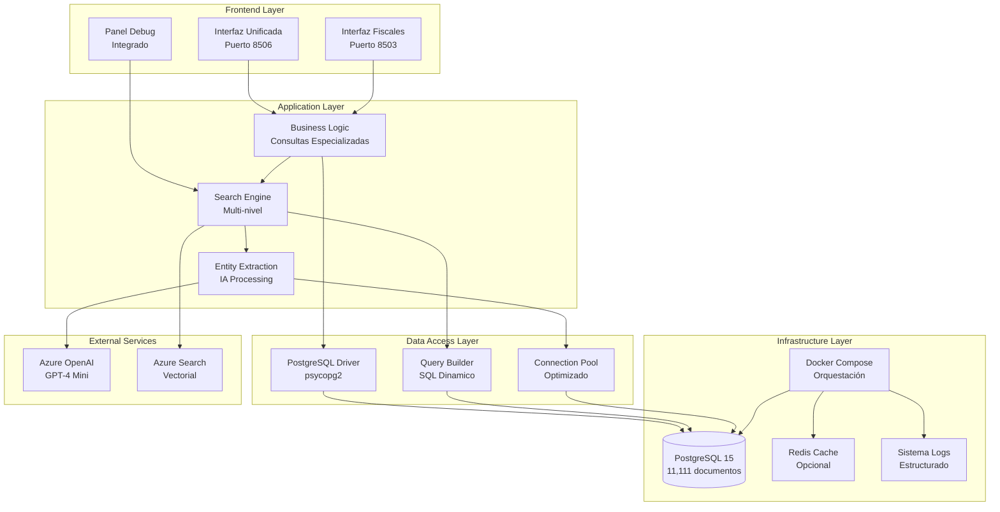
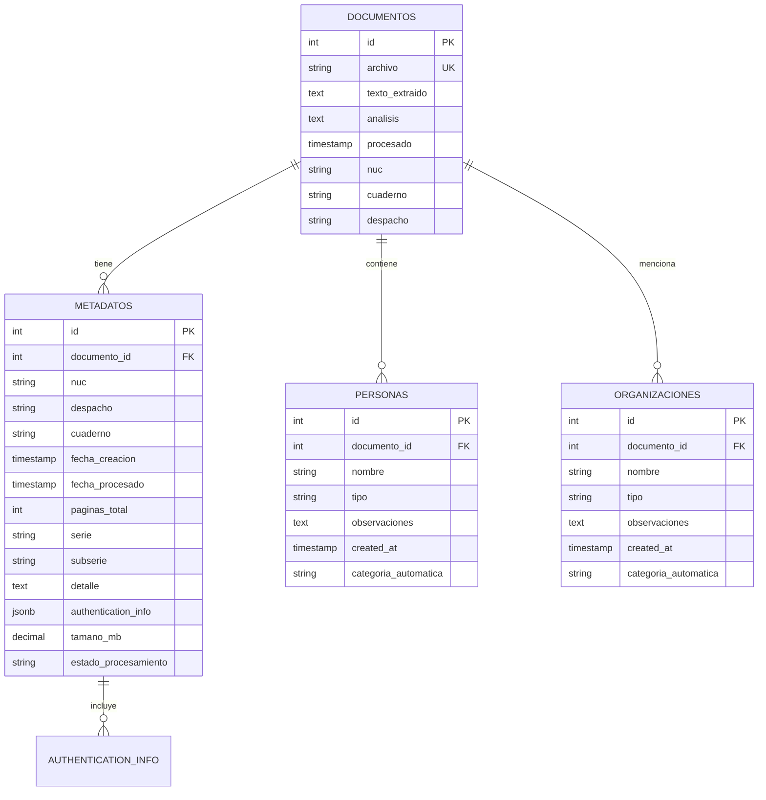

# Arquitectura Técnica del Sistema de Documentos Jurídicos

## 🏗️ Visión General de la Arquitectura

El Sistema de Documentos Jurídicos está construido con una arquitectura moderna de capas que separa claramente las responsabilidades y permite escalabilidad horizontal. La arquitectura sigue los principios de **Domain-Driven Design (DDD)** y **Clean Architecture**.

## 📊 Diagrama de Arquitectura General



## 🎯 Capas de la Arquitectura

### 1. **Frontend Layer (Presentación)**

#### Interfaz Unificada (`interfaz_unificada_mockup.py`)
- **Responsabilidad**: Navegación jerárquica Names → Documents → Analysis
- **Tecnología**: Streamlit con componentes personalizados
- **Características**:
  - Layout 60/40 (lista/contenido)
  - Renderizado Markdown nativo
  - Sistema de highlighting inteligente
  - Paginación flexible (50-500 elementos)

```python
# Estructura de componentes principales
def panel_navegacion():
    """Panel izquierdo - Lista de nombres/documentos"""
    
def panel_contenido():
    """Panel derecho - Análisis y texto detallado"""
    
def mostrar_lista_resultados():
    """Sistema de paginación y búsqueda"""
    
def aplicar_highlighting(texto, nombre):
    """Sistema de resaltado inteligente"""
```

#### Interfaz Fiscales (`interfaz_fiscales.py`)
- **Responsabilidad**: Consultas especializadas y análisis avanzado
- **Características**:
  - 12+ tipos de consultas predefinidas
  - Clasificación automática de entidades
  - Exportación de resultados
  - Dashboard de métricas

### 2. **Application Layer (Lógica de Negocio)**

#### Motor de Consultas Especializadas
```python
class ConsultasEspecializadas:
    """Maneja consultas específicas del dominio jurídico"""
    
    def detectar_tipo_consulta(self, texto: str) -> str:
        """Clasifica automáticamente el tipo de consulta"""
        
    def ejecutar_consulta_victimas(self) -> List[Dict]:
        """Consultas especializadas para víctimas"""
        
    def ejecutar_consulta_responsables(self) -> List[Dict]:
        """Consultas especializadas para responsables"""
        
    def clasificar_crimenes_lesa_humanidad(self) -> List[Dict]:
        """Clasificación automática de crímenes"""
```

#### Motor de Búsqueda Multi-nivel
```python
class BusquedaMultinivel:
    """Implementa estrategia de búsqueda con fallback"""
    
    def buscar_exacta(self, nombre: str) -> List[Dict]:
        """Nivel 1: Búsqueda exacta"""
        
    def buscar_parcial(self, nombre: str) -> List[Dict]:
        """Nivel 2: Búsqueda con ILIKE"""
        
    def buscar_por_palabras(self, nombre: str) -> List[Dict]:
        """Nivel 3: Búsqueda por palabras individuales"""
        
    def limpiar_nombre(self, nombre: str) -> str:
        """Elimina prefijos artificiales"""
```

#### Procesador de Entidades
```python
class ExtractorEntidades:
    """Extrae y clasifica entidades de documentos"""
    
    def extraer_personas(self, texto: str) -> List[Persona]:
        """Extrae personas del texto"""
        
    def clasificar_tipo_persona(self, persona: str) -> TipoPersona:
        """Clasifica: víctima, responsable, defensa, etc."""
        
    def extraer_organizaciones(self, texto: str) -> List[Organizacion]:
        """Extrae organizaciones del texto"""
```

### 3. **Data Access Layer (Acceso a Datos)**

#### Gestor de Base de Datos
```python
class DatabaseManager:
    """Maneja todas las operaciones de base de datos"""
    
    def __init__(self):
        self.connection_pool = self._create_pool()
    
    def ejecutar_consulta(self, sql: str, params: List) -> List[Dict]:
        """Ejecuta consulta con parámetros seguros"""
        
    def obtener_documentos_por_nombre(self, nombre: str) -> List[Dict]:
        """Búsqueda optimizada de documentos"""
        
    def obtener_estadisticas(self) -> Dict[str, int]:
        """Métricas del sistema en tiempo real"""
```

#### Constructor de Consultas Dinámicas
```python
class QueryBuilder:
    """Construye consultas SQL dinámicamente"""
    
    def consulta_victimas(self, filtros: Dict) -> Tuple[str, List]:
        """Construye consulta específica para víctimas"""
        
    def consulta_responsables(self, filtros: Dict) -> Tuple[str, List]:
        """Construye consulta específica para responsables"""
        
    def consulta_con_filtros(self, tabla: str, filtros: Dict) -> str:
        """Constructor genérico con filtros"""
```

### 4. **Infrastructure Layer (Infraestructura)**

#### Base de Datos PostgreSQL
```sql
-- Configuración optimizada para el dominio
CREATE DATABASE documentos_juridicos_gpt4 
WITH 
    ENCODING = 'UTF8'
    LC_COLLATE = 'es_ES.UTF-8'
    LC_CTYPE = 'es_ES.UTF-8'
    TEMPLATE = template0;

-- Extensiones especializadas
CREATE EXTENSION IF NOT EXISTS "uuid-ossp";
CREATE EXTENSION IF NOT EXISTS "pg_trgm";  -- Para búsqueda fuzzy
CREATE EXTENSION IF NOT EXISTS "unaccent"; -- Para normalización de texto
```

#### Sistema de Logs Estructurado
```python
import structlog

# Configuración de logs estructurados
structlog.configure(
    processors=[
        structlog.stdlib.filter_by_level,
        structlog.stdlib.add_logger_name,
        structlog.stdlib.add_log_level,
        structlog.stdlib.PositionalArgumentsFormatter(),
        structlog.processors.TimeStamper(fmt="iso"),
        structlog.processors.StackInfoRenderer(),
        structlog.processors.format_exc_info,
        structlog.processors.UnicodeDecoder(),
        structlog.processors.JSONRenderer()
    ],
    context_class=dict,
    logger_factory=structlog.stdlib.LoggerFactory(),
    wrapper_class=structlog.stdlib.BoundLogger,
    cache_logger_on_first_use=True,
)

# Uso en código
logger = structlog.get_logger()
logger.info(
    "consulta_ejecutada",
    tipo="listado_victimas",
    resultados=2561,
    tiempo_ms=85,
    usuario="sistema"
)
```

## 🔍 Patrones de Diseño Implementados

### 1. **Repository Pattern**
```python
class DocumentoRepository:
    """Abstrae el acceso a datos de documentos"""
    
    def buscar_por_nombre(self, nombre: str) -> List[Documento]:
        """Implementa búsqueda multi-nivel"""
        
    def obtener_por_id(self, id: int) -> Optional[Documento]:
        """Obtiene documento específico"""
        
    def contar_total(self) -> int:
        """Cuenta total de documentos"""

class PersonaRepository:
    """Abstrae el acceso a datos de personas"""
    
    def buscar_victimas(self, filtros: Dict) -> List[Persona]:
        """Búsqueda especializada de víctimas"""
        
    def clasificar_por_tipo(self) -> Dict[str, int]:
        """Clasificación automática por tipo"""
```

### 2. **Strategy Pattern**
```python
class EstrategiaBusqueda(ABC):
    """Interfaz para estrategias de búsqueda"""
    
    @abstractmethod
    def buscar(self, termino: str) -> List[Dict]:
        pass

class BusquedaExacta(EstrategiaBusqueda):
    def buscar(self, termino: str) -> List[Dict]:
        return self.db.buscar_exacto(termino)

class BusquedaParcial(EstrategiaBusqueda):
    def buscar(self, termino: str) -> List[Dict]:
        return self.db.buscar_parcial(termino)

class BusquedaPorPalabras(EstrategiaBusqueda):
    def buscar(self, termino: str) -> List[Dict]:
        return self.db.buscar_palabras(termino)
```

### 3. **Factory Pattern**
```python
class ConsultaFactory:
    """Crea consultas especializadas según el tipo"""
    
    @staticmethod
    def crear_consulta(tipo: str, parametros: Dict) -> ConsultaBase:
        if tipo == "victimas":
            return ConsultaVictimas(parametros)
        elif tipo == "responsables":
            return ConsultaResponsables(parametros)
        elif tipo == "crimenes_lesa_humanidad":
            return ConsultaCrimenes(parametros)
        else:
            return ConsultaGenerica(parametros)
```

### 4. **Observer Pattern**
```python
class EventoSistema:
    """Sistema de eventos para monitoreo"""
    
    def __init__(self):
        self._observers = []
    
    def agregar_observer(self, observer):
        self._observers.append(observer)
    
    def notificar_consulta(self, evento: Dict):
        for observer in self._observers:
            observer.procesar_evento(evento)

class MonitorPerformance:
    """Observer para métricas de performance"""
    
    def procesar_evento(self, evento: Dict):
        if evento['tipo'] == 'consulta_completada':
            self.registrar_metrica(evento['tiempo'], evento['resultados'])
```

## 🗄️ Esquema de Base de Datos Detallado

### Diagrama Entidad-Relación



### Índices Optimizados para Performance

```sql
-- Índices de texto completo para búsqueda
CREATE INDEX idx_personas_nombre_gin 
ON personas USING gin(to_tsvector('spanish', nombre));

CREATE INDEX idx_documentos_texto_gin 
ON documentos USING gin(to_tsvector('spanish', texto_extraido));

-- Índices para búsqueda exacta y parcial
CREATE INDEX idx_personas_nombre_btree ON personas(nombre);
CREATE INDEX idx_personas_nombre_lower ON personas(lower(nombre));
CREATE INDEX idx_personas_nombre_trigram ON personas USING gin(nombre gin_trgm_ops);

-- Índices compuestos para consultas frecuentes
CREATE INDEX idx_personas_tipo_documento ON personas(tipo, documento_id);
CREATE INDEX idx_metadatos_nuc_despacho ON metadatos(nuc, despacho);
CREATE INDEX idx_documentos_procesado_desc ON documentos(procesado DESC);

-- Índices para análisis estadístico
CREATE INDEX idx_personas_tipo_created ON personas(tipo, created_at);
CREATE INDEX idx_metadatos_fecha_despacho ON metadatos(fecha_creacion, despacho);
```

### Funciones Especializadas

```sql
-- Función para búsqueda fuzzy tolerante a errores
CREATE OR REPLACE FUNCTION buscar_nombre_fuzzy(
    termino TEXT,
    limite INTEGER DEFAULT 100,
    umbral REAL DEFAULT 0.3
) RETURNS TABLE(
    id INTEGER,
    nombre TEXT,
    tipo TEXT,
    similitud REAL
) AS $$
BEGIN
    RETURN QUERY
    SELECT 
        p.id,
        p.nombre,
        p.tipo,
        similarity(p.nombre, termino) as similitud
    FROM personas p
    WHERE similarity(p.nombre, termino) > umbral
    ORDER BY similitud DESC
    LIMIT limite;
END;
$$ LANGUAGE plpgsql;

-- Función para estadísticas de víctimas por despacho
CREATE OR REPLACE FUNCTION estadisticas_victimas_despacho()
RETURNS TABLE(
    despacho TEXT,
    total_victimas BIGINT,
    total_documentos BIGINT,
    promedio_victimas_por_doc NUMERIC
) AS $$
BEGIN
    RETURN QUERY
    SELECT 
        m.despacho,
        COUNT(DISTINCT p.id) as total_victimas,
        COUNT(DISTINCT d.id) as total_documentos,
        ROUND(COUNT(DISTINCT p.id)::NUMERIC / COUNT(DISTINCT d.id), 2) as promedio_victimas_por_doc
    FROM metadatos m
    JOIN documentos d ON m.documento_id = d.id
    JOIN personas p ON d.id = p.documento_id
    WHERE p.tipo ILIKE '%victim%'
    GROUP BY m.despacho
    ORDER BY total_victimas DESC;
END;
$$ LANGUAGE plpgsql;
```

## 🚀 Configuración de Deployment

### Docker Compose para Producción

```yaml
# docker-compose.prod.yml
version: '3.8'

services:
  postgres:
    image: postgres:15-alpine
    container_name: docs_postgres_prod
    environment:
      POSTGRES_DB: documentos_juridicos_gpt4
      POSTGRES_USER: docs_user
      POSTGRES_PASSWORD: ${POSTGRES_PASSWORD}
      POSTGRES_INITDB_ARGS: "--encoding=UTF-8 --locale=es_ES.UTF-8"
    volumes:
      - postgres_data_prod:/var/lib/postgresql/data
      - ./scripts/schema.sql:/docker-entrypoint-initdb.d/01_schema.sql
      - ./scripts/indices.sql:/docker-entrypoint-initdb.d/02_indices.sql
      - ./scripts/funciones.sql:/docker-entrypoint-initdb.d/03_funciones.sql
    ports:
      - "5432:5432"
    restart: unless-stopped
    deploy:
      resources:
        limits:
          memory: 8G
          cpus: '4'
        reservations:
          memory: 4G
          cpus: '2'
    healthcheck:
      test: ["CMD-SHELL", "pg_isready -U docs_user -d documentos_juridicos_gpt4"]
      interval: 30s
      timeout: 10s
      retries: 3

  streamlit_unificada:
    build:
      context: .
      dockerfile: Dockerfile.streamlit
    container_name: streamlit_unificada_prod
    environment:
      - POSTGRES_HOST=postgres
      - POSTGRES_PASSWORD=${POSTGRES_PASSWORD}
      - STREAMLIT_SERVER_PORT=8506
      - STREAMLIT_SERVER_ADDRESS=0.0.0.0
    ports:
      - "8506:8506"
    depends_on:
      postgres:
        condition: service_healthy
    restart: unless-stopped
    deploy:
      resources:
        limits:
          memory: 4G
          cpus: '2'
        reservations:
          memory: 2G
          cpus: '1'
    volumes:
      - ./logs:/app/logs
      - ./config:/app/config:ro

  streamlit_fiscales:
    build:
      context: .
      dockerfile: Dockerfile.streamlit
    container_name: streamlit_fiscales_prod
    environment:
      - POSTGRES_HOST=postgres
      - POSTGRES_PASSWORD=${POSTGRES_PASSWORD}
      - STREAMLIT_SERVER_PORT=8503
      - STREAMLIT_SERVER_ADDRESS=0.0.0.0
      - STREAMLIT_SERVER_HEADLESS=true
    ports:
      - "8503:8503"
    depends_on:
      postgres:
        condition: service_healthy
    restart: unless-stopped
    deploy:
      resources:
        limits:
          memory: 4G
          cpus: '2'
        reservations:
          memory: 2G
          cpus: '1'
    volumes:
      - ./logs:/app/logs
      - ./config:/app/config:ro

  nginx:
    image: nginx:alpine
    container_name: nginx_proxy_prod
    ports:
      - "80:80"
      - "443:443"
    volumes:
      - ./nginx/nginx.conf:/etc/nginx/nginx.conf:ro
      - ./nginx/ssl:/etc/nginx/ssl:ro
    depends_on:
      - streamlit_unificada
      - streamlit_fiscales
    restart: unless-stopped

  redis:
    image: redis:7-alpine
    container_name: redis_cache_prod
    volumes:
      - redis_data_prod:/data
    ports:
      - "6379:6379"
    restart: unless-stopped
    deploy:
      resources:
        limits:
          memory: 1G
        reservations:
          memory: 512M

volumes:
  postgres_data_prod:
    driver: local
  redis_data_prod:
    driver: local

networks:
  default:
    driver: bridge
    ipam:
      driver: default
      config:
        - subnet: 172.20.0.0/16
```

### Dockerfile Optimizado

```dockerfile
# Dockerfile.streamlit
FROM python:3.11-slim

# Instalar dependencias del sistema
RUN apt-get update && apt-get install -y \
    gcc \
    g++ \
    libc-dev \
    libpq-dev \
    && rm -rf /var/lib/apt/lists/*

# Crear usuario no-root
RUN useradd --create-home --shell /bin/bash streamlit

# Configurar directorio de trabajo
WORKDIR /app

# Copiar requirements e instalar dependencias Python
COPY requirements.txt .
RUN pip install --no-cache-dir -r requirements.txt

# Copiar código de la aplicación
COPY --chown=streamlit:streamlit . .

# Crear directorios necesarios
RUN mkdir -p logs config && chown -R streamlit:streamlit logs config

# Cambiar a usuario no-root
USER streamlit

# Configurar variables de entorno
ENV PYTHONPATH=/app
ENV STREAMLIT_SERVER_HEADLESS=true
ENV STREAMLIT_SERVER_ENABLE_CORS=false
ENV STREAMLIT_SERVER_ENABLE_XSRF_PROTECTION=false

# Exponer puerto
EXPOSE 8506

# Health check
HEALTHCHECK --interval=30s --timeout=30s --start-period=5s --retries=3 \
    CMD curl -f http://localhost:8506/_stcore/health || exit 1

# Comando por defecto
CMD ["streamlit", "run", "interfaz_unificada_mockup.py", "--server.port=8506", "--server.address=0.0.0.0"]
```

### Configuración Nginx para Load Balancing

```nginx
# nginx/nginx.conf
upstream streamlit_unificada {
    server streamlit_unificada:8506;
}

upstream streamlit_fiscales {
    server streamlit_fiscales:8503;
}

server {
    listen 80;
    server_name documentos-juridicos.fiscalia.gov.co;
    
    # Redirect HTTP to HTTPS
    return 301 https://$server_name$request_uri;
}

server {
    listen 443 ssl http2;
    server_name documentos-juridicos.fiscalia.gov.co;
    
    # SSL Configuration
    ssl_certificate /etc/nginx/ssl/cert.pem;
    ssl_certificate_key /etc/nginx/ssl/key.pem;
    ssl_protocols TLSv1.2 TLSv1.3;
    ssl_ciphers ECDHE-RSA-AES128-GCM-SHA256:ECDHE-RSA-AES256-GCM-SHA384;
    ssl_prefer_server_ciphers off;
    
    # Security headers
    add_header X-Frame-Options DENY;
    add_header X-Content-Type-Options nosniff;
    add_header X-XSS-Protection "1; mode=block";
    add_header Strict-Transport-Security "max-age=31536000; includeSubDomains" always;
    
    # Interfaz Unificada (Principal)
    location / {
        proxy_pass http://streamlit_unificada;
        proxy_http_version 1.1;
        proxy_set_header Upgrade $http_upgrade;
        proxy_set_header Connection "upgrade";
        proxy_set_header Host $http_host;
        proxy_set_header X-Real-IP $remote_addr;
        proxy_set_header X-Forwarded-For $proxy_add_x_forwarded_for;
        proxy_set_header X-Forwarded-Proto $scheme;
        proxy_cache_bypass $http_upgrade;
        proxy_read_timeout 86400;
    }
    
    # Interfaz Fiscales (Consultas Especializadas)
    location /fiscales/ {
        rewrite ^/fiscales/(.*) /$1 break;
        proxy_pass http://streamlit_fiscales;
        proxy_http_version 1.1;
        proxy_set_header Upgrade $http_upgrade;
        proxy_set_header Connection "upgrade";
        proxy_set_header Host $http_host;
        proxy_set_header X-Real-IP $remote_addr;
        proxy_set_header X-Forwarded-For $proxy_add_x_forwarded_for;
        proxy_set_header X-Forwarded-Proto $scheme;
        proxy_cache_bypass $http_upgrade;
        proxy_read_timeout 86400;
    }
    
    # Health check endpoints
    location /health {
        access_log off;
        return 200 "healthy\n";
        add_header Content-Type text/plain;
    }
}
```

## 📊 Monitoreo y Observabilidad

### Sistema de Métricas

```python
# metrics.py
import time
from typing import Dict, Any
from dataclasses import dataclass
from collections import defaultdict

@dataclass
class MetricaConsulta:
    tipo: str
    tiempo_ejecucion: float
    resultados_encontrados: int
    timestamp: float
    usuario: str = "sistema"

class CollectorMetricas:
    """Recolecta y almacena métricas del sistema"""
    
    def __init__(self):
        self.metricas = defaultdict(list)
        self.contadores = defaultdict(int)
    
    def registrar_consulta(self, tipo: str, tiempo: float, resultados: int):
        """Registra métrica de consulta ejecutada"""
        metrica = MetricaConsulta(
            tipo=tipo,
            tiempo_ejecucion=tiempo,
            resultados_encontrados=resultados,
            timestamp=time.time()
        )
        self.metricas['consultas'].append(metrica)
        self.contadores[f'consultas_{tipo}'] += 1
    
    def obtener_estadisticas(self) -> Dict[str, Any]:
        """Obtiene estadísticas agregadas"""
        consultas = self.metricas['consultas']
        if not consultas:
            return {}
        
        tiempos = [c.tiempo_ejecucion for c in consultas]
        resultados = [c.resultados_encontrados for c in consultas]
        
        return {
            'total_consultas': len(consultas),
            'tiempo_promedio': sum(tiempos) / len(tiempos),
            'tiempo_maximo': max(tiempos),
            'tiempo_minimo': min(tiempos),
            'resultados_promedio': sum(resultados) / len(resultados),
            'consultas_por_tipo': dict(self.contadores)
        }

# Instancia global
metrics_collector = CollectorMetricas()
```

### Dashboard de Métricas en Tiempo Real

```python
# dashboard_metricas.py
import streamlit as st
import plotly.graph_objects as go
import plotly.express as px
from datetime import datetime, timedelta

def mostrar_dashboard_metricas():
    """Dashboard completo de métricas del sistema"""
    
    st.title("📊 Dashboard de Métricas - Sistema de Documentos Jurídicos")
    
    # Métricas principales
    col1, col2, col3, col4 = st.columns(4)
    
    stats = metrics_collector.obtener_estadisticas()
    
    with col1:
        st.metric(
            "Total Consultas", 
            stats.get('total_consultas', 0),
            delta=f"+{stats.get('consultas_ultima_hora', 0)} última hora"
        )
    
    with col2:
        st.metric(
            "Tiempo Promedio", 
            f"{stats.get('tiempo_promedio', 0):.0f}ms",
            delta=f"{stats.get('mejora_tiempo', 0):.0f}ms"
        )
    
    with col3:
        st.metric(
            "Resultados Promedio", 
            f"{stats.get('resultados_promedio', 0):.0f}",
            delta=f"+{stats.get('mejora_resultados', 0):.0f}"
        )
    
    with col4:
        st.metric(
            "Tasa Éxito", 
            f"{stats.get('tasa_exito', 0):.1f}%",
            delta=f"+{stats.get('mejora_tasa', 0):.1f}%"
        )
    
    # Gráficos de rendimiento
    tab1, tab2, tab3 = st.tabs(["🚀 Performance", "📈 Tendencias", "🔍 Análisis"])
    
    with tab1:
        mostrar_graficos_performance()
    
    with tab2:
        mostrar_tendencias_uso()
    
    with tab3:
        mostrar_analisis_detallado()

def mostrar_graficos_performance():
    """Gráficos de performance en tiempo real"""
    
    # Gráfico de tiempos de respuesta
    fig_tiempos = go.Figure()
    fig_tiempos.add_trace(go.Scatter(
        x=list(range(len(tiempos_respuesta))),
        y=tiempos_respuesta,
        mode='lines+markers',
        name='Tiempo de Respuesta',
        line=dict(color='#1f77b4', width=2)
    ))
    fig_tiempos.update_layout(
        title="Tiempos de Respuesta (Últimas 100 consultas)",
        xaxis_title="Consulta #",
        yaxis_title="Tiempo (ms)",
        height=400
    )
    st.plotly_chart(fig_tiempos, use_container_width=True)
    
    # Distribución de tipos de consulta
    tipos_consulta = obtener_distribucion_tipos()
    fig_tipos = px.pie(
        values=list(tipos_consulta.values()),
        names=list(tipos_consulta.keys()),
        title="Distribución de Tipos de Consulta"
    )
    st.plotly_chart(fig_tipos, use_container_width=True)
```

## 🔧 Herramientas de Desarrollo

### Script de Health Check

```bash
#!/bin/bash
# scripts/health_check.sh

echo "🏥 Verificando salud del Sistema de Documentos Jurídicos..."

# Verificar servicios Docker
echo "📦 Verificando servicios Docker..."
docker-compose ps

# Verificar PostgreSQL
echo "🗄️ Verificando PostgreSQL..."
docker exec -it docs_postgres pg_isready -U docs_user -d documentos_juridicos_gpt4
if [ $? -eq 0 ]; then
    echo "✅ PostgreSQL está funcionando"
else
    echo "❌ PostgreSQL no responde"
    exit 1
fi

# Verificar conectividad Streamlit
echo "🌐 Verificando Streamlit Unificada (8506)..."
curl -f http://localhost:8506/_stcore/health > /dev/null 2>&1
if [ $? -eq 0 ]; then
    echo "✅ Streamlit Unificada está funcionando"
else
    echo "❌ Streamlit Unificada no responde"
fi

echo "🌐 Verificando Streamlit Fiscales (8503)..."
curl -f http://localhost:8503/_stcore/health > /dev/null 2>&1
if [ $? -eq 0 ]; then
    echo "✅ Streamlit Fiscales está funcionando"
else
    echo "❌ Streamlit Fiscales no responde"
fi

# Verificar base de datos
echo "📊 Verificando datos en base de datos..."
DOCS_COUNT=$(docker exec -it docs_postgres psql -U docs_user -d documentos_juridicos_gpt4 -t -c "SELECT COUNT(*) FROM documentos;" | tr -d ' \n\r')
PERSONAS_COUNT=$(docker exec -it docs_postgres psql -U docs_user -d documentos_juridicos_gpt4 -t -c "SELECT COUNT(*) FROM personas;" | tr -d ' \n\r')

echo "📄 Documentos en BD: $DOCS_COUNT"
echo "👥 Personas en BD: $PERSONAS_COUNT"

if [ "$DOCS_COUNT" -gt 10000 ]; then
    echo "✅ Base de datos tiene datos suficientes"
else
    echo "⚠️ Base de datos tiene pocos documentos"
fi

# Verificar logs
echo "📝 Verificando logs recientes..."
if [ -f "logs/sistema.log" ]; then
    ERRORES=$(tail -n 100 logs/sistema.log | grep -c "ERROR")
    echo "🚨 Errores en últimas 100 líneas: $ERRORES"
    
    if [ "$ERRORES" -lt 5 ]; then
        echo "✅ Nivel de errores aceptable"
    else
        echo "⚠️ Muchos errores recientes"
    fi
else
    echo "⚠️ Archivo de logs no encontrado"
fi

# Verificar espacio en disco
echo "💾 Verificando espacio en disco..."
DISK_USAGE=$(df -h / | awk 'NR==2 {print $5}' | sed 's/%//')
echo "💾 Uso de disco: $DISK_USAGE%"

if [ "$DISK_USAGE" -lt 80 ]; then
    echo "✅ Espacio en disco suficiente"
else
    echo "⚠️ Poco espacio en disco disponible"
fi

echo "🏥 Health check completado"
```

### Script de Backup Automático

```bash
#!/bin/bash
# scripts/backup.sh

BACKUP_DIR="backups"
TIMESTAMP=$(date +"%Y%m%d_%H%M%S")
BACKUP_FILE="backup_$TIMESTAMP.sql"

echo "💾 Iniciando backup de base de datos..."

# Crear directorio de backups si no existe
mkdir -p $BACKUP_DIR

# Realizar backup
docker exec -t docs_postgres pg_dump -U docs_user -d documentos_juridicos_gpt4 > "$BACKUP_DIR/$BACKUP_FILE"

if [ $? -eq 0 ]; then
    echo "✅ Backup completado: $BACKUP_DIR/$BACKUP_FILE"
    
    # Comprimir backup
    gzip "$BACKUP_DIR/$BACKUP_FILE"
    echo "📦 Backup comprimido: $BACKUP_DIR/$BACKUP_FILE.gz"
    
    # Limpiar backups antiguos (mantener últimos 7 días)
    find $BACKUP_DIR -name "backup_*.sql.gz" -mtime +7 -delete
    echo "🧹 Backups antiguos limpiados"
    
else
    echo "❌ Error en backup"
    exit 1
fi
```

---

**Autor**: Rodrigo Bazurto  
**Última actualización**: 20 de Agosto, 2025  
**Versión**: 2.0.0
