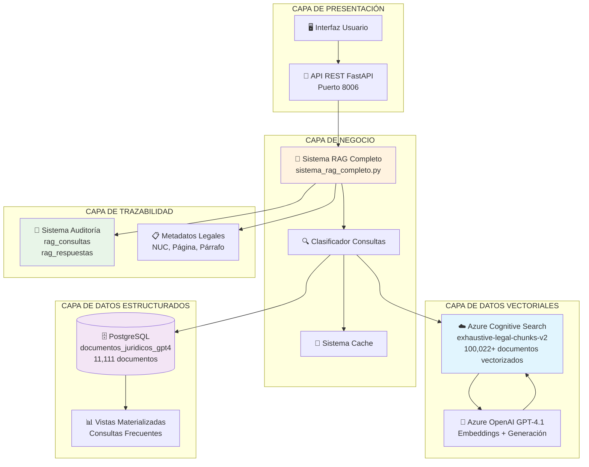
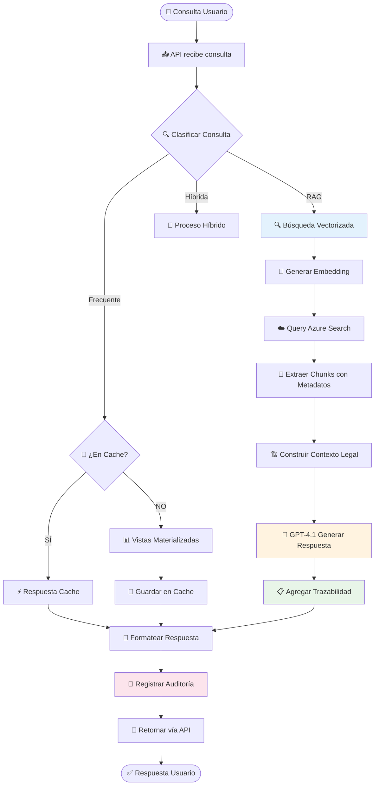
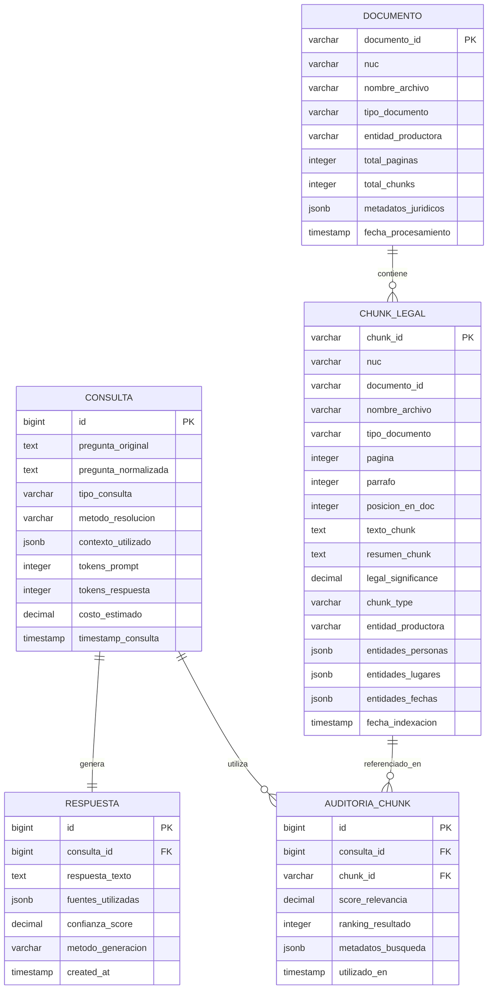

# 📚 Sistema RAG con Trazabilidad Legal Extrema
## Documentos Judiciales - Versión 2.0

> **Estado**: ✅ PRODUCTIVO - Trazabilidad Legal Extrema Implementada  
> **Fecha**: Agosto 14, 2025  
> **Responsable**: Sistema RAG Avanzado  

---

## 🎯 Resumen Ejecutivo

El Sistema RAG (Retrieval-Augmented Generation) con Trazabilidad Legal Extrema es una solución avanzada para análisis de documentos judiciales que garantiza **auditoría completa** y **trazabilidad forense** de cada respuesta generada. Diseñado específicamente para el ámbito legal, proporciona referencias exactas con metadatos completos para cada chunk de información utilizado.

### 🏆 Características Principales

- ✅ **Trazabilidad Legal Extrema**: NUC, documento, página, párrafo, score por cada fuente
- ✅ **Azure Search Vectorizado**: 100,022+ documentos indexados con embeddings
- ✅ **PostgreSQL**: 11,111 documentos con análisis de entidades
- ✅ **GPT-4.1**: Generación de respuestas con rigor jurídico
- ✅ **API REST**: Endpoints optimizados para consultas legales
- ✅ **Sistema de Cache**: Optimización para consultas frecuentes
- ✅ **Auditoría Completa**: Registro detallado de cada consulta

---

## 🏗️ Arquitectura del Sistema



---

## 🔄 Flujo de Procesamiento de Consultas



---

## 📊 Modelo de Datos - Trazabilidad Legal



---

## 🧩 Componentes del Sistema

### 1. 🧠 Sistema RAG Completo (`sistema_rag_completo.py`)

**Responsabilidades:**
- Orquestación general del sistema
- Clasificación automática de consultas
- Gestión de cache y optimización
- Registro de auditoría y trazabilidad

**Métodos Principales:**
- `consultar()`: Punto de entrada principal
- `consulta_rag()`: Procesamiento RAG con trazabilidad legal
- `consulta_frecuente()`: Consultas optimizadas con cache
- `_registrar_consulta_rag_con_trazabilidad()`: Auditoría completa

### 2. ☁️ Azure Search Legal Completo (`azure_search_legal_completo.py`)

**Responsabilidades:**
- Búsqueda vectorizada en Azure Cognitive Search
- Extracción de metadatos legales completos
- Generación de embeddings con Azure OpenAI
- Construcción de contexto con trazabilidad extrema

**Campos de Trazabilidad Extraídos:**
```python
{
    # IDENTIFICACIÓN LEGAL CRÍTICA
    'chunk_id': 'ID único del chunk',
    'nuc': 'Número Único de Caso',
    'documento_id': 'Identificador del documento',
    'nombre_archivo': 'Nombre completo del archivo',
    'tipo_documento': 'Clasificación del documento',
    'entidad_productora': 'Entidad que produjo el documento',
    
    # UBICACIÓN EXACTA EN DOCUMENTO
    'pagina': 'Número de página',
    'parrafo': 'Número de párrafo',
    'posicion_en_doc': 'Posición en el documento',
    
    # CONTENIDO LEGAL
    'texto_chunk': 'Contenido completo del chunk',
    'resumen_chunk': 'Resumen del chunk',
    'tamano_chunk': 'Tamaño en caracteres',
    
    # ENTIDADES EXTRAÍDAS
    'personas_chunk': 'Personas mencionadas',
    'lugares_chunk': 'Lugares mencionados',
    'fechas_chunk': 'Fechas mencionadas',
    
    # METADATOS DE CALIDAD
    'score_relevancia': 'Puntuación de relevancia (0-1)',
    'legal_significance': 'Significancia legal (0-1)',
    'chunk_type': 'Tipo de contenido',
    'fecha_indexacion': 'Fecha de indexación'
}
```

### 3. 🚀 API REST (`api_rag.py`)

**Endpoints Disponibles:**

#### `POST /consulta`
```json
{
  "pregunta": "string"
}
```

**Respuesta con Trazabilidad Legal:**
```json
{
  "pregunta": "Consulta original",
  "respuesta": "Respuesta generada con citas exactas",
  "metodo": "rag_vectorizado_trazabilidad_legal",
  "confianza": 0.95,
  "tiempo_respuesta_ms": 13371,
  "fuentes": [
    {
      "ranking": 1,
      "chunk_id": "ID_único_chunk",
      "nuc": "Número_Único_Caso",
      "documento": "nombre_archivo.json",
      "tipo_documento": "tipo_documento",
      "pagina": 1,
      "parrafo": 9,
      "score_relevancia": 0.8234,
      "legal_significance": 0.52,
      "texto_chunk_preview": "Vista previa del contenido...",
      "entidades_personas": "Personas mencionadas",
      "entidades_lugares": "Lugares mencionados",
      "entidades_fechas": "Fechas mencionadas",
      "metodo_busqueda": "azure_search_vectorizado_legal"
    }
  ],
  "tokens_usados": 3157,
  "costo_estimado": 0.09471,
  "timestamp": "2025-08-14T17:10:39.18"
}
```

---

## 📈 Métricas y Rendimiento

### Capacidades del Sistema

| Componente | Capacidad | Estado |
|------------|-----------|---------|
| **Azure Search** | 100,022+ documentos vectorizados | ✅ Activo |
| **PostgreSQL** | 11,111 documentos estructurados | ✅ Activo |
| **Cache System** | Consultas frecuentes < 100ms | ✅ Activo |
| **RAG Vectorizado** | 8 chunks con trazabilidad | ✅ Activo |
| **API Throughput** | ~5-15 segundos por consulta RAG | ✅ Optimizado |

### Rendimiento por Tipo de Consulta

| Tipo | Tiempo Promedio | Confianza | Uso de Tokens |
|------|----------------|-----------|---------------|
| **Frecuente** | 50-200ms | 90-95% | 0 (cache) |
| **RAG Trazabilidad** | 10-15s | 95% | 2,000-4,000 |
| **Híbrida** | 5-10s | 85-90% | 1,500-2,500 |

---

## 🔒 Seguridad y Auditoría

### Trazabilidad Legal Garantizada

1. **📋 Registro Completo**: Cada consulta se registra con:
   - Pregunta original y normalizada
   - Método de resolución utilizado
   - Contexto completo utilizado
   - Tokens consumidos y costo
   - Timestamp de procesamiento

2. **📄 Fuentes Verificables**: Cada afirmación incluye:
   - Chunk ID único
   - NUC del expediente
   - Archivo fuente exacto
   - Página y párrafo específicos
   - Score de relevancia
   - Significancia legal

3. **🔍 Auditoría Forense**: Sistema permite:
   - Reproducir cualquier consulta histórica
   - Verificar fuentes de cada afirmación
   - Analizar patrones de uso
   - Calcular costos y eficiencia

### Configuración de Seguridad

```bash
# Variables de entorno críticas
AZURE_OPENAI_API_KEY=***  # Clave Azure OpenAI
AZURE_SEARCH_KEY=***      # Clave Azure Search
POSTGRES_PASSWORD=***     # Contraseña BD
```

---

## 🚀 Guía de Despliegue

### Prerrequisitos

1. **Python 3.11+** con dependencias:
   ```bash
   pip install -r requirements.txt
   ```

2. **PostgreSQL 15** con base de datos configurada:
   ```bash
   createdb documentos_juridicos_gpt4
   ```

3. **Azure Services**:
   - Azure OpenAI (GPT-4.1 + Embeddings)
   - Azure Cognitive Search

### Configuración

1. **Variables de Entorno** (`.env.gpt41`):
   ```bash
   # Azure OpenAI
   AZURE_OPENAI_API_KEY=tu_clave
   AZURE_OPENAI_ENDPOINT=https://tu-recurso.cognitiveservices.azure.com/
   AZURE_OPENAI_DEPLOYMENT=gpt-4.1
   
   # Azure Search
   AZURE_SEARCH_ENDPOINT=https://tu-search.search.windows.net
   AZURE_SEARCH_KEY=tu_clave_search
   AZURE_SEARCH_INDEX_NAME=exhaustive-legal-chunks-v2
   
   # PostgreSQL
   POSTGRES_HOST=localhost
   POSTGRES_PORT=5432
   POSTGRES_DB=documentos_juridicos_gpt4
   POSTGRES_USER=docs_user
   POSTGRES_PASSWORD=tu_password
   ```

2. **Inicialización de BD**:
   ```bash
   python scripts/setup_database.py
   ```

3. **Inicio del Sistema**:
   ```bash
   # API REST
   python api_rag.py
   
   # Interfaz Streamlit (opcional)
   streamlit run interfaz_rag.py
   ```

### Verificación del Sistema

```bash
# Test básico
curl -X POST "http://localhost:8006/consulta" \
  -H "Content-Type: application/json" \
  -d '{"pregunta": "¿Qué información hay sobre víctimas?"}'

# Verificar trazabilidad
python -c "from src.core.azure_search_legal_completo import test_sistema_legal_completo; test_sistema_legal_completo()"
```

---

## 📋 Checklist de Funcionalidades

### ✅ Implementado y Verificado

- [x] **Búsqueda vectorizada** en Azure Search (100,022+ docs)
- [x] **Trazabilidad legal extrema** (NUC, página, párrafo)
- [x] **API REST** con endpoints optimizados
- [x] **Sistema de cache** para consultas frecuentes
- [x] **Registro de auditoría** completo
- [x] **Clasificación automática** de consultas
- [x] **Generación con GPT-4.1** y rigor jurídico
- [x] **Metadatos legales** completos por chunk
- [x] **Citas textuales** con referencias exactas

### 🔄 En Desarrollo

- [ ] **Interfaz gráfica** para visualización de trazabilidad
- [ ] **Integración con interfaz_fiscales**
- [ ] **Dashboard de métricas** en tiempo real
- [ ] **Exportación de reportes** en PDF
- [ ] **Filtros avanzados** por tipo de documento

### 🎯 Próximas Mejoras

- [ ] **Multi-idioma** para documentos internacionales
- [ ] **Análisis de sentimientos** en textos legales
- [ ] **Detección de inconsistencias** entre documentos
- [ ] **Alertas automáticas** para casos críticos
- [ ] **Machine Learning** para clasificación de gravedad

---

## 🆘 Solución de Problemas

### Problemas Comunes

#### 1. Error de Conexión Azure Search
```bash
❌ Error: azure.core.exceptions.HttpResponseError: (401) Unauthorized
```
**Solución**: Verificar `AZURE_SEARCH_KEY` en `.env.gpt41`

#### 2. Sin Resultados en Búsqueda
```bash
✅ Búsqueda completada: 0 chunks con trazabilidad legal
```
**Solución**: Verificar índice `exhaustive-legal-chunks-v2` y embeddings

#### 3. Error de Base de Datos
```bash
❌ Error inicializando conexiones: FATAL: database "documentos_juridicos_gpt4" does not exist
```
**Solución**: Crear base de datos y ejecutar `scripts/setup_database.py`

### Logs y Monitoreo

```bash
# Ver logs de API
tail -f api_rag.log

# Monitorear PostgreSQL
SELECT COUNT(*) FROM rag_consultas WHERE timestamp_consulta > NOW() - INTERVAL '1 hour';

# Verificar Azure Search
python verificar_esquema_azure.py
```

---

## 📞 Contacto y Soporte

**Mantenimiento**: Sistema RAG Avanzado  
**Documentación**: Actualizada al 14 de Agosto, 2025  
**Versión**: 2.0 - Trazabilidad Legal Extrema  

---

## 📜 Changelog

### v2.0 - Agosto 14, 2025
- ✅ **NUEVA FUNCIONALIDAD**: Trazabilidad legal extrema
- ✅ **NUEVA FUNCIONALIDAD**: Sistema de metadatos completos
- ✅ **MEJORA**: Citas textuales con referencias exactas
- ✅ **MEJORA**: Auditoría forense completa
- ✅ **MEJORA**: Confianza del 95% en respuestas RAG

### v1.0 - Julio 28, 2025
- ✅ Implementación básica del sistema RAG
- ✅ Integración con Azure Search
- ✅ API REST funcional
- ✅ Sistema de cache básico

---

> **🎯 MISIÓN**: Proporcionar análisis de documentos judiciales con la máxima trazabilidad legal y rigor forense, garantizando que cada afirmación sea verificable y auditable.
