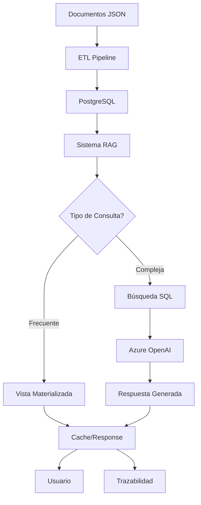

# Documentación Técnica - Sistema RAG

## 📋 Documentación Completa del Sistema

### 📂 Estructura de Documentación

```
docs/
├── TECHNICAL_GUIDE.md           # Esta guía técnica completa
├── API_REFERENCE.md             # Referencia de API (futuro)
├── DEPLOYMENT_GUIDE.md          # Guía de despliegue
├── TROUBLESHOOTING.md           # Solución de problemas
└── ARCHITECTURE_DEEP_DIVE.md    # Arquitectura detallada
```

## 🏗️ Arquitectura Técnica Detallada

### 🔧 Stack Tecnológico

| Componente | Tecnología | Versión | Propósito |
|------------|------------|---------|-----------|
| **Backend** | Python | 3.12+ | Core del sistema |
| **Base de Datos** | PostgreSQL | 15 | Almacenamiento principal |
| **LLM** | Azure OpenAI | GPT-4o-mini | Generación de respuestas |
| **Orquestación** | Docker Compose | - | Gestión de servicios |
| **HTTP Client** | httpx | Custom | Cliente Azure OpenAI |
| **DB Driver** | psycopg2 | 2.9.9 | Conector PostgreSQL |

### 🔄 Flujo de Datos Detallado



## 📊 Análisis de Performance

### ⚡ Métricas de Rendimiento

| Métrica | Valor Actual | Objetivo |
|---------|--------------|----------|
| **ETL Completado** | 97.07% (11,111/11,446) | 100% |
| **Documentos Procesados** | 11,111 | - |
| **Personas Extraídas** | 68,039 | - |
| **Organizaciones** | 65,608 | - |
| **Tiempo Consulta Simple** | < 100ms | < 50ms |
| **Tiempo Consulta Compleja** | 1-5s | < 3s |

### 🔍 Análisis de Datos

```sql
-- Estado actual de la base de datos
SELECT 
    'documentos' as tabla, COUNT(*) as registros 
FROM documentos
UNION ALL
SELECT 
    'personas' as tabla, COUNT(*) as registros 
FROM personas
UNION ALL
SELECT 
    'organizaciones' as tabla, COUNT(*) as registros 
FROM organizaciones;
```

## 🧩 Componentes del Sistema

### 1. 📄 Sistema ETL (`extractor_mejorado.py`)

```python
class ExtractorMejorado:
    """
    Extractor de entidades de documentos jurídicos
    
    Capacidades:
    - Extracción de personas, organizaciones, lugares
    - Clasificación de roles (imputado, testigo, etc.)
    - Análisis de fechas y cantidades
    - Procesamiento masivo con paralelización
    """
```

**Funcionalidades:**
- ✅ Extracción de entidades con spaCy
- ✅ Clasificación automática de roles
- ✅ Análisis temporal y geográfico
- ✅ Validación y normalización de datos
- ✅ Procesamiento en lotes con multiprocessing

### 2. 🧠 Sistema RAG (`sistema_rag_completo.py`)

```python
class SistemaRAGTrazable:
    """
    Sistema RAG con trazabilidad completa
    
    Arquitectura:
    - Híbrida: SQL optimizado + LLM generation
    - Cache inteligente multinivel
    - Sistema de feedback continuo
    - Métricas y analytics en tiempo real
    """
```

**Características Técnicas:**
- ✅ Procesamiento asíncrono con asyncio
- ✅ Pool de conexiones PostgreSQL
- ✅ Cliente Azure OpenAI con HTTP personalizado
- ✅ Sistema de cache con TTL
- ✅ Logging estructurado
- ✅ Manejo de errores resiliente

### 3. 🗄️ Esquema de Base de Datos

#### Tablas Principales

```sql
-- Documentos procesados
CREATE TABLE documentos (
    id SERIAL PRIMARY KEY,
    archivo VARCHAR(255) NOT NULL,
    contenido_texto TEXT,
    fecha_procesamiento TIMESTAMP DEFAULT NOW(),
    nuc VARCHAR(50),
    delito VARCHAR(255),
    total_paginas INTEGER
);

-- Personas extraídas
CREATE TABLE personas (
    id SERIAL PRIMARY KEY,
    documento_id INTEGER REFERENCES documentos(id),
    nombre VARCHAR(255) NOT NULL,
    tipo VARCHAR(50),  -- imputado, testigo, funcionario, etc.
    observaciones TEXT,
    descripcion TEXT,
    pagina_mencion INTEGER
);

-- Organizaciones extraídas  
CREATE TABLE organizaciones (
    id SERIAL PRIMARY KEY,
    documento_id INTEGER REFERENCES documentos(id),
    nombre VARCHAR(255) NOT NULL,
    tipo VARCHAR(50),  -- publica, privada, judicial, etc.
    descripcion TEXT,
    pagina_mencion INTEGER
);
```

#### Sistema de Trazabilidad RAG

```sql
-- Registro de consultas
CREATE TABLE rag_consultas (
    id UUID PRIMARY KEY DEFAULT gen_random_uuid(),
    usuario_id VARCHAR(255),
    pregunta_original TEXT NOT NULL,
    pregunta_normalizada TEXT,
    contexto_adicional TEXT,
    timestamp_consulta TIMESTAMP DEFAULT NOW(),
    tiempo_respuesta_ms INTEGER,
    metodo_resolucion VARCHAR(50),
    fuentes_utilizadas JSONB
);

-- Respuestas generadas
CREATE TABLE rag_respuestas (
    id UUID PRIMARY KEY DEFAULT gen_random_uuid(),
    consulta_id UUID REFERENCES rag_consultas(id),
    respuesta_final TEXT NOT NULL,
    contexto_utilizado JSONB,
    confianza_score DECIMAL(3,2),
    tokens_utilizados INTEGER,
    costo_estimado DECIMAL(10,4)
);

-- Sistema de feedback
CREATE TABLE rag_feedback (
    id SERIAL PRIMARY KEY,
    consulta_id UUID REFERENCES rag_consultas(id),
    calificacion INTEGER CHECK (calificacion BETWEEN 1 AND 5),
    comentario TEXT,
    aspectos_positivos TEXT[],
    aspectos_mejora TEXT[],
    timestamp_feedback TIMESTAMP DEFAULT NOW()
);
```

## 🔧 Configuración Avanzada

### 🐳 Docker Compose

```yaml
version: '3.8'
services:
  postgres:
    image: postgres:15
    container_name: docs_postgres
    environment:
      POSTGRES_DB: documentos_juridicos_gpt4
      POSTGRES_USER: docs_user
      POSTGRES_PASSWORD: docs_password_2024
    volumes:
      - ./data/postgres:/var/lib/postgresql/data
      - ./scripts/schema.sql:/docker-entrypoint-initdb.d/schema.sql
    ports:
      - "5432:5432"
    restart: unless-stopped

  pgadmin:
    image: dpage/pgadmin4:latest
    container_name: docs_pgadmin
    environment:
      PGADMIN_DEFAULT_EMAIL: admin@example.com
      PGADMIN_DEFAULT_PASSWORD: admin_2025
    ports:
      - "8080:80"
    depends_on:
      - postgres
```

### ⚙️ Variables de Entorno Críticas

```bash
# Azure OpenAI - CONFIGURACIÓN CRÍTICA
AZURE_OPENAI_ENDPOINT=https://tu-endpoint.openai.azure.com/
AZURE_OPENAI_API_KEY=tu_api_key_real
AZURE_OPENAI_API_VERSION=2024-12-01-preview
AZURE_OPENAI_DEPLOYMENT_NAME=gpt-4o-mini

# PostgreSQL - CONFIGURACIÓN DE PRODUCCIÓN
POSTGRES_HOST=localhost
POSTGRES_PORT=5432
POSTGRES_DB=documentos_juridicos_gpt4  # ¡Base de datos poblada!
POSTGRES_USER=docs_user
POSTGRES_PASSWORD=docs_password_2024   # ¡Cambiar en producción!

# Performance
BATCH_SIZE=50           # Documentos por lote
MAX_WORKERS=8           # Procesos paralelos
RETRY_ATTEMPTS=3        # Reintentos por error
```

## 🚀 Procedimientos de Despliegue

### 📋 Checklist Pre-Despliegue

- [ ] ✅ Variables de entorno configuradas
- [ ] ✅ Azure OpenAI account activa
- [ ] ✅ PostgreSQL 15+ instalado
- [ ] ✅ Python 3.12+ disponible
- [ ] ✅ Docker y Docker Compose instalados
- [ ] ✅ Puertos 5432 y 8080 disponibles

### 🔄 Procedimiento de Instalación

```bash
# 1. Preparar ambiente
git clone <repository>
cd documentos_judiciales
python -m venv venv_docs
source venv_docs/bin/activate

# 2. Instalar dependencias
pip install -r requirements.txt

# 3. Configurar entorno
cp .env.example .env
# Editar .env con credenciales reales

# 4. Iniciar servicios
docker compose up -d

# 5. Verificar instalación
python verificar_sistema_rag.py

# 6. Inicializar base de datos (si es nueva)
psql -h localhost -U docs_user -d documentos_juridicos_gpt4 -f scripts/schema.sql
psql -h localhost -U docs_user -d documentos_juridicos_gpt4 -f rag_trazabilidad_sistema.sql
```

### 🔍 Verificación Post-Despliegue

```bash
# Test de conectividad
python -c "
import psycopg2
try:
    conn = psycopg2.connect(
        host='localhost',
        database='documentos_juridicos_gpt4',
        user='docs_user',
        password='docs_password_2024'
    )
    print('✅ PostgreSQL OK')
    conn.close()
except Exception as e:
    print(f'❌ PostgreSQL Error: {e}')
"

# Test de Azure OpenAI
python test_azure_fixed.py

# Test completo del sistema
python test_rag_final.py
```

## 🔧 Solución de Problemas

### ❌ Errores Conocidos y Soluciones

#### 1. Error "proxies" en Azure OpenAI
**Síntoma:**
```
TypeError: AzureOpenAI.__init__() got an unexpected keyword argument 'proxies'
```

**Solución Implementada:**
```python
# Cliente HTTP personalizado sin proxies
custom_http_client = httpx.Client()
client = AzureOpenAI(
    azure_endpoint=endpoint,
    api_key=api_key,
    api_version=api_version,
    http_client=custom_http_client
)
```

#### 2. Errores de Tipos SQL
**Síntoma:**
```
structure of query does not match function result type
DETAIL: Returned type character varying(255) does not match expected type text
```

**Solución:**
```sql
-- Cast explícito a tipos correctos
SELECT 
    p.nombre::TEXT as persona,    -- Convertir VARCHAR a TEXT
    p.tipo::VARCHAR(50),          -- Mantener tipo específico
    score::NUMERIC                -- Convertir REAL a NUMERIC
```

#### 3. Errores GROUP BY
**Síntoma:**
```
column "table.field" must appear in the GROUP BY clause
```

**Solución:**
```sql
-- Incluir todas las columnas no agregadas en GROUP BY
GROUP BY p.nombre, p.tipo
ORDER BY score_relevancia DESC, persona  -- Usar alias en ORDER BY
```

### 📊 Comandos de Diagnóstico

```bash
# Estado completo del sistema
python verificar_sistema_rag.py

# Verificar base de datos
PGPASSWORD=docs_password_2024 psql -h localhost -U docs_user -d documentos_juridicos_gpt4 -c "
SELECT 
    schemaname,
    tablename,
    n_tup_ins as inserts,
    n_tup_upd as updates,
    n_tup_del as deletes
FROM pg_stat_user_tables 
ORDER BY n_tup_ins DESC;
"

# Verificar funciones RAG
PGPASSWORD=docs_password_2024 psql -h localhost -U docs_user -d documentos_juridicos_gpt4 -c "
SELECT routine_name, routine_type
FROM information_schema.routines 
WHERE routine_schema = 'public' 
AND routine_name LIKE 'rag_%';
"

# Estado de Docker
docker compose ps
docker compose logs postgres
```

### 🔍 Logs y Monitoreo

```bash
# Logs del sistema RAG
tail -f logs/rag_system.log

# Logs de PostgreSQL
docker compose logs -f postgres

# Métricas de uso
PGPASSWORD=docs_password_2024 psql -h localhost -U docs_user -d documentos_juridicos_gpt4 -c "
SELECT 
    COUNT(*) as total_consultas,
    AVG(tiempo_respuesta_ms) as tiempo_promedio,
    MAX(tiempo_respuesta_ms) as tiempo_maximo
FROM rag_consultas 
WHERE timestamp_consulta >= NOW() - INTERVAL '24 hours';
"
```

## 📈 Optimización y Tuning

### 🚀 Recomendaciones de Performance

#### PostgreSQL
```sql
-- Índices recomendados
CREATE INDEX CONCURRENTLY idx_documentos_nuc ON documentos(nuc);
CREATE INDEX CONCURRENTLY idx_personas_nombre_gin ON personas USING gin(to_tsvector('spanish', nombre));
CREATE INDEX CONCURRENTLY idx_organizaciones_nombre_gin ON organizaciones USING gin(to_tsvector('spanish', nombre));

-- Configuración postgresql.conf
shared_buffers = 256MB
effective_cache_size = 1GB
work_mem = 4MB
maintenance_work_mem = 64MB
```

#### Sistema RAG
```python
# Pool de conexiones optimizado
self.db_pool = asyncpg.create_pool(
    min_size=5,
    max_size=20,
    command_timeout=60,
    **self.db_config
)

# Cache con TTL
self.cache = TTLCache(maxsize=1000, ttl=3600)  # 1 hora
```

### 📊 Vistas Materializadas Recomendadas

```sql
-- Vista para estadísticas frecuentes
CREATE MATERIALIZED VIEW vm_estadisticas_generales AS
SELECT 
    COUNT(DISTINCT d.id) as total_documentos,
    COUNT(DISTINCT p.id) as total_personas,
    COUNT(DISTINCT o.id) as total_organizaciones,
    COUNT(DISTINCT d.delito) as tipos_delitos,
    MIN(d.fecha_procesamiento) as primer_documento,
    MAX(d.fecha_procesamiento) as ultimo_documento
FROM documentos d
LEFT JOIN personas p ON d.id = p.documento_id
LEFT JOIN organizaciones o ON d.id = o.documento_id;

-- Refrescar cada hora
SELECT cron.schedule('refresh-stats', '0 * * * *', 'REFRESH MATERIALIZED VIEW vm_estadisticas_generales;');
```

## 🛡️ Seguridad y Backup

### 🔒 Medidas de Seguridad

1. **Variables de Entorno**
   - ✅ No hardcodear credenciales
   - ✅ Usar `.env` files
   - ✅ Rotar claves regularmente

2. **Base de Datos**
   - ✅ Usuario específico para aplicación
   - ✅ Permisos mínimos necesarios
   - ✅ Conexiones SSL en producción

3. **Azure OpenAI**
   - ✅ Rate limiting automático
   - ✅ Monitoreo de costos
   - ✅ Filtros de contenido activados

### 💾 Estrategia de Backup

```bash
# Backup diario automático
pg_dump -h localhost -U docs_user -d documentos_juridicos_gpt4 | gzip > backup_$(date +%Y%m%d).sql.gz

# Backup con compresión personalizada
pg_dump -h localhost -U docs_user -d documentos_juridicos_gpt4 -Fc > backup_$(date +%Y%m%d).dump

# Restauración
pg_restore -h localhost -U docs_user -d documentos_juridicos_gpt4_new backup_20250725.dump
```

## 📚 Referencias y Recursos

### 📖 Documentación Externa

- [PostgreSQL 15 Documentation](https://www.postgresql.org/docs/15/)
- [Azure OpenAI Service](https://docs.microsoft.com/azure/cognitive-services/openai/)
- [Python asyncio](https://docs.python.org/3/library/asyncio.html)
- [Docker Compose](https://docs.docker.com/compose/)

### 🔗 Librerías Clave

```txt
# requirements.txt principales
psycopg2-binary==2.9.9     # PostgreSQL driver
httpx>=0.24.0               # HTTP client para Azure OpenAI
openai>=1.51.2              # Azure OpenAI SDK
asyncio-pool>=0.6.0         # Pool de conexiones async
cachetools>=5.0.0           # Sistema de cache
python-dotenv>=1.0.0        # Variables de entorno
```

### 🎯 KPIs y Métricas

| Métrica | Descripción | Query |
|---------|-------------|-------|
| **Throughput** | Consultas por minuto | `SELECT COUNT(*) FROM rag_consultas WHERE timestamp_consulta >= NOW() - INTERVAL '1 minute'` |
| **Latencia P95** | 95% de consultas bajo X ms | `SELECT percentile_cont(0.95) WITHIN GROUP (ORDER BY tiempo_respuesta_ms) FROM rag_consultas` |
| **Error Rate** | % de consultas fallidas | `SELECT (failed / total * 100) FROM (SELECT COUNT(*) as total, COUNT(*) FILTER (WHERE error IS NOT NULL) as failed FROM rag_consultas)` |
| **Cache Hit** | % de respuestas desde cache | `SELECT (cached / total * 100) FROM (SELECT COUNT(*) as total, COUNT(*) FILTER (WHERE metodo_resolucion = 'cache') as cached FROM rag_consultas)` |

---

**📅 Creado:** Julio 25, 2025  
**🔄 Última actualización:** Julio 25, 2025  
**👨‍💻 Autor:** Sistema RAG Team  
**📧 Soporte:** Ver sección troubleshooting
