# 🔒 Guía de Seguridad - Sistema de Documentos Jurídicos

## 📋 Índice

1. [Visión General de Seguridad](#visión-general-de-seguridad)
2. [Clasificación de Datos](#clasificación-de-datos)
3. [Autenticación y Autorización](#autenticación-y-autorización)
4. [Seguridad de la Base de Datos](#seguridad-de-la-base-de-datos)
5. [Seguridad de Red](#seguridad-de-red)
6. [Auditoría y Monitoreo](#auditoría-y-monitoreo)
7. [Gestión de Incidentes](#gestión-de-incidentes)
8. [Cumplimiento y Regulaciones](#cumplimiento-y-regulaciones)
9. [Procedimientos de Emergencia](#procedimientos-de-emergencia)

## 🛡️ Visión General de Seguridad

El Sistema de Documentos Jurídicos maneja información clasificada y sensible de procesos judiciales. Por ello, implementa múltiples capas de seguridad siguiendo los estándares internacionales **ISO 27001**, **NIST Cybersecurity Framework** y las regulaciones de la **Fiscalía General de la Nación**.

### Marco de Seguridad Implementado

```mermaid
graph TB
    subgraph "Capa de Presentación"
        A[HTTPS/TLS 1.3]
        B[Autenticación MFA]
        C[Headers de Seguridad]
    end
    
    subgraph "Capa de Aplicación"
        D[Autorización RBAC]
        E[Validación de Entrada]
        F[Cifrado de Sesiones]
    end
    
    subgraph "Capa de Datos"
        G[Cifrado en Reposo]
        H[Cifrado en Tránsito]
        I[Backup Cifrado]
    end
    
    subgraph "Capa de Infraestructura"
        J[Firewall WAF]
        K[Segmentación de Red]
        L[Monitoreo 24/7]
    end
    
    A --> D
    B --> E
    C --> F
    D --> G
    E --> H
    F --> I
    G --> J
    H --> K
    I --> L
```



### Principios de Seguridad

1. **Defensa en Profundidad**: Múltiples capas de seguridad
2. **Principio de Menor Privilegio**: Acceso mínimo necesario
3. **Segregación de Funciones**: Separación de responsabilidades
4. **Cifrado Integral**: Datos protegidos en reposo y tránsito
5. **Monitoreo Continuo**: Vigilancia 24/7 de actividades
6. **Respuesta Rápida**: Procedimientos de incident response

## 📊 Clasificación de Datos

### Niveles de Clasificación

#### 🔴 ULTRA SECRETO
- **Contenido**: Información de investigaciones en curso, identidades protegidas
- **Acceso**: Solo personal autorizado de Fiscalía
- **Retención**: 10+ años con revisión anual
- **Cifrado**: AES-256 + HSM

#### 🟠 SECRETO
- **Contenido**: Documentos de procesos judiciales, testimonios
- **Acceso**: Personal de investigación autorizado
- **Retención**: 5-10 años
- **Cifrado**: AES-256

#### 🟡 CONFIDENCIAL
- **Contenido**: Metadatos procesados, estadísticas agregadas
- **Acceso**: Personal técnico y analistas
- **Retención**: 3-5 años
- **Cifrado**: AES-128

#### 🟢 INTERNO
- **Contenido**: Logs del sistema, métricas de performance
- **Acceso**: Administradores de sistema
- **Retención**: 1-3 años
- **Cifrado**: Cifrado básico

### Matriz de Clasificación de Datos

| Tipo de Dato | Clasificación | Cifrado | Backup | Acceso |
|--------------|---------------|---------|--------|---------|
| Texto completo documentos | ULTRA SECRETO | AES-256 + HSM | Diario cifrado | Fiscales + |
| Análisis GPT-4 | SECRETO | AES-256 | Diario cifrado | Investigadores |
| Nombres personas | SECRETO | AES-256 | Diario cifrado | Investigadores |
| Metadatos procesamiento | CONFIDENCIAL | AES-128 | Semanal | Técnicos |
| Logs aplicación | INTERNO | Cifrado básico | Mensual | Administradores |
| Métricas sistema | INTERNO | Cifrado básico | No requerido | Soporte |

### Manejo de Datos Sensibles

```python
# Ejemplo de clasificación automática
class ClasificadorDatos:
    """Clasifica automáticamente datos según sensibilidad"""
    
    PATRONES_ULTRA_SECRETO = [
        r'testigo\s+protegido',
        r'identidad\s+reservada',
        r'operación\s+encubierta'
    ]
    
    PATRONES_SECRETO = [
        r'víctima:?\s*[A-ZÁÉÍÓÚÑ][a-záéíóúñ]+',
        r'responsable:?\s*[A-ZÁÉÍÓÚÑ][a-záéíóúñ]+',
        r'testimonio\s+de'
    ]
    
    def clasificar_contenido(self, texto: str) -> str:
        """Clasifica contenido automáticamente"""
        if any(re.search(patron, texto, re.IGNORECASE) 
               for patron in self.PATRONES_ULTRA_SECRETO):
            return "ULTRA_SECRETO"
        elif any(re.search(patron, texto, re.IGNORECASE) 
                 for patron in self.PATRONES_SECRETO):
            return "SECRETO"
        else:
            return "CONFIDENCIAL"
    
    def aplicar_cifrado(self, datos: str, clasificacion: str) -> bytes:
        """Aplica cifrado según clasificación"""
        if clasificacion == "ULTRA_SECRETO":
            return self.cifrar_hsm(datos)
        elif clasificacion in ["SECRETO", "CONFIDENCIAL"]:
            return self.cifrar_aes256(datos)
        else:
            return self.cifrar_basico(datos)
```

## 🔐 Autenticación y Autorización

### Sistema de Autenticación Multi-Factor (MFA)

#### Configuración OAuth 2.0 + OIDC
```yaml
# config/auth.yml
oauth2:
  provider: fiscalia_sso
  client_id: ${OAUTH_CLIENT_ID}
  client_secret: ${OAUTH_CLIENT_SECRET}
  authorization_endpoint: "https://sso.fiscalia.gov.co/auth"
  token_endpoint: "https://sso.fiscalia.gov.co/token"
  userinfo_endpoint: "https://sso.fiscalia.gov.co/userinfo"
  
mfa:
  required: true
  providers:
    - totp  # Time-based OTP
    - sms   # SMS backup
    - yubikey  # Hardware token
  
session:
  timeout_minutes: 30
  refresh_before_expiry: 5
  secure_cookie: true
  same_site: strict
```

#### Implementación de RBAC (Role-Based Access Control)

```python
# auth/rbac.py
from enum import Enum
from typing import Set, List

class Rol(Enum):
    FISCAL_SUPERIOR = "fiscal_superior"
    FISCAL_INVESTIGADOR = "fiscal_investigador"
    INVESTIGADOR_CTI = "investigador_cti"
    ANALISTA_DATOS = "analista_datos"
    TECNICO_SISTEMA = "tecnico_sistema"
    AUDITOR = "auditor"

class Permiso(Enum):
    # Documentos
    LEER_DOCUMENTOS = "documentos:leer"
    BUSCAR_DOCUMENTOS = "documentos:buscar"
    EXPORTAR_DOCUMENTOS = "documentos:exportar"
    
    # Personas
    LISTAR_VICTIMAS = "personas:listar_victimas"
    LISTAR_RESPONSABLES = "personas:listar_responsables"
    EDITAR_PERSONAS = "personas:editar"
    
    # Consultas
    EJECUTAR_CONSULTAS_BASICAS = "consultas:basicas"
    EJECUTAR_CONSULTAS_AVANZADAS = "consultas:avanzadas"
    CREAR_CONSULTAS_PERSONALIZADAS = "consultas:crear"
    
    # Administración
    GESTIONAR_USUARIOS = "admin:usuarios"
    VER_LOGS_SISTEMA = "admin:logs"
    CONFIGURAR_SISTEMA = "admin:config"

class MatrizPermisos:
    """Define qué permisos tiene cada rol"""
    
    PERMISOS_POR_ROL = {
        Rol.FISCAL_SUPERIOR: {
            Permiso.LEER_DOCUMENTOS,
            Permiso.BUSCAR_DOCUMENTOS,
            Permiso.EXPORTAR_DOCUMENTOS,
            Permiso.LISTAR_VICTIMAS,
            Permiso.LISTAR_RESPONSABLES,
            Permiso.EJECUTAR_CONSULTAS_BASICAS,
            Permiso.EJECUTAR_CONSULTAS_AVANZADAS,
            Permiso.CREAR_CONSULTAS_PERSONALIZADAS,
        },
        Rol.FISCAL_INVESTIGADOR: {
            Permiso.LEER_DOCUMENTOS,
            Permiso.BUSCAR_DOCUMENTOS,
            Permiso.LISTAR_VICTIMAS,
            Permiso.LISTAR_RESPONSABLES,
            Permiso.EJECUTAR_CONSULTAS_BASICAS,
            Permiso.EJECUTAR_CONSULTAS_AVANZADAS,
        },
        Rol.INVESTIGADOR_CTI: {
            Permiso.LEER_DOCUMENTOS,
            Permiso.BUSCAR_DOCUMENTOS,
            Permiso.LISTAR_VICTIMAS,
            Permiso.EJECUTAR_CONSULTAS_BASICAS,
        },
        Rol.ANALISTA_DATOS: {
            Permiso.BUSCAR_DOCUMENTOS,
            Permiso.EJECUTAR_CONSULTAS_BASICAS,
            Permiso.EJECUTAR_CONSULTAS_AVANZADAS,
            Permiso.CREAR_CONSULTAS_PERSONALIZADAS,
        },
        Rol.TECNICO_SISTEMA: {
            Permiso.VER_LOGS_SISTEMA,
            Permiso.CONFIGURAR_SISTEMA,
        },
        Rol.AUDITOR: {
            Permiso.LEER_DOCUMENTOS,
            Permiso.BUSCAR_DOCUMENTOS,
            Permiso.VER_LOGS_SISTEMA,
        }
    }
    
    @classmethod
    def usuario_tiene_permiso(cls, rol: Rol, permiso: Permiso) -> bool:
        """Verifica si un rol tiene un permiso específico"""
        return permiso in cls.PERMISOS_POR_ROL.get(rol, set())

class VerificadorAutorizacion:
    """Middleware de autorización para Streamlit"""
    
    def __init__(self):
        self.matriz = MatrizPermisos()
    
    def requiere_permiso(self, permiso: Permiso):
        """Decorador para funciones que requieren permisos específicos"""
        def decorador(func):
            def wrapper(*args, **kwargs):
                usuario = st.session_state.get('usuario')
                if not usuario:
                    st.error("🚫 Debe iniciar sesión")
                    st.stop()
                
                if not self.matriz.usuario_tiene_permiso(usuario.rol, permiso):
                    st.error(f"🚫 No tiene permisos para: {permiso.value}")
                    st.stop()
                
                return func(*args, **kwargs)
            return wrapper
        return decorador

# Uso en la aplicación
auth = VerificadorAutorizacion()

@auth.requiere_permiso(Permiso.LISTAR_VICTIMAS)
def mostrar_lista_victimas():
    """Solo usuarios con permisos pueden ver víctimas"""
    # Código de la función...
    pass
```

### Gestión de Tokens JWT

```python
# auth/tokens.py
import jwt
import time
from datetime import datetime, timedelta
from cryptography.hazmat.primitives import hashes
from cryptography.hazmat.primitives.asymmetric import rsa

class GestorTokens:
    """Maneja generación y validación de tokens JWT"""
    
    def __init__(self):
        self.algoritmo = "RS256"
        self.tiempo_vida_horas = 8
        self.tiempo_refresh_dias = 30
    
    def generar_token(self, usuario_id: str, rol: str, permisos: List[str]) -> str:
        """Genera JWT con información del usuario"""
        payload = {
            'sub': usuario_id,
            'rol': rol,
            'permisos': permisos,
            'iat': int(time.time()),
            'exp': int(time.time()) + (self.tiempo_vida_horas * 3600),
            'iss': 'sistema-documentos-juridicos',
            'aud': 'fiscalia-usuarios'
        }
        
        return jwt.encode(
            payload, 
            self.obtener_clave_privada(), 
            algorithm=self.algoritmo
        )
    
    def validar_token(self, token: str) -> dict:
        """Valida y decodifica JWT"""
        try:
            payload = jwt.decode(
                token,
                self.obtener_clave_publica(),
                algorithms=[self.algoritmo],
                audience='fiscalia-usuarios',
                issuer='sistema-documentos-juridicos'
            )
            return payload
        except jwt.ExpiredSignatureError:
            raise Exception("Token expirado")
        except jwt.InvalidTokenError:
            raise Exception("Token inválido")
```

## 🗄️ Seguridad de la Base de Datos

### Cifrado en Reposo

#### Configuración PostgreSQL con Cifrado
```sql
-- postgresql.conf
# Configuración de cifrado transparente de datos (TDE)
wal_level = replica
archive_mode = on
ssl = on
ssl_cert_file = '/var/lib/postgresql/ssl/server.crt'
ssl_key_file = '/var/lib/postgresql/ssl/server.key'
ssl_ca_file = '/var/lib/postgresql/ssl/ca.crt'

# Cifrado de datos en reposo
cluster_name = 'documentos_juridicos_encrypted'

# Configuración de logs de auditoría
log_destination = 'csvlog'
logging_collector = on
log_directory = '/var/log/postgresql'
log_filename = 'postgresql-%Y-%m-%d_%H%M%S.log'
log_rotation_age = 1d
log_rotation_size = 100MB

# Logs de conexiones y comandos
log_connections = on
log_disconnections = on
log_statement = 'ddl'
log_min_duration_statement = 1000
```

#### Funciones de Cifrado Personalizadas
```sql
-- Función para cifrar datos sensibles
CREATE OR REPLACE FUNCTION cifrar_dato_sensible(
    texto_plano TEXT,
    clasificacion TEXT DEFAULT 'SECRETO'
) RETURNS BYTEA AS $$
DECLARE
    clave_cifrado BYTEA;
    resultado BYTEA;
BEGIN
    -- Obtener clave según clasificación
    SELECT clave INTO clave_cifrado 
    FROM claves_cifrado 
    WHERE tipo_clasificacion = clasificacion;
    
    -- Cifrar usando AES-256
    resultado := pgp_sym_encrypt(
        texto_plano::TEXT, 
        clave_cifrado::TEXT,
        'compress-algo=1, cipher-algo=aes256'
    );
    
    -- Registrar en auditoría
    INSERT INTO auditoria_cifrado (
        operacion, 
        clasificacion, 
        timestamp,
        usuario_id
    ) VALUES (
        'cifrado', 
        clasificacion, 
        NOW(),
        current_setting('session.user_id')
    );
    
    RETURN resultado;
END;
$$ LANGUAGE plpgsql SECURITY DEFINER;

-- Función para descifrar datos
CREATE OR REPLACE FUNCTION descifrar_dato_sensible(
    dato_cifrado BYTEA,
    clasificacion TEXT DEFAULT 'SECRETO'
) RETURNS TEXT AS $$
DECLARE
    clave_cifrado BYTEA;
    resultado TEXT;
BEGIN
    -- Verificar permisos del usuario
    IF NOT usuario_tiene_permiso_descifrado(
        current_setting('session.user_id'), 
        clasificacion
    ) THEN
        RAISE EXCEPTION 'Sin permisos para descifrar datos de clasificación %', clasificacion;
    END IF;
    
    -- Obtener clave
    SELECT clave INTO clave_cifrado 
    FROM claves_cifrado 
    WHERE tipo_clasificacion = clasificacion;
    
    -- Descifrar
    resultado := pgp_sym_decrypt(
        dato_cifrado, 
        clave_cifrado::TEXT
    );
    
    -- Registrar acceso en auditoría
    INSERT INTO auditoria_cifrado (
        operacion, 
        clasificacion, 
        timestamp,
        usuario_id
    ) VALUES (
        'descifrado', 
        clasificacion, 
        NOW(),
        current_setting('session.user_id')
    );
    
    RETURN resultado;
END;
$$ LANGUAGE plpgsql SECURITY DEFINER;
```

### Control de Acceso a Nivel de Fila (RLS)

```sql
-- Habilitar RLS en tablas sensibles
ALTER TABLE documentos ENABLE ROW LEVEL SECURITY;
ALTER TABLE personas ENABLE ROW LEVEL SECURITY;
ALTER TABLE organizaciones ENABLE ROW LEVEL SECURITY;

-- Política para fiscales: solo ven documentos de sus casos
CREATE POLICY politica_documentos_fiscal ON documentos
    FOR SELECT TO rol_fiscal
    USING (
        nuc IN (
            SELECT nuc FROM casos_asignados 
            WHERE fiscal_id = current_setting('session.user_id')::INTEGER
        )
    );

-- Política para investigadores CTI: acceso limitado por despacho
CREATE POLICY politica_documentos_cti ON documentos
    FOR SELECT TO rol_investigador_cti
    USING (
        despacho IN (
            SELECT despacho FROM investigadores_despacho 
            WHERE investigador_id = current_setting('session.user_id')::INTEGER
        )
    );

-- Política para analistas: solo metadatos, no texto completo
CREATE POLICY politica_documentos_analista ON documentos
    FOR SELECT TO rol_analista
    USING (true);  -- Pueden ver registros pero con columnas limitadas

-- Vista restringida para analistas
CREATE VIEW documentos_metadatos AS
SELECT 
    id,
    archivo,
    nuc,
    despacho,
    cuaderno,
    procesado,
    -- NO incluir texto_extraido ni analisis
    LENGTH(texto_extraido) as longitud_texto,
    CASE 
        WHEN analisis IS NOT NULL THEN 'Disponible'
        ELSE 'No disponible'
    END as estado_analisis
FROM documentos;

GRANT SELECT ON documentos_metadatos TO rol_analista;
```

### Auditoría de Base de Datos

```sql
-- Tabla de auditoría detallada
CREATE TABLE auditoria_bd (
    id SERIAL PRIMARY KEY,
    timestamp TIMESTAMPTZ DEFAULT NOW(),
    usuario_bd TEXT NOT NULL,
    usuario_aplicacion TEXT,
    operacion TEXT NOT NULL,  -- SELECT, INSERT, UPDATE, DELETE
    tabla TEXT NOT NULL,
    registro_id INTEGER,
    columnas_modificadas JSONB,
    valores_anteriores JSONB,
    valores_nuevos JSONB,
    ip_origen INET,
    clasificacion_datos TEXT,
    justificacion TEXT,
    contexto_operacion TEXT
);

-- Trigger para auditoría automática
CREATE OR REPLACE FUNCTION trigger_auditoria() 
RETURNS TRIGGER AS $$
BEGIN
    INSERT INTO auditoria_bd (
        usuario_bd,
        usuario_aplicacion,
        operacion,
        tabla,
        registro_id,
        valores_anteriores,
        valores_nuevos,
        ip_origen,
        clasificacion_datos
    ) VALUES (
        current_user,
        current_setting('session.user_id', true),
        TG_OP,
        TG_TABLE_NAME,
        COALESCE(NEW.id, OLD.id),
        CASE WHEN TG_OP != 'INSERT' THEN row_to_json(OLD) END,
        CASE WHEN TG_OP != 'DELETE' THEN row_to_json(NEW) END,
        inet_client_addr(),
        current_setting('session.clasificacion_datos', true)
    );
    
    RETURN COALESCE(NEW, OLD);
END;
$$ LANGUAGE plpgsql;

-- Aplicar trigger a todas las tablas sensibles
CREATE TRIGGER auditoria_documentos
    AFTER INSERT OR UPDATE OR DELETE ON documentos
    FOR EACH ROW EXECUTE FUNCTION trigger_auditoria();

CREATE TRIGGER auditoria_personas
    AFTER INSERT OR UPDATE OR DELETE ON personas
    FOR EACH ROW EXECUTE FUNCTION trigger_auditoria();
```

## 🌐 Seguridad de Red

### Configuración del Firewall de Aplicaciones Web (WAF)

```nginx
# nginx/security.conf
# Configuración de seguridad avanzada

# Rate limiting por IP
limit_req_zone $binary_remote_addr zone=api_limit:10m rate=10r/s;
limit_req_zone $binary_remote_addr zone=login_limit:10m rate=1r/s;

# Geoblocking - Solo permitir tráfico de Colombia
geo $allowed_country {
    default 0;
    # Rangos IP de Colombia (ejemplo simplificado)
    190.0.0.0/8 1;
    181.0.0.0/8 1;
    200.0.0.0/8 1;
}

server {
    listen 443 ssl http2;
    server_name documentos-juridicos.fiscalia.gov.co;
    
    # Verificar geolocalización
    if ($allowed_country = 0) {
        return 403 "Acceso denegado desde este país";
    }
    
    # Headers de seguridad
    add_header Strict-Transport-Security "max-age=31536000; includeSubDomains; preload" always;
    add_header X-Frame-Options "DENY" always;
    add_header X-Content-Type-Options "nosniff" always;
    add_header X-XSS-Protection "1; mode=block" always;
    add_header Referrer-Policy "strict-origin-when-cross-origin" always;
    add_header Content-Security-Policy "default-src 'self'; script-src 'self' 'unsafe-inline'; style-src 'self' 'unsafe-inline'; img-src 'self' data:; font-src 'self'; connect-src 'self'; frame-ancestors 'none';" always;
    add_header Permissions-Policy "camera=(), microphone=(), geolocation=(), payment=()" always;
    
    # Configuración SSL/TLS estricta
    ssl_certificate /etc/nginx/ssl/fiscalia.crt;
    ssl_certificate_key /etc/nginx/ssl/fiscalia.key;
    ssl_protocols TLSv1.3;
    ssl_ciphers ECDHE-ECDSA-AES256-GCM-SHA384:ECDHE-RSA-AES256-GCM-SHA384;
    ssl_prefer_server_ciphers off;
    ssl_session_cache shared:SSL:50m;
    ssl_session_timeout 1d;
    ssl_session_tickets off;
    
    # OCSP Stapling
    ssl_stapling on;
    ssl_stapling_verify on;
    
    # Rate limiting
    limit_req zone=api_limit burst=20 nodelay;
    
    # Protección contra ataques comunes
    location / {
        # Bloquear user agents maliciosos
        if ($http_user_agent ~* "sqlmap|nikto|dirbuster|nmap|masscan") {
            return 403 "Usuario bloqueado";
        }
        
        # Bloquear intentos de path traversal
        if ($request_uri ~* "\.\./|/\.\./|\.\./\.\./") {
            return 403 "Path traversal detectado";
        }
        
        # Bloquear intentos de SQL injection en URL
        if ($args ~* "union|select|insert|delete|update|drop|create|alter") {
            return 403 "SQL injection detectado";
        }
        
        proxy_pass http://streamlit_backend;
        proxy_set_header X-Real-IP $remote_addr;
        proxy_set_header X-Forwarded-For $proxy_add_x_forwarded_for;
        proxy_set_header X-Forwarded-Proto $scheme;
    }
    
    # Endpoint de login con rate limiting estricto
    location /auth/ {
        limit_req zone=login_limit burst=5 nodelay;
        proxy_pass http://auth_backend;
    }
    
    # Bloquear acceso directo a archivos sensibles
    location ~* \.(env|config|key|pem|sql|backup)$ {
        deny all;
        return 404;
    }
}
```

### Segmentación de Red con Docker

```yaml
# docker-compose.security.yml
version: '3.8'

networks:
  frontend_net:
    driver: bridge
    ipam:
      config:
        - subnet: 172.20.1.0/24
  backend_net:
    driver: bridge
    internal: true  # Sin acceso a internet
    ipam:
      config:
        - subnet: 172.20.2.0/24
  database_net:
    driver: bridge
    internal: true  # Máximo aislamiento
    ipam:
      config:
        - subnet: 172.20.3.0/24

services:
  nginx:
    image: nginx:alpine
    networks:
      - frontend_net
    ports:
      - "443:443"
    deploy:
      resources:
        limits:
          memory: 512M
          cpus: '0.5'
      
  streamlit_unificada:
    build: .
    networks:
      - frontend_net
      - backend_net
    deploy:
      resources:
        limits:
          memory: 2G
          cpus: '1'
      
  postgres:
    image: postgres:15-alpine
    networks:
      - database_net
    environment:
      POSTGRES_PASSWORD_FILE: /run/secrets/db_password
    secrets:
      - db_password
    deploy:
      resources:
        limits:
          memory: 4G
          cpus: '2'

secrets:
  db_password:
    file: ./secrets/db_password.txt
```

## 📊 Auditoría y Monitoreo

### Sistema de Logs Centralizados

```python
# logging/security_logger.py
import structlog
import json
from datetime import datetime
from typing import Dict, Any

class SecurityLogger:
    """Logger especializado para eventos de seguridad"""
    
    def __init__(self):
        self.logger = structlog.get_logger("security")
    
    def login_exitoso(self, usuario_id: str, ip: str, metodo_auth: str):
        """Registra login exitoso"""
        self.logger.info(
            "login_exitoso",
            usuario_id=usuario_id,
            ip_origen=ip,
            metodo_auth=metodo_auth,
            timestamp=datetime.utcnow().isoformat(),
            evento_tipo="authentication",
            nivel_riesgo="bajo"
        )
    
    def login_fallido(self, usuario_intento: str, ip: str, razon: str):
        """Registra intento de login fallido"""
        self.logger.warning(
            "login_fallido",
            usuario_intento=usuario_intento,
            ip_origen=ip,
            razon_fallo=razon,
            timestamp=datetime.utcnow().isoformat(),
            evento_tipo="authentication_failure",
            nivel_riesgo="medio"
        )
    
    def acceso_datos_sensibles(self, usuario_id: str, tabla: str, 
                             registros_accedidos: int, clasificacion: str):
        """Registra acceso a datos clasificados"""
        self.logger.info(
            "acceso_datos_sensibles",
            usuario_id=usuario_id,
            tabla_accedida=tabla,
            registros_count=registros_accedidos,
            clasificacion_datos=clasificacion,
            timestamp=datetime.utcnow().isoformat(),
            evento_tipo="data_access",
            nivel_riesgo="alto" if clasificacion == "ULTRA_SECRETO" else "medio"
        )
    
    def exportacion_datos(self, usuario_id: str, formato: str, 
                         registros_exportados: int, destino: str):
        """Registra exportación de datos"""
        self.logger.warning(
            "exportacion_datos",
            usuario_id=usuario_id,
            formato_exportacion=formato,
            registros_count=registros_exportados,
            destino=destino,
            timestamp=datetime.utcnow().isoformat(),
            evento_tipo="data_export",
            nivel_riesgo="alto"
        )
    
    def actividad_sospechosa(self, usuario_id: str, tipo_actividad: str, 
                           detalles: Dict[str, Any]):
        """Registra actividad potencialmente sospechosa"""
        self.logger.error(
            "actividad_sospechosa",
            usuario_id=usuario_id,
            tipo_actividad=tipo_actividad,
            detalles=detalles,
            timestamp=datetime.utcnow().isoformat(),
            evento_tipo="suspicious_activity",
            nivel_riesgo="critico"
        )

# Instancia global
security_logger = SecurityLogger()
```

### Monitoreo en Tiempo Real

```python
# monitoring/security_monitor.py
import time
from collections import defaultdict, deque
from datetime import datetime, timedelta
from typing import Dict, List

class SecurityMonitor:
    """Monitor de seguridad en tiempo real"""
    
    def __init__(self):
        self.intentos_login = defaultdict(deque)
        self.accesos_datos = defaultdict(deque)
        self.alertas_activas = []
        
        # Umbrales de alerta
        self.MAX_INTENTOS_LOGIN = 5
        self.VENTANA_TIEMPO_MINUTOS = 15
        self.MAX_ACCESOS_SENSIBLES_HORA = 100
    
    def verificar_intentos_login(self, ip: str) -> bool:
        """Verifica si hay demasiados intentos de login fallidos"""
        ventana_tiempo = datetime.now() - timedelta(minutes=self.VENTANA_TIEMPO_MINUTOS)
        
        # Limpiar intentos antiguos
        while (self.intentos_login[ip] and 
               self.intentos_login[ip][0] < ventana_tiempo):
            self.intentos_login[ip].popleft()
        
        # Verificar si excede el límite
        if len(self.intentos_login[ip]) >= self.MAX_INTENTOS_LOGIN:
            self.generar_alerta_bruteforce(ip)
            return False
        
        return True
    
    def registrar_intento_login_fallido(self, ip: str):
        """Registra un intento de login fallido"""
        self.intentos_login[ip].append(datetime.now())
        
        if not self.verificar_intentos_login(ip):
            security_logger.actividad_sospechosa(
                usuario_id="sistema",
                tipo_actividad="brute_force_login",
                detalles={"ip": ip, "intentos": len(self.intentos_login[ip])}
            )
    
    def verificar_accesos_masivos(self, usuario_id: str) -> bool:
        """Verifica accesos masivos a datos sensibles"""
        ventana_tiempo = datetime.now() - timedelta(hours=1)
        
        # Limpiar accesos antiguos
        while (self.accesos_datos[usuario_id] and 
               self.accesos_datos[usuario_id][0] < ventana_tiempo):
            self.accesos_datos[usuario_id].popleft()
        
        if len(self.accesos_datos[usuario_id]) > self.MAX_ACCESOS_SENSIBLES_HORA:
            self.generar_alerta_acceso_masivo(usuario_id)
            return False
        
        return True
    
    def generar_alerta_bruteforce(self, ip: str):
        """Genera alerta por intento de fuerza bruta"""
        alerta = {
            "tipo": "brute_force_attack",
            "ip_origen": ip,
            "timestamp": datetime.now(),
            "severidad": "alta",
            "accion_recomendada": "bloquear_ip"
        }
        self.alertas_activas.append(alerta)
        
        # Notificar al equipo de seguridad
        self.notificar_equipo_seguridad(alerta)
    
    def generar_alerta_acceso_masivo(self, usuario_id: str):
        """Genera alerta por acceso masivo a datos"""
        alerta = {
            "tipo": "mass_data_access",
            "usuario_id": usuario_id,
            "timestamp": datetime.now(),
            "severidad": "media",
            "accion_recomendada": "revisar_actividad"
        }
        self.alertas_activas.append(alerta)
    
    def notificar_equipo_seguridad(self, alerta: Dict):
        """Notifica al equipo de seguridad por múltiples canales"""
        # Email urgente
        enviar_email_alerta(alerta)
        
        # Slack/Teams
        enviar_notificacion_chat(alerta)
        
        # SMS para alertas críticas
        if alerta["severidad"] == "critica":
            enviar_sms_emergencia(alerta)

# Instancia global
security_monitor = SecurityMonitor()
```

### Dashboard de Seguridad

```python
# dashboard/security_dashboard.py
import streamlit as st
import plotly.graph_objects as go
import plotly.express as px
from datetime import datetime, timedelta

def mostrar_dashboard_seguridad():
    """Dashboard completo de seguridad"""
    
    st.title("🔒 Dashboard de Seguridad")
    
    # Métricas en tiempo real
    col1, col2, col3, col4 = st.columns(4)
    
    with col1:
        intentos_login_hoy = contar_intentos_login_hoy()
        st.metric(
            "Intentos Login Hoy",
            intentos_login_hoy,
            delta=f"+{intentos_login_hoy - contar_intentos_login_ayer()}"
        )
    
    with col2:
        accesos_datos_sensibles = contar_accesos_datos_sensibles()
        st.metric(
            "Accesos Datos Sensibles",
            accesos_datos_sensibles,
            delta=f"+{accesos_datos_sensibles - accesos_datos_sensibles_ayer()}"
        )
    
    with col3:
        alertas_activas = len(security_monitor.alertas_activas)
        st.metric(
            "Alertas Activas",
            alertas_activas,
            delta=alertas_activas,
            delta_color="inverse"
        )
    
    with col4:
        usuarios_activos = contar_usuarios_activos()
        st.metric(
            "Usuarios Activos",
            usuarios_activos,
            delta=f"+{usuarios_activos - usuarios_activos_ayer()}"
        )
    
    # Tabs para diferentes vistas
    tab1, tab2, tab3, tab4 = st.tabs([
        "🚨 Alertas", "📊 Análisis", "👥 Usuarios", "🔐 Auditoría"
    ])
    
    with tab1:
        mostrar_alertas_seguridad()
    
    with tab2:
        mostrar_analisis_tendencias()
    
    with tab3:
        mostrar_actividad_usuarios()
    
    with tab4:
        mostrar_logs_auditoria()

def mostrar_alertas_seguridad():
    """Muestra alertas de seguridad activas"""
    
    alertas = obtener_alertas_recientes()
    
    if not alertas:
        st.success("✅ No hay alertas de seguridad activas")
        return
    
    for alerta in alertas:
        severidad_color = {
            "critica": "🔴",
            "alta": "🟠",
            "media": "🟡",
            "baja": "🟢"
        }
        
        with st.expander(
            f"{severidad_color[alerta['severidad']]} "
            f"{alerta['tipo']} - {alerta['timestamp'].strftime('%H:%M:%S')}"
        ):
            st.json(alerta)
            
            col1, col2 = st.columns(2)
            with col1:
                if st.button(f"Resolver {alerta['id']}", key=f"resolver_{alerta['id']}"):
                    resolver_alerta(alerta['id'])
                    st.success("Alerta resuelta")
                    st.rerun()
            
            with col2:
                if st.button(f"Escalar {alerta['id']}", key=f"escalar_{alerta['id']}"):
                    escalar_alerta(alerta['id'])
                    st.info("Alerta escalada")

def mostrar_analisis_tendencias():
    """Análisis de tendencias de seguridad"""
    
    # Gráfico de intentos de login por hora
    datos_login = obtener_datos_login_24h()
    fig_login = px.line(
        x=datos_login['hora'],
        y=datos_login['intentos'],
        title="Intentos de Login (24h)"
    )
    st.plotly_chart(fig_login, use_container_width=True)
    
    # Mapa de calor de accesos por IP
    datos_ip = obtener_accesos_por_ip()
    fig_ip = px.scatter_geo(
        lat=datos_ip['lat'],
        lon=datos_ip['lon'],
        size=datos_ip['accesos'],
        hover_name=datos_ip['ip'],
        title="Accesos por Ubicación Geográfica"
    )
    st.plotly_chart(fig_ip, use_container_width=True)
```

## 🚨 Gestión de Incidentes

### Plan de Respuesta a Incidentes

#### Clasificación de Incidentes

```python
# incidents/classification.py
from enum import Enum
from dataclasses import dataclass
from typing import List, Dict, Optional

class TipoIncidente(Enum):
    BRECHA_DATOS = "brecha_datos"
    ACCESO_NO_AUTORIZADO = "acceso_no_autorizado"
    MALWARE = "malware"
    ATAQUE_DENEGACION = "ddos"
    INGENIERIA_SOCIAL = "phishing"
    VULNERABILIDAD_SISTEMA = "vulnerabilidad"
    FALLA_SEGURIDAD = "falla_seguridad"

class SeveridadIncidente(Enum):
    CRITICA = 1  # Datos clasificados comprometidos
    ALTA = 2     # Acceso no autorizado confirmado
    MEDIA = 3    # Actividad sospechosa detectada
    BAJA = 4     # Violación menor de políticas

@dataclass
class Incidente:
    id: str
    tipo: TipoIncidente
    severidad: SeveridadIncidente
    descripcion: str
    timestamp_deteccion: datetime
    timestamp_notificacion: Optional[datetime]
    timestamp_contencion: Optional[datetime]
    timestamp_resolucion: Optional[datetime]
    afectados: List[str]  # Usuarios, sistemas, datos afectados
    acciones_tomadas: List[str]
    responsable_investigacion: str
    estado: str  # detectado, en_investigacion, contenido, resuelto
    evidencias: List[str]
    lecciones_aprendidas: Optional[str]

class GestorIncidentes:
    """Gestor principal de incidentes de seguridad"""
    
    def __init__(self):
        self.incidentes_activos = {}
        self.plantillas_respuesta = self._cargar_plantillas()
    
    def detectar_incidente(self, evento: Dict) -> Optional[Incidente]:
        """Analiza evento y determina si es un incidente"""
        
        # Reglas de detección automática
        if evento.get('tipo') == 'login_fallido_masivo':
            return self._crear_incidente_brute_force(evento)
        
        elif evento.get('tipo') == 'acceso_datos_clasificados_no_autorizado':
            return self._crear_incidente_brecha_datos(evento)
        
        elif evento.get('tipo') == 'exportacion_masiva_datos':
            return self._crear_incidente_exfiltracion(evento)
        
        return None
    
    def notificar_incidente(self, incidente: Incidente):
        """Notifica incidente según severidad"""
        
        if incidente.severidad == SeveridadIncidente.CRITICA:
            # Notificación inmediata 24/7
            self._notificar_emergencia(incidente)
            self._escalar_direccion_fiscalia(incidente)
            
        elif incidente.severidad == SeveridadIncidente.ALTA:
            # Notificación en 1 hora
            self._notificar_equipo_seguridad(incidente)
            self._notificar_coordinador_ti(incidente)
            
        else:
            # Notificación en horario laboral
            self._notificar_por_email(incidente)
    
    def contener_incidente(self, incidente_id: str, acciones: List[str]):
        """Ejecuta acciones de contención"""
        incidente = self.incidentes_activos[incidente_id]
        
        for accion in acciones:
            if accion == "bloquear_usuario":
                self._bloquear_usuario(incidente.afectados)
            elif accion == "aislar_sistema":
                self._aislar_sistema_afectado(incidente)
            elif accion == "cambiar_credenciales":
                self._forzar_cambio_credenciales(incidente.afectados)
            elif accion == "respaldar_evidencias":
                self._respaldar_evidencias_forenses(incidente)
        
        incidente.timestamp_contencion = datetime.now()
        incidente.acciones_tomadas.extend(acciones)
        incidente.estado = "contenido"
```

### Procedimientos de Emergencia

#### Plan de Contingencia para Brecha de Datos

```python
# emergency/data_breach_response.py

class ResponseBrechaD datoss:
    """Respuesta especializada para brechas de datos"""
    
    def __init__(self):
        self.timeline_respuesta = {
            0: "Detección y evaluación inicial",
            1: "Contención inmediata",
            2: "Evaluación de impacto",
            4: "Notificación autoridades",
            24: "Comunicación pública si requerida",
            72: "Informe detallado"
        }
    
    def ejecutar_plan_emergencia(self, incidente: Incidente):
        """Ejecuta plan de emergencia para brecha de datos"""
        
        # Hora 0: Contención inmediata
        self._contencion_inmediata(incidente)
        
        # Hora 1: Evaluación de datos comprometidos
        datos_comprometidos = self._evaluar_datos_comprometidos(incidente)
        
        # Hora 2: Determinar obligaciones legales
        obligaciones = self._determinar_obligaciones_legales(datos_comprometidos)
        
        # Hora 4: Notificar autoridades si requerido
        if obligaciones['notificar_autoridades']:
            self._notificar_autoridades_competentes(incidente, datos_comprometidos)
        
        # Hora 24: Comunicación a afectados
        if obligaciones['notificar_afectados']:
            self._comunicar_afectados(incidente, datos_comprometidos)
        
        # Hora 72: Informe detallado
        self._generar_informe_detallado(incidente)
    
    def _contencion_inmediata(self, incidente: Incidente):
        """Acciones de contención en la primera hora"""
        
        acciones = [
            "Aislar sistemas afectados",
            "Preservar evidencias forenses",
            "Revocar accesos comprometidos",
            "Activar copias de seguridad",
            "Documentar toda acción tomada"
        ]
        
        for accion in acciones:
            resultado = self._ejecutar_accion_contencion(accion, incidente)
            self._documentar_accion(accion, resultado, incidente)
    
    def _evaluar_datos_comprometidos(self, incidente: Incidente) -> Dict:
        """Evalúa qué tipos de datos fueron comprometidos"""
        
        evaluacion = {
            'datos_personales': False,
            'datos_clasificados': False,
            'datos_procesales': False,
            'credenciales_sistema': False,
            'cantidad_registros': 0,
            'clasificacion_maxima': 'PUBLICO'
        }
        
        # Análisis forense de los datos afectados
        for sistema_afectado in incidente.afectados:
            datos_sistema = self._analizar_datos_sistema(sistema_afectado)
            evaluacion = self._consolidar_evaluacion(evaluacion, datos_sistema)
        
        return evaluacion
    
    def _determinar_obligaciones_legales(self, datos_comprometidos: Dict) -> Dict:
        """Determina obligaciones legales según datos comprometidos"""
        
        obligaciones = {
            'notificar_autoridades': False,
            'notificar_afectados': False,
            'tiempo_limite_notificacion': None,
            'autoridades_competentes': []
        }
        
        # Ley de Protección de Datos Personales
        if datos_comprometidos['datos_personales']:
            obligaciones['notificar_autoridades'] = True
            obligaciones['tiempo_limite_notificacion'] = 72  # horas
            obligaciones['autoridades_competentes'].append('SIC')
        
        # Datos judiciales clasificados
        if datos_comprometidos['datos_procesales']:
            obligaciones['notificar_autoridades'] = True
            obligaciones['autoridades_competentes'].extend([
                'Fiscalia_General',
                'Consejo_Superior_Judicatura'
            ])
        
        return obligaciones
```

### Forense Digital

```python
# forensics/digital_forensics.py

class ForenseDigital:
    """Herramientas de análisis forense digital"""
    
    def __init__(self):
        self.herramientas_forenses = {
            'volatility': '/usr/bin/volatility',
            'autopsy': '/usr/bin/autopsy',
            'sleuthkit': '/usr/bin/sleuthkit'
        }
    
    def preservar_evidencias(self, incidente: Incidente) -> str:
        """Preserva evidencias digitales del incidente"""
        
        evidencias_dir = f"/forensics/evidence/{incidente.id}"
        os.makedirs(evidencias_dir, exist_ok=True)
        
        # Crear imagen forense de logs
        self._crear_imagen_logs(evidencias_dir)
        
        # Capturar estado de memoria si es posible
        self._capturar_memoria_sistema(evidencias_dir)
        
        # Exportar tablas de base de datos relevantes
        self._exportar_datos_bd_forenses(evidencias_dir, incidente)
        
        # Calcular hashes para integridad
        self._calcular_hashes_evidencias(evidencias_dir)
        
        return evidencias_dir
    
    def analizar_logs_actividad(self, periodo_inicio: datetime, 
                               periodo_fin: datetime) -> Dict:
        """Analiza logs en busca de actividad sospechosa"""
        
        logs_query = """
        SELECT * FROM auditoria_bd 
        WHERE timestamp BETWEEN %s AND %s
        ORDER BY timestamp
        """
        
        logs = ejecutar_consulta_bd(logs_query, [periodo_inicio, periodo_fin])
        
        analisis = {
            'accesos_fuera_horario': [],
            'volumen_accesos_inusual': [],
            'patrones_sospechosos': [],
            'ips_no_reconocidas': []
        }
        
        for log in logs:
            # Análisis de horarios inusuales
            if self._es_horario_inusual(log['timestamp']):
                analisis['accesos_fuera_horario'].append(log)
            
            # Análisis de volumen
            if self._volumen_accesos_inusual(log['usuario_aplicacion']):
                analisis['volumen_accesos_inusual'].append(log)
        
        return analisis
    
    def generar_informe_forense(self, incidente_id: str) -> str:
        """Genera informe forense completo"""
        
        template_informe = """
        INFORME FORENSE DIGITAL
        ======================
        
        Incidente ID: {incidente_id}
        Fecha/Hora: {timestamp}
        Investigador: {investigador}
        
        RESUMEN EJECUTIVO
        ----------------
        {resumen}
        
        EVIDENCIAS PRESERVADAS
        ---------------------
        {evidencias}
        
        ANÁLISIS TÉCNICO
        ---------------
        {analisis_tecnico}
        
        TIMELINE DE EVENTOS
        ------------------
        {timeline}
        
        CONCLUSIONES
        -----------
        {conclusiones}
        
        RECOMENDACIONES
        --------------
        {recomendaciones}
        """
        
        # Compilar datos del informe
        datos_informe = self._compilar_datos_informe(incidente_id)
        
        # Generar informe
        informe = template_informe.format(**datos_informe)
        
        # Guardar y firmar digitalmente
        ruta_informe = f"/forensics/reports/{incidente_id}_informe_forense.pdf"
        self._generar_pdf_firmado(informe, ruta_informe)
        
        return ruta_informe
```

---

**Clasificación**: CONFIDENCIAL  
**Autorizado por**: Director de Seguridad de la Información  
**Última revisión**: 20 de Agosto, 2025  
**Próxima revisión**: 20 de Febrero, 2026
